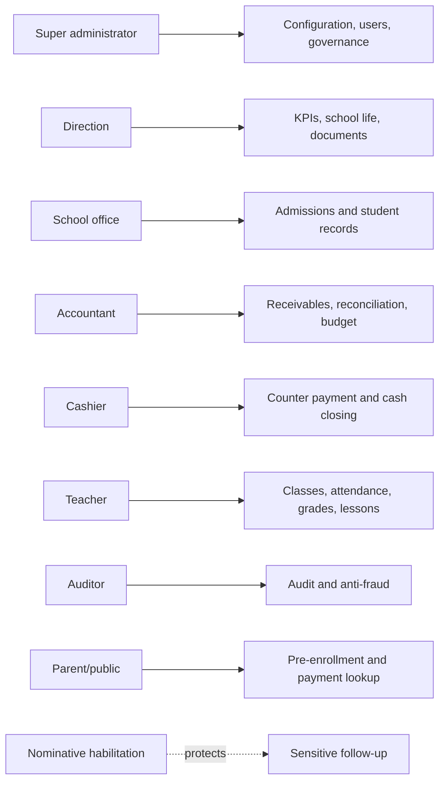
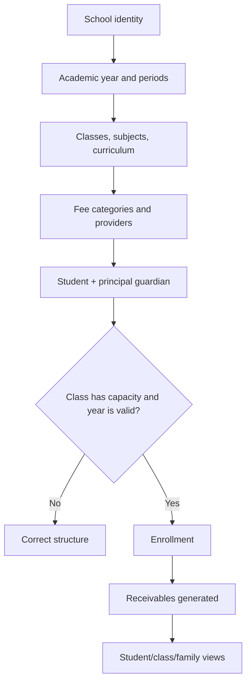
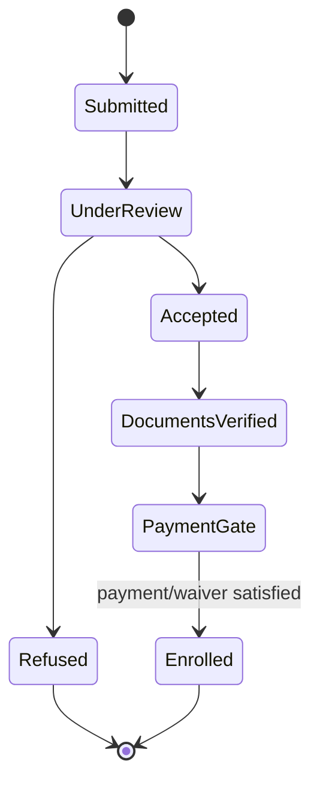
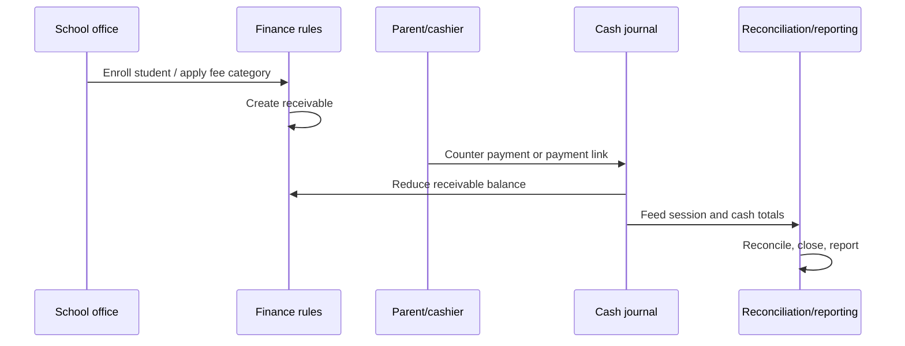
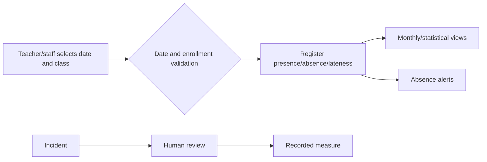
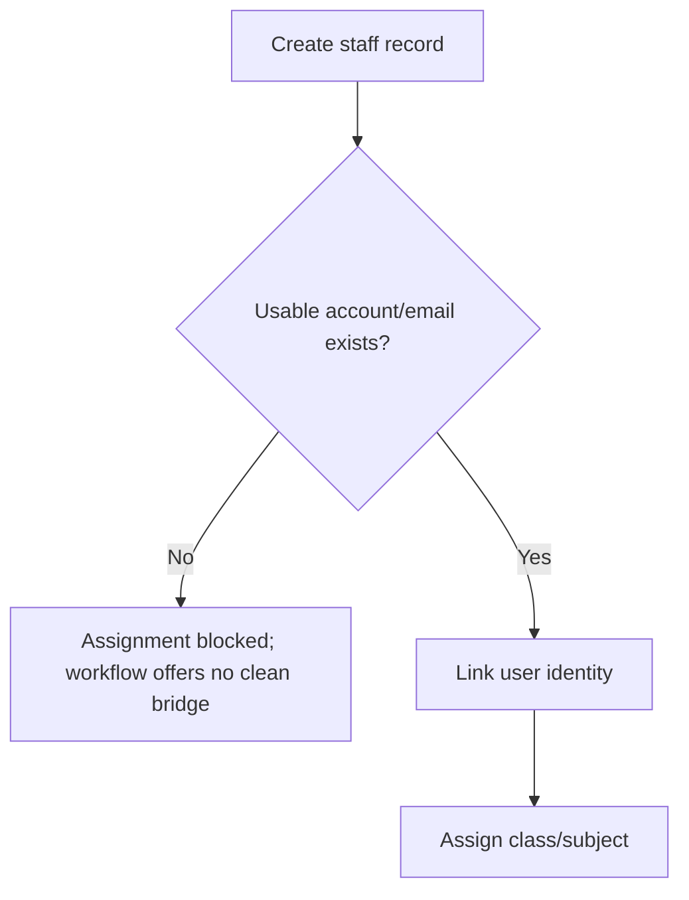

# 01 — Lakoli Platform Audit

> **ROUND-5 DEEP WORKFLOW REVALIDATION — authoritative (2026-08-02).** This report supersedes earlier audit rounds wherever they differ. It is based on exhaustive interactive exploration, replay of the available “Revoir le guide” tours, safe synthetic workflow execution, responsive checks and client-bundle/route inspection.

## 1. Evidence model and limits

| Marker | Meaning |
|---|---|
| **CONFIRMED** | Directly observed in the browser, executed safely, or present in the shipped client. |
| **DEDUCED** | Strong conclusion from multiple confirmed observations; not asserted as implementation fact. |
| **NEEDS VALIDATION** | Requires another role, a real provider, production data, destructive action or server-side access. |

The audit covered every discoverable page, tab, link, button, form and guide available to the audited super-administrator, plus public enrollment/payment entries. It did not send real campaigns, charge a payment instrument, buy a subscription, delete business data or bypass authorisation. Teacher-only and sensitive-follow-up pages correctly refused this account.

### 1.1 Exhaustive-revision method

This revision applies five complementary review methods rather than treating the browser crawl as a flat list of screens:

1. **Critique and Refine** — every earlier conclusion was challenged against the round-5 browser record and the shipped-client evidence; over-broad labels such as “absent” were replaced by operational classifications.
2. **Problem Decomposition** — each domain was decomposed into entry conditions, controls, state transitions, permissions, outputs, dependencies and failure paths.
3. **Source Triangulation** — a claim is retained only when supported by one or more of: observed runtime behaviour, a replayed product guide, a shipped route/component/API contract, or cross-page propagation.
4. **Boundary and Edge-Case Sweep** — dates, capacity, empty states, duplicates, role boundaries, loading states, irreversible actions, provider dependencies and cross-module reconciliation were explicitly examined.
5. **Stakeholder Lens Rotation** — findings are interpreted separately for school leadership, registrar, accountant/cashier, teacher, family/student, auditor/DPO and product/engineering.

The resulting report deliberately separates **feature existence** from **operational availability**. In particular, Orientation and Conformity have substantial shipped implementations but were gated as “coming soon” on the audited tenant. They are therefore classified **IMPLEMENTED_BUT_GATED**, not absent and not runtime-validated end to end.

## 2. Executive assessment

Lakoli is a broad, Côte d’Ivoire-oriented school ERP whose centre of gravity is **admissions, fee collection, cash operations and administrative compliance**, not learning analytics. Its strongest product quality is operational teaching: guides, prerequisite-aware empty states and multi-step workflows explain how a school should configure and run the product. Its breadth is genuine: admissions, re-enrollment, student/guardian records, receivables, cash, payment links, cafeteria, transport, HR, attendance, school life, messaging, documents, official exports and governance all have visible surfaces.

The product is not uniformly reliable. Round 5 reproduced failures that affect record truth: future attendance is accepted, a discipline date changes after save, debt KPI and ledger disagree, refused applicants can appear in documents, saved activity state is unstable, and academic-year/period forms fail. The product’s own AI/health audit did not identify several of these defects. A mature functional catalogue therefore coexists with fragile state transitions and inconsistent validation.

Commercially, Lakoli is stronger than Pilotage in finance, cash, payment communication, official documents, HR and operational services. It is weaker in coherent pedagogical analytics, transparent cross-portal data consistency, open integrations and demonstrable technical assurance.

## 3. Product purpose, personas and access model

Lakoli supports the daily administration of a school or group of schools. Confirmed role vocabulary includes `super_admin`, direction, accounting, cashier, schooling/registrar, teacher, auditor and permanent staff. A separate parent-facing surface exists for pre-enrollment and payment lookup. Route metadata in the shipped client assigns role lists; a second, nominative habilitation gate protects sensitive follow-up.



Positive controls confirmed: the teacher workspace refused a super-administrator, and sensitive follow-up refused access without specific habilitation. **NEEDS VALIDATION:** whether every API endpoint independently enforces the same controls, because only client-visible behaviour and route metadata were available.

## 4. Complete information architecture

The application is organised into five working spaces plus settings and public/auth flows.

| Domain | Pages and submodules confirmed |
|---|---|
| Steering | Dashboard, financial reports, analytics, calendar, onboarding/configuration progress. |
| Admissions and records | Enrollment dashboard, new-student wizard, administrative pre-enrollment, public pre-enrollment, mass re-enrollment, end-of-year transition, students, guardians, import, assignment status, national exams, photo directory, CIO exports. |
| Pedagogy | Classes, subjects, periods, academic years, curricula, teacher assignments, timetable, teacher monitoring, lesson book/visa, grades, evaluation planning, report cards, attendance and absence alerts. |
| School life | Discipline, clubs/activities and sensitive follow-up. Orientation has a substantial shipped implementation but is tenant-gated and was not operational in the audited account. |
| Finance and services | Fee categories, receivables, discounts, counter payment, payment journal/session, online payments, cash, cash closing, reconciliation, anti-fraud, budget, cafeteria, transport, other services. |
| Families and communication | Messaging, SMS campaigns, automation rules, email tab, WhatsApp deep links, communication credit, delivery log, parent portal and parent pre-enrollment queue. |
| Administration | HR, timekeeping, documents, users, audit, deletion approvals, AI audit, subscription, help and a substantial shipped-but-tenant-gated Conformity centre. |
| Settings | General information, academic years, classes/reference data, payment providers, HR/social settings, parent portal, communication, export on termination and other configuration tiles. |
| Public/auth | Login, space chooser, initial setup, pre-enrollment, matricule-based payment portal, subscription/payment callbacks. |

The command palette exposes routes that are not all present in the main sidebar. This improves expert navigation but also hides product breadth from ordinary users.

## 5. Functional catalogue

### 5.1 Setup and reference data

The onboarding sequence is explicit: school identity → academic year → periods → classes → subjects/curricula → users/teachers → fee rules → payment/communication configuration. The dashboard shows a progress checklist and deep links. The initial `/app/setup` surface remains reachable from an authenticated tenant, which should be treated as an idempotent setup/resume page or restricted after completion.

Academic-year and period management are foundational because most later selectors depend on them. Round 5 found these forms capable of resetting or returning server errors, making this a high-impact defect. Class creation works; a synthetic class propagated into enrollment choices. The class dialog is partially obscured by the fixed mobile navigation at narrow width.

### 5.2 Admissions, student and guardian records

The primary wizard collects student identity, class/enrollment data and a guardian/principal contact. The principal contact becomes the routing key for SMS and payment links. Class options load asynchronously; the audited wizard briefly claimed none existed before populating.

There are two pre-enrollment funnels:

- an administrative queue used by school staff;
- a public/parent entry whose dossiers appear in a separate parent-portal queue.

They are not presented as one reconciled source of truth. The intended states include review, acceptance/refusal, document verification and an enrollment/payment gate. A refused applicant remained eligible for at least one document listing: a boundary failure between application state and official output.

Bulk student import documents expected columns and the side effect of generating receivables. The mass page at `/app/inscriptions/masse` is not generic enrollment: it transfers/re-enrolls students from a source class/year to a destination class/year. Its guide describes a broader enrollment pipeline and is therefore mismatched.

### 5.3 Finance, cash and online payment

Lakoli’s deepest chain is fee category → student receivable → discount/adjustment → payment → cash session/journal → reconciliation → cash closing → financial reporting.

- Fee categories define charge semantics and can drive other services.
- Receivables expose outstanding balance, status and filtering.
- Discounts have documented restrictions, including tuition-only rules in the inspected surface.
- Counter payment is a guided flow; cashier session and payment journal provide traceability.
- Online payment surfaces support payment links and provider callbacks, but the audited tenant had no configured provider.
- Cash closing produces a formal closing trail; it was not triggered because it is a consequential accounting action.
- Budget, anti-fraud and reconciliation are separate modules.

A synthetic fee, receivable and cash payment propagated across the relevant views. However, the headline debt KPI was approximately 5k while the detailed ledger total was approximately 8k in the same state. This is a confirmed reconciliation defect.

### 5.4 Pedagogy and attendance

The pedagogy surface covers class/subject/year structures, teacher assignments, timetable, curriculum grids, grade entry, evaluation planning, report cards, lesson-book/visa and teacher attendance. This is broad operational functionality, but the product does not expose Pilotage-style class/subject risk analytics or a coherent alert-to-remediation loop.

Attendance offers daily register, monthly view, statistics, lateness reporting and absence alerts. A future-dated attendance record was accepted. The embedded “absence alerts” tab crashed, although its direct route rendered. These defects compromise both validation and navigation.

### 5.5 School life

Discipline supports incident/sanction recording and retains human governance rather than automated punishment. In the executed path, the saved event appeared under the wrong date. Clubs/activities support many types, domains and printed summaries; an executed synthetic activity did not preserve all state across navigation/reload. Sensitive follow-up is protected by nominative habilitation. The audited tenant presents Orientation as “coming soon,” while shipped code contains the versioned referential, campaign, individual wishes, freeze and export workflow described in Appendix A; it is **IMPLEMENTED_BUT_GATED**.

### 5.6 Communication

The messaging centre provides typed SMS, campaigns, automation rules, an email surface, WhatsApp deep-link templates, prepaid communication credit and delivery logs. Campaign audience, template and scheduling controls were inspected. Credit values briefly contradicted each other (0 versus 99) during asynchronous loading. WhatsApp is described as client-side deep linking rather than a server API.

No real campaign was sent. The system did automatically attempt two transactional SMS messages during synthetic record creation; both targeted only a reserved synthetic number. Delivery/retry semantics with a real gateway remain unvalidated.

### 5.7 HR and services

HR covers staff records, departments, payroll-related fields, contracts and timekeeping; settings reference Côte d’Ivoire social/tax concepts. Cafeteria, transport and other services attach operational charges to families. Synthetic HR/timekeeping and cafeteria paths worked. The HR-to-teaching-assignment path exposed a deadlock: assignment expects an account/email condition that the preceding staff workflow does not cleanly establish. Transport does not expose the complete route/stop model implied by its guide, and “other services” had no usable create action in the tested configuration.

### 5.8 Documents, reporting and governance

Confirmed reporting/output surfaces include financial CSV/print, student and guardian lists, re-enrollment Excel, teacher-attendance Excel/PDF, report cards, timetable print, activity recap, CIO/StatCIO exports, exam registers, 12 official document generators, SMS logs, audit log and a portable tenant export. Outputs are fixed artefacts; no general report builder or scheduled subscription mechanism was found.

Governance includes users, route roles, audit, anti-fraud, approval-gated deletion, data export on termination and an AI/quality audit. The AI audit’s practical value is limited because it missed multiple defects reproduced manually.

## 6. End-to-end workflows

### 6.1 Configuration to active student



Round 5 executed the class → student/guardian → enrollment chain. The main edge conditions are asynchronous false-empty selectors, fragile year/period prerequisites and imperfect admission-state boundaries.

### 6.2 Pre-enrollment to enrollment



The state model is described in the UI/guides, but the public queue and staff queue are siloed and a refused applicant leaked into document output. Both facts weaken confidence that the diagram is enforced consistently.

### 6.3 Money-in and cash control



The synthetic counter-payment path worked, but the inconsistent debt aggregates mean financial truth must be reconciled before relying on executive KPIs.

### 6.4 Attendance and discipline



Observed divergence: the date-validation gate accepted the future, the alerts tab transition crashed, and discipline read-back changed the date. These are core integrity problems.

### 6.5 Re-enrollment campaign

The mass workflow selects a source year/class, a destination year/class, eligible students, decisions/exceptions and applies a transfer. It is best modelled as a campaign with eligibility, capacity, payment/status and audit controls. Only one active year was available in the audited state, limiting full cross-year execution.

### 6.6 HR to teacher assignment



This is a confirmed workflow design defect, not merely missing test data.

## 7. Domain/data model

```mermaid
erDiagram
  SCHOOL ||--o{ ACADEMIC_YEAR : owns
  ACADEMIC_YEAR ||--o{ PERIOD : contains
  ACADEMIC_YEAR ||--o{ CLASS : structures
  STUDENT ||--o{ ENROLLMENT : has
  CLASS ||--o{ ENROLLMENT : receives
  STUDENT }o--o{ GUARDIAN : linked_to
  STUDENT ||--o{ RECEIVABLE : owes
  FEE_CATEGORY ||--o{ RECEIVABLE : generates
  RECEIVABLE ||--o{ PAYMENT : settled_by
  PAYMENT }o--|| CASH_SESSION : recorded_in
  STUDENT ||--o{ ATTENDANCE : has
  STUDENT ||--o{ DISCIPLINE_EVENT : concerns
  STAFF ||--o| USER_ACCOUNT : may_link
  STAFF ||--o{ TEACHING_ASSIGNMENT : receives
  CLASS ||--o{ ASSESSMENT : schedules
  ASSESSMENT ||--o{ GRADE : produces
```

This model is **DEDUCED** from UI relations and workflow propagation; it is not a server schema claim.

## 8. Technical architecture inferred from the shipped client

| Layer | Finding | Grade |
|---|---|---|
| Frontend | React SPA under `/app`, Vite-style hashed assets and route-level lazy chunks. | CONFIRMED |
| Navigation | Client router with path/role metadata; command-palette and hidden routes supplement the sidebar. | CONFIRMED |
| Backend boundary | REST endpoints under `/api`; session endpoints include current user/logout/space switching. | CONFIRMED |
| Multi-space | Space list/switching and group/school vocabulary exist. | CONFIRMED surface; server isolation NEEDS VALIDATION |
| Payments | Paystack/CinetPay settings and online-payment/subscription callbacks. | CONFIRMED surface; real provider NEEDS VALIDATION |
| Messaging | Metered SMS wallet/log; WhatsApp deep links; email tab. | CONFIRMED surface |
| Localisation | French, FCFA, Ivorian school ladder and administrative terms. | CONFIRMED |
| Unknown | Server framework, database, queues, object storage and infrastructure. | NOT OBSERVED |

One initial dashboard load hit a lazy-chunk/error boundary and only offered reload, suggesting deployment/cache recovery weakness. Audit records also displayed a loopback-style client IP; proxy header handling needs validation.

## 9. UX and design assessment

Strengths:

- coherent workspaces aligned to school operations;
- unusually strong embedded guidance and replayable tours;
- rules and prerequisites often explained at the decision point;
- guided, stepwise flows for high-risk tasks;
- useful onboarding checklist and purposeful empty states;
- dedicated mobile navigation and a generally consistent visual vocabulary.

Weaknesses:

- slow/asynchronous surfaces frequently show misleading interim numbers or empty states;
- error boundaries are dead ends with reload as the primary remedy;
- hidden routes and settings tiles reduce discoverability;
- “coming soon,” locked and broken states are not always distinguished;
- inconsistent labels for similar enrollment/payment concepts;
- mobile fixed navigation can cover modal actions;
- modal/accessibility semantics are inconsistent. A full WCAG conformance audit was not performed.

## 10. Security, privacy and governance observations

Positive confirmed evidence includes route RBAC, nominative sensitive-data habilitation, approval-gated deletion, audit records, password recovery, explicit subscription consent and tenant data export. Concerns include a client-observed hard-coded demo-account billing bypass, unclear API-side enforcement, loopback-like audit IPs, reachable setup/callback edge behaviour, and lack of evidence for open security assurance. No penetration testing was performed.

## 11. Confirmed defect register

| Priority | Finding | Operational impact |
|---|---|---|
| P0 | Future attendance accepted. | Official registers can contain impossible facts. |
| P0 | Discipline event date changes/misrenders after save. | Incident chronology is unreliable. |
| P0 | Debt KPI and detailed ledger disagree. | Management and collection decisions use conflicting balances. |
| P1 | Refused applicant appears in document population. | Admission-state/privacy boundary failure. |
| P1 | Academic-year/period forms reset or fail. | Foundational setup blocks downstream modules. |
| P1 | HR → teacher assignment identity deadlock. | Staff cannot cleanly become teaching users. |
| P1 | Attendance-alert tab crashes. | Absence intervention workflow breaks. |
| P1 | Activity state is not stable after save/navigation. | School-life records lose truth. |
| P2 | Public and staff pre-enrollment are separate silos. | Duplicate/manual reconciliation risk. |
| P2 | Asynchronous counters show contradictory values. | Users act on false loading states. |
| P2 | Class dialog actions are obscured on mobile. | Mobile task completion failure. |
| P2 | Transport and other-services workflows are shallower than guidance. | Feature expectation gap. |
| P2 | AI health check misses reproduced defects. | False assurance. |
| P3 | Staff deep link without `/app` returns 404. | Navigation friction. |
| P3 | Callback without parameters ended the session. | Brittle edge handling. |

## 12. Strengths, weaknesses and risks

**Strengths:** operational breadth, finance/cash depth, locally relevant terminology, embedded training, official output catalogue, separation of financial roles, human governance for sensitive decisions, and traceability concepts.

**Weaknesses:** inconsistent data validation/aggregation, incomplete modules, cross-queue fragmentation, limited pedagogical insight, closed integration surface, unstable async states, and insufficient automated health detection.

**Primary risks:** inaccurate official/financial records; staff bypassing broken paths with offline workarounds; accidental communication from supposedly safe workflows; role-specific defects hidden from super-admin testing; and overreliance on UI guidance that sometimes disagrees with behaviour.

## 13. Coverage and residual validation

All super-admin-accessible modules and public entries were browsed. All available guides were replayed and incorporated. Synthetic end-to-end data enabled class, student, guardian, fee/payment, cafeteria, HR/timekeeping, club, calendar and budget detail states. Remaining gaps are intentional and explicit:

- **BLOCKED_BY_ROLE:** teacher workspace and sensitive follow-up;
- **BLOCKED_BY_DEPENDENCY:** real online-payment/SMS providers and a second academic year for full mass re-enrollment;
- **NOT_TRIGGERED_SAFETY:** real campaigns, real payments, subscription purchase, destructive deletion, tenant export and provider callbacks;
- **NEEDS VALIDATION:** API-side authorisation, server architecture, real delivery/retry, and full accessibility/security testing.

Detailed evidence: [`audit-evidence/lakoli/lakoli_deep-workflow-browser-audit-07.md`](audit-evidence/lakoli/lakoli_deep-workflow-browser-audit-07.md). Existing route/bundle inventories and screenshots remain supporting, non-authoritative appendices when they conflict with round 5.

## 14. Audit residue disclosure

Recoverable synthetic data remains to preserve cross-module evidence: a class, student, guardian, fee/payment, cafeteria record, staff/time entry, club/activity, calendar event and budget item. Two application-generated SMS attempts targeted a reserved synthetic number. No real person, real payment instrument or destructive action was involved.

---

## Appendix A — Detailed feature and control catalogue

This appendix restores the control-level detail removed by the earlier condensed rewrite. “Available” means the control exists in the shipped product; it does not imply that a consequential action was executed.

### A.1 Admissions, enrollment and student records

| Capability | Entry and inputs | State/rules | Outputs and dependencies | Classification |
|---|---|---|---|---|
| New enrollment | New/existing student; identity; DOB components; nationality; automatic/manual matricule; repeat/state-assigned flags; father, mother and tutor blocks; principal contact; class; fee selection; documents | Class/year required; finance step cannot proceed when applicable fees total zero; principal contact drives family communication | Student, guardian links, enrollment, receivables, required-document checklist | Confirmed surface; safe synthetic chain executed |
| Enrollment documents | Two photos, civil/birth record, vaccination, originating-school file, parental-authority evidence and signed form for a new student; reduced set for re-enrollment | Each file can be `a_controler`, `conforme` or `a_corriger`; correction requires a reason | Student file, admission completeness and later official outputs | Confirmed shipped flow |
| Enrollment lifecycle | Staff or public dossier | `preinscription_creee → paiement_demande → paiement_recu → dossier_complet → validee`; cancellation path exists | Active enrollment and class visibility | Confirmed from guide/client; partial runtime execution |
| Payment exception | Direction-controlled exception | Default rule: validation requires confirmed payment; Direction may explicitly override | Enrollment activation plus audit evidence | Confirmed contract; exception not executed |
| Pre-payment correction | Edit class, student identity and fees from success/receipt path | Allowed only before first payment; financial file becomes locked after first collection | Corrected enrollment without duplicate student | Confirmed guide and controls |
| Counter collection | Amount, cashier/session, mode and receipt context | Eight payment modes exposed; payment must attach to receivable; physical/manual-counter semantics differ from online | Payment, receipt, cash session, receivable reduction | Executed with synthetic cash payment |
| Public pre-enrollment | Family identity, student identity, desired class/services/documents | Seven public statuses; messages and document requests; conversion is staff-controlled | Public dossier and a separate parent-portal queue | Confirmed; silo from staff queue observed |
| Student import | CSV/TXT/XLSX/XLS; mapped aliases; 12 expected columns; preview | Maximum 2,000 rows; per-line validity; receivable generation by default; “without receivables” requires double confirmation | Batch students/enrollments/receivables and result report | Confirmed guide/client; not applied |
| Student profile | Identity, school record, family, health/emergency, finance, documents | Sensitive fields depend on role; document conformity tracked separately | Consolidated operational record | Confirmed surface |
| End-of-year decision | Results, non-computability reason and human decision | `admitted`, `postponed`, `repeater`, `excluded`, `transferred`, `leaver`, `pending`; six non-computability codes; only published bulletins count; freeze uses hash; reopen/correction needs reason ≥10 characters and optimistic version | Frozen decision register and next-year eligibility | Confirmed shipped workflow |
| Re-enrollment campaign | Source year/class, results, contact, responses, collection and destination | Six steps: Results → Initialize → Contact → Responses → Collect → Re-enroll; four independent axes for contact/response/final/payment; next year required; payment guard | New-year enrollments, next-year receivables, grouped SMS | Confirmed shipped flow; cross-year completion blocked by audited data |
| State assignment registry | Official/non-official status, source and reason | Immutable SHA-256 events; declarative status does not silently overwrite official source | Traceable assignment history | Confirmed shipped flow |
| Destructive deletion | Request, justification, reviewer comment | Two-person approval; reject requires comment; approval performs permanent deletion | Audited deletion outcome | Confirmed; deliberately not executed |

Key boundary cases: asynchronous class loading can briefly show a false empty state; a refused applicant leaked into a document population; public and administrative dossiers are not visibly reconciled; full cross-year campaign behaviour, duplicate matricules across imports and exception validation require controlled staging tests.

### A.2 Finance, cash, payments and subscriptions

| Capability | Controls and lifecycle | Core business rule | Output / risk |
|---|---|---|---|
| Fee categories | 18 fee types, schedule, cycle/class/service scope, periodicity | Scope changes do not retroactively rewrite existing receivables | Fee rules and future receivables |
| Receivables | Search/filter, balance/status, student/account detail, adjustments | Post-payment financial identity is locked; ledger is the detailed truth source | Debt ledger; currently disagrees with headline KPI |
| Discounts/bursaries | Eight default criteria; targeted grant | Audited implementation limits discount eligibility to tuition in relevant path | Reduced receivable and justification trail |
| Cash contribution | Manual physical-money entry with source and amount | Must not be confused with a student payment or online settlement | Cash position only |
| Expense workflow | Draft expense → validation or rejection | Separation between proposal and accounting effect | Cash/budget impact after validation |
| Cash closing | Theoretical versus counted amount; one close per day; formal PV | Closing is presented as irreversible, while mass-cancellation controls create a documentation contradiction | Daily official close and variance |
| Mass cancellation | Select eligible payments; type `ANNULER n` | Explicit high-friction confirmation; cancellation does not equal cash closing reversal | Reversed payment records and audit trail |
| Refund | Student/payment, amount, motive, overpayment handling | Refund is a dedicated operation, not a negative payment | Refund record and updated balances |
| Online payment | Provider configuration, test/production state, payment link, callback | Four aggregator/provider surfaces were found; configuration and provider validation precede use | Remote checkout and reconciliation; not charged in audit |
| Reconciliation | Internal ledger comparison and provider settlement comparison | Two reconciliation layers should not be merged | Exception lists and control evidence |
| Anti-fraud | Nine anomaly categories and review surface | Detection signals require human review | Fraud-control queue; effectiveness not validated |
| Budget | Forecast lines, periods, actual comparison and bootstrap | Budget is separate from cash availability | Forecast-versus-actual steering |
| Cafeteria | Subscription, periodic charge, expense and service state | Service can be suspended/cancelled independently from school enrollment | Service roster, receivable and expense |
| Transport | Subscription and charge surface | Route/stop depth implied by guide was not present in tested tenant | Shallow operational service |
| Other services | Generic subscription framework | Availability depends on service configuration | Extensible charges; create action unavailable in tested state |
| Communication wallet | Balance, segments, threshold, packs, Mobile Money recharge and verification | Hard balance guard; recharge verification is idempotent | Send capacity and ledger |
| Lakoli SaaS billing | Plan/invoice history, consent and callbacks | 60-day withdrawal language and no automatic debit were shown | Tenant subscription state |

The financial domain cannot be considered fully dependable until the approximately 5k dashboard debt and approximately 8k detailed ledger are reconciled. Accountant acceptance testing must also prove cash-closing irreversibility, cancellation/refund accounting, provider settlement, concurrent cashier sessions, partial/over-payments, reversed callbacks and idempotency.

### A.3 Pedagogy, periods, assessment and official bulletins

| Feature | Inputs/actions | State machine and rules | Outputs/dependencies |
|---|---|---|---|
| Academic years | Label, dates, active status, rollover | Foundational prerequisite; audited forms reset or errored | Scopes nearly every transaction |
| Periods | Type, dates, cycle scope, annual weights, quick creation | Closure runs prechecks; reopen depublishes official results | Assessment windows and bulletin snapshots |
| Classes | Cycle/level, label, capacity, mark scale, terminal flag; standard bulk generator | Capacity and academic scope apply; narrow-screen modal action can be covered | Enrollments, timetable, assessments |
| Subjects/curricula | Official grid, coefficients/order, seed/edit/synchronise | Changes must reconcile with class/cycle curriculum | Teacher assignments and calculations |
| Teacher assignment | Teacher account, class, subject | Depends on a linked usable identity; staff-to-account bridge is defective | Gradebook, timetable and teacher workspace |
| Timetable | Days, slots, rooms, class/teacher, workload; drag/print | Conflict and workload checks; Africa/Abidjan time assumptions | Teacher/class schedules |
| Assessment | Type, title, class, period, subject, date, scale | Draft/publication/revision semantics; server rejection codes; score-grid validation | Grade set, KPIs, white-exam results |
| Bulletin | Period/class/student and signatures | Provisional watermark before closure; official generation has four gates | Ivorian masthead, average, rank and archive |
| Lesson book | Date, topic/content, teacher/class/subject | `draft → submitted → visa` or `correct`; human visa workflow | Teaching-progress evidence |
| Attendance | Class/date/slot; present/absent/late/excused; lateness 1–600 and motive ≥3 | Empty does not mean present; expected slots exclude weekends/holidays; correction is audited | Register, rates, printed sheet, parent SMS and alerts |
| Compositions/exams | Rooms, supervisors, population and schedule | Conflict returns 409; override requires reason ≥10; SMS is idempotent; lifecycle is guarded | Exam plan and notifications |
| Offline teacher mode | Local notes/attendance queue | Maximum 100 queued items, 30-day retention, conflict resolution; clear on logout/account change | Deferred synchronisation |

Runtime boundaries: a future attendance was accepted, the embedded alerts tab crashed while the direct route worked, and academic-year/period creation was unstable. Teacher-only execution was not available to the audited account, so offline conflict handling, score revision, period close/reopen and official bulletin generation remain **NEEDS VALIDATION** despite confirmed shipped implementations.

### A.4 Communication, family portal and campaigns

| Feature | Detailed behaviour | Constraints / edge cases |
|---|---|---|
| Messaging centre | Seven tabs: campaigns, individual SMS, email, history, lists, templates and automations | Recipient search begins at two characters; variable syntaxes differ across surfaces |
| Individual SMS | Recipient search, template/variables, preview and segment warning | Invalid number/format paths exist; two transactional attempts targeted only the reserved synthetic number |
| Email | Audience selection, subject/body, recipient preview and send | Delivery/provider behaviour not validated |
| History | Status/filter and CSV export | Status vocabularies diverge between pages |
| Lists | CRUD and member management | Confirmed design gap: saved lists are not selectable as send targets |
| Campaign | Name/type; unpaid/all/class audience; message; simulation; send/schedule | Simulation is mandatory; recent payments within 24h are excluded for debt campaigns; parent numbers deduplicate across siblings |
| Campaign rules | 16 trigger events; semi-automatic/automatic; delay/time/template | Automatic mode warns about consequences; real scheduler not exercised |
| Wallet | Balance, packs, thresholds, recharge/verify | Initial values briefly contradicted (0 versus 99); balance hard-stops sends |
| WhatsApp | Individual/group/sequential-debt deep links; templates stored locally | `wa.me`, not a WhatsApp API; localStorage persistence; one client-specific hard-coded template; no delivery acknowledgement |
| Parent spaces | Pre-enrollment space plus enrolled-parent OTP space | OTP requires no parent password; staff impersonation token exists and needs security review |
| Portal settings | 13 fields plus services/classes/docs/contact | Public disclosure must track configuration and consent |
| Re-enrollment/exam notifications | Guided SMS/WhatsApp assistants | Idempotence guards exist; full delivery not validated |

The collection ladder documented in help uses J+7, J+30, J+60 and J+90 stages. No real campaign, external email or WhatsApp delivery was triggered. Delivery receipts, retry, STOP/consent handling, invalid-number quarantine, concurrent sends and wallet debits remain provider-sandbox test cases.

### A.5 HR, payroll and timekeeping

| Feature | Controls | Rules / outputs |
|---|---|---|
| Staff registry | Identity, one of nine departments, one of six contract types, one of four statuses; optional user-account creation | Account creation includes email, role, access and password ≥8; staff and user are distinct identities |
| Contracts | Create, renew, suspend, resume, terminate | A new contract auto-terminates the previous one; seniority excludes suspensions |
| Payroll preparation | Month/batch preview and hash | Blockers must be cleared before validation; draft → validate → print |
| Statutory payroll | 19 rubric codes, CNPS/CMU/IRPP/seniority settings | Côte d’Ivoire-oriented payslip; setting changes are future-only; system rubrics locked |
| Contractor schedule | Separate payment schedule | Not conflated with employee monthly payroll |
| Pointage | Six tabs; six event types; ten reason codes; anomaly views | Manual-only mode today; validated data only in formal reports |
| Single time event | Staff/date/type/reason | Idempotency guard; correction preserves original record |
| Bulk pointage | Preview then confirm | All-or-none and four-eyes semantics; produces a batch register and audit evidence |
| Terminal integration | EBKN vocabulary | Explicitly future/incomplete, not a live biometric integration |

Notable product gaps: no leave-request/approval workflow, no obvious safe staff deletion, document handling is partly client-side, CNPS/rubric sources are inconsistent or hard-coded, Abidjan assumptions are embedded, contract expiry does not visibly feed an alert queue, and a `personnelId` link is dead. The executed staff/time path worked, but the staff → account → teacher-assignment bridge deadlocked.

### A.6 School life, orientation, conformity and protected records

| Product | Operational classification | Detailed implementation |
|---|---|---|
| Discipline | Runtime available; integrity defect observed | Incident fields include class/student/date/time/type/gravity/location and facts ≥10 characters. Lifecycle: `signaled → instruction → closed`; measures: `proposed → validated → executed`; Direction validation; no automatic sanction; convocations and prompt-based micro-actions exist. |
| Clubs/activities | Runtime available; state instability observed | 18 club types, 16 domains, cycle scopes; activity lifecycle `draft → planned → completed`; Direction-only publication; participants lock after completion; printable statistical recap. |
| Sensitive follow-up | Correctly access-blocked without nominative grant | Health/social/pregnancy domains; read/write/aggregate-export scopes separated; time-limited grant with motive; demo and parent never allowed; legal basis, consent, default two-year retention, encrypted-case wording and k-threshold anonymised export. |
| Orientation DOB | **IMPLEMENTED_BUT_GATED** on audited tenant | Versioned establishment referential; formula prohibition, aliases, duplicate/provenance checks and 500-row chunks; 2026 criteria (BEPC, age ≤20 at 31/12/2026, mean ≥10); campaign states `draft/open/control/validated`; sync 3e; seven ranked wishes across general/technical tracks; individual validation; frozen hash; listing/statistics/admin/quitus exports; no official transmission. |
| Conformity centre | **IMPLEMENTED_BUT_GATED** on audited tenant | Three products: official-canevas preparation, immutable external-file reconciliation and local ActuMoyenne header prequalification. Execution states `draft → validated → generated`; blocking anomalies prevent Direction freeze; frozen snapshot drives XLSX/PDF; external import accepts CSV/XLSX without macro/formula, requires matricule, is idempotent, never mutates students and records resolution motives. |
| ActuMoyenne assistant | Shipped, client-only, non-official | Local analysis of headers; 27 canonical fields; level/series-scoped aliases; detects unknown, ambiguous, duplicate and missing required mappings; requires explicit non-official attestation; sends no file to Lakoli. |

This distinction is essential: the tenant’s “coming soon” gate proves non-availability for that customer configuration, not non-existence in the product bundle. Server-side completeness, licensing and production readiness of gated modules still require vendor validation.

### A.7 Platform, documents, governance and support

| Capability | Detail | Assurance note |
|---|---|---|
| Navigation and entitlements | 86 routed surfaces, eight roles, five sidebar sections, 15 groups, 47 entries/module codes, role-specific mobile quick navigation and primary/secondary interface scoping | Confirmed from shipped route metadata; API parity not proven |
| Initial setup | Three-step self-provisioning for school identity, cycles and administrator account | `/app/setup` remains reachable after setup; idempotence/authorisation should be tested |
| System users | Role, scope/access level, identity and credentials | Descriptions form the de facto RBAC spec; least-privilege API tests needed |
| Audit | 35 action codes, before/after diff viewer and filters | Runtime showed suspicious loopback-like IP; completeness/immutability not independently proven |
| AI quality audit | Overall score, priority-ranked anomalies and staged analysis | Missed multiple manually reproduced integrity defects; not a release gate |
| Dashboard | Direction/finance, teacher and multi-establishment group variants | KPI reconciliation defect exists; group tenant-switch isolation needs test |
| Official documents | Ten document types plus student files; logo/signature/stamp/header; unique number, QR authenticity claim and registry | Refused applicant leakage; QR verification and signature authenticity not independently exercised |
| Bulletin registry | Student/class/period/average/mention/status | Provisional/closed/published distinction; same-snapshot PDF/XLSX claim |
| Tenant exit export | Reason ≥10, exact school-name confirmation, one concurrent job, UUID idempotency key, SHA-256 manifest, private archive | Does not cancel subscription/delete data; protected health/social data excluded into separate process |
| Settings | 17 hidden-access cards plus 18 general-information fields and four official-image uploads | Subscription can lock cycles; storage uses direct object upload |
| Authentication | Login, six-digit OTP by SMS/email, multi-space chooser, establishment switch, demo/presenter modes | Help text contradicts live self-service reset; callback without parameters logged the audit account out |
| Onboarding | Ten-step checklist; four optional suggestions; per-step guide and score | Strong operational teaching; guide/runtime mismatches exist |
| Guided tours/help | 63 tours and 73 articles in 16 sections | Guides expose hidden rules but some documentation is stale |
| Support | In-product modal creates a prefilled WhatsApp request including school, user role and page | Privacy and external-channel retention need notice/consent review |
| Async jobs | Polling for long-running exports and related work | Queue framework/server reliability not visible from client alone |

## Appendix B — Entity lifecycles and invariant catalogue

| Entity | States / invariant | Failure or untested boundary |
|---|---|---|
| Enrollment | Payment-confirmed before validation except explicit Direction override | Refused dossier leaked into an output; public/admin queues siloed |
| Financial file | Editable before first payment; locked afterward | Reversal/refund interaction with lock not executed |
| Receivable | Charge − valid payments − valid reductions = balance | Dashboard aggregate differs from ledger |
| Cash day | One closing/day; theoretical compared with counted | Irrevocability language conflicts with later cancellation tooling |
| Period | Open → prechecked/closed → published; reopen depublishes | Form/server instability blocked execution |
| Assessment | Draft → published → revision with trace | Teacher role blocked from round-5 execution |
| Lesson entry | Draft → submitted → visa/correction | Role workflow not executed |
| Attendance | Date/class/slot must be valid; correction audited | Future date accepted; embedded alerts navigation crashed |
| Discipline measure | Proposed → validated → executed | Saved chronology changed date |
| Activity | Draft → planned → completed; participants locked after completion | State did not persist reliably |
| Orientation campaign | Draft → open → control → validated/frozen | Tenant gated; server readiness unknown |
| Conformity execution | Draft → validated snapshot → generated file | Tenant gated; external-file cases not run |
| Protected case | Grant scope/time/domain must cover operation | Correct denial observed; authorised workflow unavailable |
| Staff contract | Current contract, suspension/resumption, renewal/termination | Alerts and teaching-identity bridge weak |
| Deletion request | Requested → approved/executed or rejected | Consequential path deliberately not executed |
| Tenant export | Queued → processing → ready/failed; one concurrent; idempotent request | Archive content and restore usability not inspected |

## Appendix C — Reports, exports, notifications and integrations

### C.1 Report and export inventory

| Domain | Artefacts |
|---|---|
| Admissions | Enrollment receipt, dossier checklist, student/guardian lists, import result, re-enrollment workbook, assignment register, photo directory |
| Pedagogy | Provisional/official bulletins, score grids, timetable print, attendance sheet and statistics, teacher-monitoring outputs, exam registers/results |
| Finance | Payment receipt, cash journal, daily closing PV, receivable/debt exports, reconciliation output, budget views, refund/cancellation evidence, financial CSV/print |
| HR | Staff list, contract/payroll artefacts, statutory payslip, validated attendance Excel/PDF |
| School life | Discipline/convocation records, activity recap, orientation listing/statistics/admin/quitus, anonymised protected-case synthesis |
| Governance | Audit log/diff, deletion decisions, SMS delivery log, tenant-exit ZIP with manifest/SHA-256, conformity anomaly workbook and frozen official-canevas outputs |

No general ad-hoc report designer, scheduled report subscription, public BI API or documented warehouse connector was found.

### C.2 Notification event map

| Trigger | Audience/channel | Status |
|---|---|---|
| Enrollment/payment | Principal guardian; transactional SMS/receipt/payment link | Surface confirmed; two synthetic SMS attempts observed |
| Debt aging | Unpaid/all/class campaigns; staged J+7/J+30/J+60/J+90 | Simulation/rules confirmed; real gateway not exercised |
| Attendance | Parent SMS and absence-alert queue | Shipped; alerts-tab navigation defect |
| Re-enrollment | Grouped SMS/WhatsApp assistants | Shipped; full campaign not executed |
| Exams | Parent/student scheduling notifications | Idempotence guards confirmed in client evidence |
| Deletion review | Requester/reviewer workflow | Shipped; not executed |
| System | Tenant banners: info, warning, error, maintenance, SMS, success | Runtime/client confirmed |

### C.3 Integration map

| Integration | Evidence | Operational status |
|---|---|---|
| Paystack/CinetPay and additional provider surfaces | Configuration, test/production banners, callbacks, payment links | **BLOCKED_BY_DEPENDENCY** in audited tenant; no charge made |
| SMS gateway | Wallet, segments, logs, transactional/campaign APIs | Requests observed; delivery not proven |
| Email | Password OTP and message tab | Provider delivery not proven |
| WhatsApp | `wa.me` links for family messages and support | Client-side handoff, not API integration |
| Object storage | Direct upload/object-path retrieval for official assets and files | Confirmed client contract; server vendor unknown |
| Administrative authorities | Orientation/conformity exports mention DRENA/IEPP/DOB/AGFNE/CIO | Export/preparation only; explicitly no official transmission |
| Biometric terminal | EBKN vocabulary in timekeeping | Future placeholder, not operational |

## Appendix D — Stakeholder lens review

| Stakeholder | What works for them | What can harm them | Required acceptance evidence |
|---|---|---|---|
| Direction | Broad dashboard, approval controls, official documents, group view and compliance preparation | Conflicting debt KPI, unstable foundational setup, AI audit false confidence | Reconciled KPIs, period/year lifecycle tests, signed audit completeness and restore drill |
| Registrar/school office | Rich enrollment wizard, documents, import, year-end and re-enrollment | Queue silos, refused-record leakage, asynchronous false-empty states | Golden-path plus refusal/duplicate/capacity/document boundary suite |
| Accountant/cashier | Deep receivables, counter cash, close, refund, reconciliation and budget | Aggregate mismatch, ambiguous closing/cancellation semantics, provider unknowns | Double-entry reconciliation, close/reopen policy, callback/idempotency sandbox |
| Teacher | Timetable, grade, attendance, lesson book and offline vocabulary | Teacher role not validated; identity bridge blocks assignment; future attendance accepted | Teacher account journey, offline conflicts, correction/visa/publication permissions |
| Parent/student | OTP portal, public pre-enrollment, payment and notifications | Public/admin silo, gateway uncertainty, sensitive-data exposure risk | Identity matching, consent, cross-child dedup, status and delivery reconciliation |
| Auditor/DPO | Audit, anti-fraud, two-person deletion, protected grants and portable export | API enforcement unproven, loopback IP, protected export/process unknown | Immutable server audit, access recertification, retention/deletion/export evidence |
| Product/engineering | Large modular client, guides, explicit rules, jobs and status models | Runtime/client drift, stale help, state integrity failures, hidden gated scope | Contract tests, feature-entitlement matrix, error observability and release checklist |

## Appendix E — Edge-case and failure-path register

| Boundary | Expected behaviour | Evidence / result | Priority |
|---|---|---|---|
| Future attendance date | Reject before persistence | Accepted | P0 |
| Discipline date round-trip | Preserve exact local date/time | Read-back changed date | P0 |
| Debt aggregation | KPI equals scoped ledger | ~5k vs ~8k | P0 |
| Refused admission in official output | Exclude or clearly watermark | Included in at least one document population | P1 |
| Activity reload | Preserve saved lifecycle/state | Unstable after navigation/reload | P1 |
| Year/period form submit | Persist or return actionable field error | Reset/server error | P1 |
| Staff without account | Offer atomic account link/create before teacher assignment | Dead-end dependency | P1 |
| Embedded attendance-alert tab | Same result as direct route | Tab crashed; direct route rendered | P1 |
| Narrow modal | Primary action remains reachable above fixed nav | Obstructed | P2 |
| Selector while loading | Show loading skeleton, not “none” | False empty appeared | P2 |
| Callback without parameters | Safe error without destroying active session | Audit account logged out | P2 |
| Same guardian for siblings | One campaign contact where appropriate | Dedup rule exists; full send not executed | Needs validation |
| Payment callback retry | Idempotent single settlement | Contract implied; provider test absent | Needs validation |
| Import duplicate/file replay | Reuse or reject without duplicate mutation | Student import untested; conformity replay is idempotent | Needs validation |
| Cash overpayment/partial/refund | Ledger and receipt remain balanced | Controls exist; combinations not executed | Needs validation |
| Concurrent closing/export | One authoritative job and deterministic conflict | UI guards one close/export; concurrency not tested | Needs validation |
| Cross-tenant space switch | No cache/data bleed | Multi-space surface exists; isolation not tested | Needs validation |
| Gated module direct API | Server independently denies unavailable entitlement | Client gate confirmed only | Needs validation |
| Protected grant expiry/domain mismatch | Deny read/write/export independently | Unauthorised denial confirmed; authorised edges unavailable | Needs validation |

## Appendix F — Open questions for vendor validation

1. Which API endpoints and server policies enforce route roles, module entitlements, `niveauInterface` and nominative protected-case grants?
2. Are Orientation and Conformity production-supported products, tenant-specific pilots or dormant shipped code, and what server versions are required?
3. What is the authoritative debt formula and which records explain the reproduced KPI/ledger difference?
4. How are payment callbacks signed, replay-protected, reconciled and reversed across every configured provider?
5. Which timezone conversion caused the discipline-date drift, and can future attendance be rejected server-side?
6. What reconciles public pre-enrollment with staff-created dossiers and prevents duplicate students/guardians?
7. What is the formal accounting policy for an “irreversible” cash close followed by cancellation or refund?
8. Are audit records append-only, tamper-evident and proxy-aware, and how are exports/reads of sensitive data recorded?
9. Where are uploaded student documents encrypted, scanned, retained and deleted?
10. Can a staff record atomically create/link a user account and teacher identity without email deadlock?
11. Which help articles and guides are version-bound, and how is guide/runtime drift detected in release tests?
12. What SLOs, backup/restore tests, incident logs, accessibility results and independent security assessments exist?

## Appendix G — Screenshot evidence index

Screenshots are supporting evidence, not a substitute for the interaction logs or control catalogue.

| Evidence | What it documents |
|---|---|
| [`lakoli_dashboard_direction-overview-01.png`](audit-evidence/lakoli/screenshots/lakoli_dashboard_direction-overview-01.png) | Direction dashboard structure and executive KPIs |
| [`lakoli_dashboard_configuration-progress-01.png`](audit-evidence/lakoli/screenshots/lakoli_dashboard_configuration-progress-01.png) | Onboarding/configuration progress and task guidance |
| [`lakoli_finance_reports-balance-tab-01.png`](audit-evidence/lakoli/screenshots/lakoli_finance_reports-balance-tab-01.png) | Financial-report balance surface |
| [`lakoli_finance_new-fee-category-modal-01.png`](audit-evidence/lakoli/screenshots/lakoli_finance_new-fee-category-modal-01.png) | Fee-category creation controls |
| [`lakoli_pedagogy_new-class-modal-01.png`](audit-evidence/lakoli/screenshots/lakoli_pedagogy_new-class-modal-01.png) | Class creation modal and fields |
| [`lakoli_hr_new-staff-form-01.png`](audit-evidence/lakoli/screenshots/lakoli_hr_new-staff-form-01.png) | Staff/account creation workflow |
| [`lakoli_communication_automations-tab-01.png`](audit-evidence/lakoli/screenshots/lakoli_communication_automations-tab-01.png) | Communication automation rules |
| [`lakoli_calendar_new-event-modal-01.png`](audit-evidence/lakoli/screenshots/lakoli_calendar_new-event-modal-01.png) | Calendar-event creation |
| [`lakoli_admin_new-user-modal-01.png`](audit-evidence/lakoli/screenshots/lakoli_admin_new-user-modal-01.png) | System-user creation and role/scope controls |
| [`lakoli_attendance_alerts-runtime-error-01.png`](audit-evidence/lakoli/screenshots/lakoli_attendance_alerts-runtime-error-01.png) | Reproduced embedded attendance-alert failure |
| [`lakoli_mobile_dashboard-absences-01.png`](audit-evidence/lakoli/screenshots/lakoli_mobile_dashboard-absences-01.png) | Narrow-screen dashboard/absence presentation |
| [`lakoli_mobile_financial-reports-01.png`](audit-evidence/lakoli/screenshots/lakoli_mobile_financial-reports-01.png) | Narrow-screen financial reporting |
