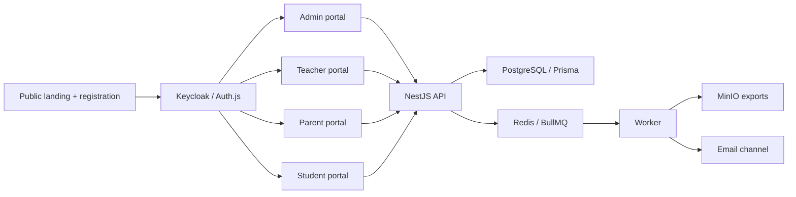
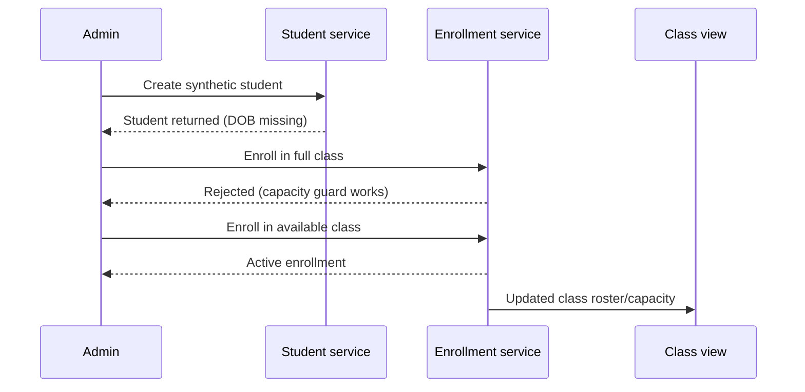
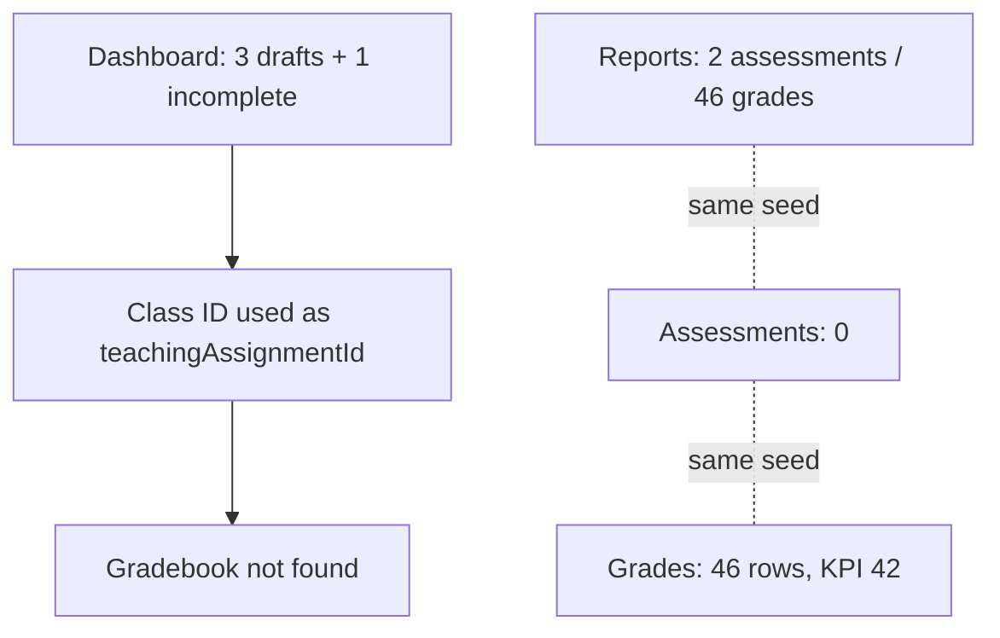
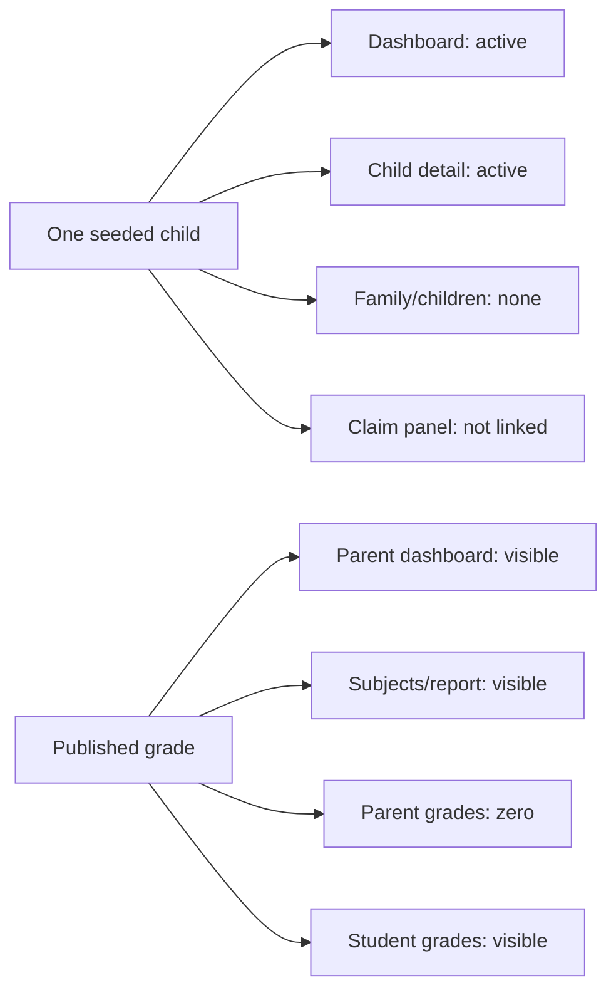
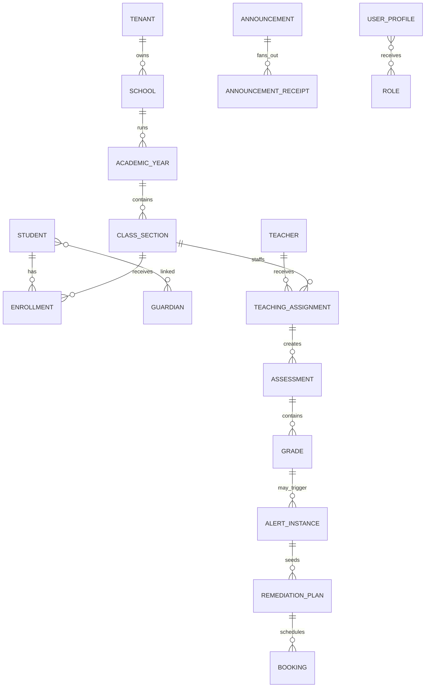
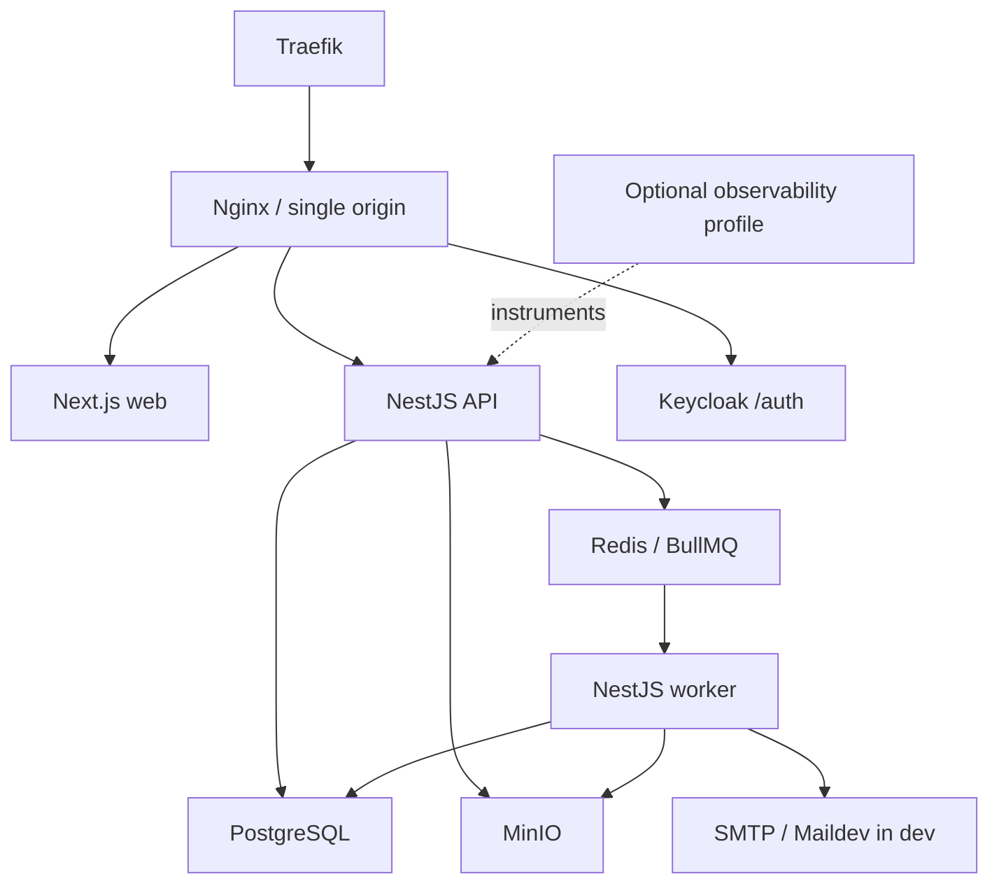
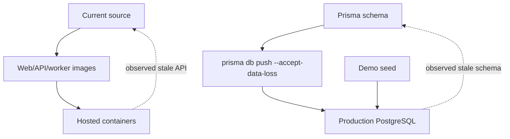

# 02 — Pilotage scolaire: Internal Platform Audit

> **ROUND-5 HOSTED MULTI-ROLE REVALIDATION — authoritative (2026-08-02).** This report supersedes prior rounds where they differ. It combines exhaustive interactive browsing of the hosted deployment across admin, teacher, parent and student portals with a route-by-route source inventory and repository/deployment review.

## 1. Evidence model and scope

| Marker | Meaning |
|---|---|
| **CONFIRMED-RUNTIME** | Directly rendered or executed in the hosted browser. |
| **CONFIRMED-SOURCE** | Present in the checked repository/configuration. |
| **DEDUCED** | Strong conclusion from correlated runtime and source evidence. |
| **BLOCKED** | Missing data/dependency, absent route or deliberate safety boundary. |

Every source `page.tsx` route was requested through the appropriate portal or reconciled with its redirect. All visible forms, menus, tabs, buttons, filters and links were inspected. The audit safely created a synthetic student and enrollment to test propagation. Two pages remain data-dependent: import-batch detail (no batch exists) and custom-role edit (no custom role exists; system roles are immutable). Real sends, destructive actions, import apply/rollback and authorisation bypass attempts were not performed.

### 1.1 Exhaustive-revision method

The revision applies the same five-method protocol used for Lakoli: (1) adversarial critique of every earlier conclusion, (2) decomposition into UI/API/data/worker/deployment controls, (3) triangulation between four hosted portals, source and live stack, (4) an explicit boundary-condition sweep, and (5) rotation through administrator, teacher, parent, student, auditor, operator and engineering viewpoints. A feature is classified by its weakest required layer: a polished screen backed by a stale 404 API is not operational, and source code that cannot run against the hosted schema is not counted as delivered.

## 2. Executive assessment

Pilotage has a strong architectural and product idea: connect school structure, assessments, grades, attendance, alerts, parent–teacher conversation and remediation in one role-aware platform. Its repository contains substantial domain depth, background workers, object exports, granular permissions and automated-test assets. Portal isolation correctly rejected student credentials from the other three portals.

The hosted product is currently **not operationally coherent enough for production trust**. The same facts are counted differently across dashboards and detail pages; grade and enrollment records disappear on some portals while appearing on others; several prominent links lead to 404/error pages; the active academic year is two years behind the current date; announcements do not fan out consistently; and parent/child linkage contradicts itself within the parent portal.

The most serious issues are structural rather than cosmetic:

1. New/unmapped authenticated users are attached to a hard-coded `demo` tenant.
2. A `withTenant` helper exists, but repository search finds no use sites and no SQL policies enabling PostgreSQL row-level security.
3. Production startup uses `prisma db push --accept-data-loss` and the repository explicitly lacks migration history.
4. Hosted pages expose development-only Maildev instructions and seed artefacts.
5. The student identity client is aliased to the parent client.

Pilotage leads Lakoli in its intended pedagogy/alert/remediation model, but the runtime must first establish one source of truth, safe tenancy and complete navigation.

## 3. Product and role topology

Roles are school admin, teacher, parent and student. Source permission guards combine realm roles with database custom roles. Runtime negative testing confirmed that the student account cannot enter admin, teacher or parent portals. An administrator account could also enter the teacher portal because the seeded account carries multiple roles; this is compatible with multi-role design, but should be made explicit in account UI/audit.

## 4. Public and identity surfaces

The landing page advertises realtime propagation, WCAG 2.2 AA, GDPR, sovereign hosting, 99.5% availability, OWASP ASVS L2, ISO 27001 readiness, admin validation, custom fields, append-only audit, drag-and-drop timetabling and PWA capability. These are marketing claims, not audit conclusions; several are unverified and some conflict with the observed runtime.

Confirmed issues:

- privacy, terms, cookies, pricing, contact and help routes all return 404;
- parent registration requires acceptance of terms/privacy that cannot be opened;
- hosted admin/teacher registration exposes Maildev `localhost` instructions;
- teacher/admin registration is invitation-only; parent self-registration is open;
- student password recovery targets the parent identity client;
- the landing page links admin, teacher and parent portals but omits student.

The parent form validates a 12-character password policy, identity/contact fields, confirmation and consents. Source registration and user-sync code both resolve profiles against the constant `demo` tenant, turning open registration into a potential tenant-isolation defect.

## 5. Administrator portal

### 5.1 Dashboard and operational truth

The dashboard showed 2,466 students after the synthetic record, 187 teachers, 94 classes, 28 pending enrollment requests, hundreds of grade-related records and four configured alerts. The surrounding modules disagree:

- enrollment queue: zero, with approval/rejection described as deferred;
- assessment list: zero published;
- analytics: 417 evaluated and 420 grade-like records;
- alert management: zero active rules;
- teacher page KPI: 177 while pagination totals 187;
- subject warnings: 8 unstaffed versus 3 in assignment management;
- role permissions: 96 on one surface and 97 on another.

These are not loading-only differences; several persisted after navigation and filtering.

### 5.2 School structure and enrollment

School structure includes tenant/schools, academic years, cycles/levels, classes, subjects, coefficient matrix and teaching assignments. The active academic year is 2023–2024 on a 2026 audit date. Existing 2026 calendar events are still attached to that active year.

The new-student path was executed. A date of birth entered in the form was silently omitted on read-back. Enrollment into a full class was correctly rejected; enrollment into a class with capacity succeeded and appeared in class detail. One existing class is already 29/28, revealing either historical/import bypass or inconsistent capacity enforcement. Creating a new class via the prominent UI link crashes because `/admin/classes/new` is not implemented as a valid page.

Existing student birth years in one terminale class span implausible values (2009–2017), signalling poor seed/data-quality controls.

### 5.3 Assignments, assessments and analytics

Assignments rendered 290 active rows and 118 warnings on one giant page: 91 classes without lead teacher, 24 primary classes without assistant, 3 unstaffed subjects. The lack of pagination is a performance/usability risk.

The assessment/grade domain is internally rich in source (assessment lifecycle, batches, revisions, analytics snapshots) but runtime queries do not agree. The same seed state produces zero assessments on one page, two published assessments in teacher reports, three drafts on teacher dashboard and 46 grades elsewhere. Alert and remediation outputs cannot be trusted until the upstream query semantics are unified.

### 5.4 Alerts, communication and notifications

The alert configurator lists eight rule types, but the dashboard/configuration totals conflict and behaviour-rule evaluation is not fully implemented. Notification source uses 30-second polling; comments identify SSE as future work. Email/push coverage remains staged.

Four announcements exist. A whole-school composer estimated 191 accounts but broke them down as 1 parent, 0 teachers, 0 administrators and 190 “other.” The resulting announcement reached the parent but not the student, and recipient roles were blank. Announcement detail has send/delete but no edit/archive. Parent detail exposed an internal seed-author label.

### 5.5 Calendar

Calendar supports event creation and a one-click French-holiday import. The button has no confirmation and executed immediately during inspection, adding 22 holidays to the active 2023–2024 year. This illustrates three defects: no confirmation for a bulk write, stale year selection, and weak preview/idempotency communication. Calendar totals differ by role/filter (teacher 37 KPI versus 39 filter; parent interim/final 14/36).

### 5.6 Imports, exports, users and governance

The import wizard exposes five types but uses one generic UTF-8/5 MB upload step without templates or required-column guidance. OneRoster covers only users, classes and enrollments. REST integration is not live. Import-batch detail/apply/rollback remained **BLOCKED_BY_DEPENDENCY** because no batch exists.

Exports include grade spreadsheets, PDF bulletins, enrollments, attendance and audit CSV, queued through BullMQ and delivered from MinIO with one-hour links. Historical files were not downloaded.

There are 191 users, 186 never connected, four system roles and no custom role. A teacher profile displayed a custom/parent role combination. Role assignment controls apply immediately. The teacher invitation form has no student role and would send an email, so it was not submitted.

Audit page crashes with a server component error; reports is 404. Settings claim administrator MFA required, teacher MFA recommended, password/lock/session controls, five-year grade retention and ten-year append-only audit. These claims are not validated by the broken audit surface or an external security assessment.

## 6. Teacher portal

The demo teacher has two classes and a physics/chemistry assignment. Counts disagree: 48 students in one context, 46 cumulative in another, 43 distinct in another, and one class alternates between 25 and 26.

### 6.1 Grade and assessment workflow

Class gradebook links pass a class-section ID while the gradebook expects a teaching-assignment ID. The page explicitly reports this mismatch, and the dashboard “create assessment” path uses the same broken URL. Global grades display 46 rows with an average around 11.1 while their KPI says 42; assessments says zero; reports says two assessments/46 grades; dashboard says three drafts plus one incomplete grade.

### 6.2 Attendance and lessons

Attendance defaults to a 2026 date while the academic year is 2023–2024 and found no session for one class. New lesson defaults to **Published**, making it parent-visible before explicit review. A draft default would be safer.

### 6.3 Messaging, remediation and reporting

Class “new announcement” points to `/teacher/messaging?...`, which is 404. The alternative message composer calculated zero recipients for a class with known families. Parent–teacher conversation works; opening the seeded conversation marked it read, and report-thread action exists.

Remediation shows a weekly slot and one pending booking. Slot creation supports recurring/one-off, day/time/capacity but lacks visible location/end/overlap controls. Copy says an admin will publish while the teacher action is “publish,” an authority mismatch. Documents are empty and direct upload is explicitly deferred to a later worker release.

Teacher profile and help links are 404. “Import grades” points to the admin import page. Notification settings contain parent-specific text (“your child”), indicating copy/component leakage.

## 7. Parent portal

The parent dashboard and child detail identify one active child in 2nde A. The children list, “My family” settings and claim panel simultaneously say there is no active enrollment or linked child. An age KPI changes after asynchronous modal loading.

Grades is the most serious cross-portal contradiction: the parent grades page returns zero even when supplied the child identifier, while dashboard, subjects, printable report and student portal all show the published 11.2 physics/chemistry grade.

Attendance shows seven records and 71.4% (five present, one excused, one unexcused), but includes a 2nde B record while the child is active in 2nde A and displays an invalid −71.4-point trend. It may mix history without labelling it.

Calendar counters initially/finally disagree and the imported holidays became visible. The parent sees the whole-school announcement that the student lacks. Notifications remain zero. A teacher message refers to a file that is absent from documents.

Remediation lets the parent mark the school-created plan achieved or close it, but provides no direct booking action and says to contact the school despite a teacher-side pending booking. Printable report works but combines current 2026 generation with 2023–2024 year and rounds a tiny comparison into “+0.0 above.” Profile/help links are 404.

## 8. Student portal

The student portal is functional but deliberately small: dashboard, grades, upcoming evaluations, attendance and announcements. It correctly shows the known grade and seven attendance records. It does not receive the all-school announcement visible to the parent. It has no profile/settings page and help is 404. Its password-reset link uses the parent Keycloak client, confirmed in source by the portal override.

Positive security evidence: the student was correctly redirected out of admin, teacher and parent portals with a wrong-portal error.

## 9. Domain architecture and entities

The Prisma schema models a substantive platform: tenants/schools, years/terms/cycles/levels/subjects/coefficients/classes; students/guardians/claims/enrollments; identity/roles/permissions/teachers/assignments; assessments/grades/revisions/attendance/lessons/calendar; announcements/receipts/notifications/conversations/reports; alerts/meetings/analytics snapshots; imports/integrations/exports; remediation/tutoring/availability/bookings; audit/outbox.

## 10. Repository and deployment architecture

| Layer | Confirmed technology |
|---|---|
| Workspace | pnpm 9, Turborepo, Node.js 20+. |
| Web | Next.js 15, React 18, Auth.js/NextAuth 5 beta, Tailwind 4 beta, Zod, Recharts, Playwright/axe assets. |
| API | NestJS 10, Prisma 5, PostgreSQL 15, JWT/JWKS, class-validator, Helmet, Swagger outside production. |
| Worker | NestJS/BullMQ, Redis, ExcelJS, PDFKit/React-PDF, Nodemailer. |
| Storage/identity | MinIO/S3, Keycloak 26. |
| Development services | Maildev; optional Jaeger, Prometheus, Grafana and Loki. |
| Production ingress | Nginx behind an existing Traefik route; single public origin including Keycloak `/auth`. |

API modules cover alerts, analytics, announcements, attendance, calendar, child claims, enrollments, exports, grades, guardians, identity, imports/integrations, lessons, messaging, notifications, remediation, school structure, schools, student portal, students, teacher exports and teaching. Worker modules process alerts, analytics snapshots, imports, exports, notification email/digest and remediation sweeps.

## 11. Authentication, authorisation and tenancy

Positive evidence:

- Keycloak RS256 JWT validation through cached/rate-limited JWKS and issuer checks;
- portal middleware that separates roles (runtime-tested for student);
- database custom roles combined with realm-role permissions;
- global validation with whitelist and forbidden unknown properties;
- API proxy strips arbitrary forwarded headers and uses the authenticated bearer token.

Critical concerns:

1. `UserSyncService` and registration use `DEMO_TENANT_SLUG = 'demo'`; any unmapped login/registration is created there. In a multi-tenant product this is a cross-tenant isolation risk.
2. `PrismaService.withTenant` sets `app.current_tenant_id`, but no repository call sites were found. No `CREATE POLICY`, `ENABLE ROW LEVEL SECURITY` or equivalent tenant policy exists in the repository. The code comment that all repositories use RLS is therefore unsupported.
3. The helper uses raw string interpolation for the tenant session setting. The input is internal/UUID-like, but parameterised execution should still be used.
4. Student reuses the parent identity client. This weakens portal-specific redirect/audience separation and produced the observed reset link.
5. Helmet’s content security policy is explicitly disabled.
6. Development Maildev text is shipped to the hosted interface.

## 12. Database and release safety

The compose migrator runs `prisma db push --accept-data-loss`, and repository comments explicitly state there is no SQL migration history. Production compose deliberately runs demo seed logic outside `NODE_ENV=production`; the hosted deployment visibly contains seed records/author labels. Additional module bootstraps recreate unique indexes at runtime to compensate for the absence of migrations.

This release approach is unacceptable for production data because it lacks versioned, reviewable, reversible migrations and allows schema sync with a data-loss flag. The seed profile must be isolated from production and all demo defaults removed.

## 13. Testing and observability

The repository contains 50 test/spec files: 32 API, 12 worker and 6 web/Playwright. Coverage topics include permissions, messaging, analytics, remediation, imports, portal journeys and accessibility. Presence is not execution evidence.

Execution in this worktree was **BLOCKED_BY_DEPENDENCY**:

- Jest is absent from the worktree installation;
- API typecheck cannot resolve Jest type definitions;
- worker typecheck cannot resolve a workspace tsconfig package;
- web typecheck cannot resolve Next/React/lucide/workspace dependencies or generated `.next` route types.

These failures do not establish whether current source passes or fails in its intended CI environment. CI must install the lockfile, generate Prisma/Next artefacts and run lint, typecheck, unit, integration, Playwright and accessibility gates.

Observability configuration is optional rather than proven active. No trace, SLO dashboard, alert delivery or restore exercise was inspected. Marketing availability/security claims remain **NEEDS VALIDATION**.

## 14. Confirmed defect and risk register

| Priority | Finding | Evidence/impact |
|---|---|---|
| P0 | New profiles default to `demo` tenant. | Source-confirmed; multi-tenant isolation risk. |
| P0 | Claimed RLS is unused/unimplemented. | No helper call sites or SQL policies found. |
| P0 | Production uses `db push --accept-data-loss`. | Source/compose-confirmed data-loss risk. |
| P0 | One factual dataset yields mutually incompatible grade/assessment counts. | Runtime across admin/teacher/parent/student. |
| P0 | Parent grade page hides a published grade visible everywhere else. | Cross-portal truth failure. |
| P1 | Parent child/enrollment state contradicts itself. | Dashboard/detail vs family/list/claim. |
| P1 | Gradebook routes use the wrong identifier. | Core teacher workflow blocked. |
| P1 | Audit crashes and reports is 404. | Governance/reporting unavailable. |
| P1 | Stale active academic year drives current operations. | 2023–24 active in 2026. |
| P1 | All-school announcement misses student and misclassifies 190 recipients. | Communication fan-out/audience defect. |
| P1 | Hosted UI leaks Maildev/seed artefacts. | Deployment hygiene and trust risk. |
| P1 | Student identity aliases parent client. | Authentication separation weakness. |
| P1 | New-class UI points to a crashing route. | Structure workflow blocked. |
| P1 | Enrollment and alert dashboard totals disagree with queues/rules. | Operational decisions unreliable. |
| P2 | Student DOB silently drops. | Record integrity. |
| P2 | Attendance mixes class/history without context and trend is invalid. | Parent interpretation risk. |
| P2 | Teacher counts vary 43/46/48 and 25/26. | Roster truth unclear. |
| P2 | Lesson defaults to Published. | Accidental disclosure to parents. |
| P2 | Class messaging link 404; alternate audience is zero. | Teacher communication blocked. |
| P2 | Calendar bulk import has no confirmation and uses stale year. | Accidental bulk writes. |
| P2 | Admin assignment page renders 290 rows unpaginated. | Performance/usability. |
| P2 | Parent can close a school-created remediation plan. | Authority/governance mismatch. |
| P2 | Missing legal/help/contact/pricing pages. | Consent, support and commercial failure. |
| P3 | Profile/help links 404; copy leaks between roles. | Navigation and credibility. |
| P3 | Async KPI counters expose contradictory interim values. | False-state UX. |

## 15. Strengths and assets to preserve

- coherent domain model and modular architecture;
- strong intended grade → alert → conversation → remediation chain;
- granular permission catalogue and positive portal isolation;
- safe capacity rejection on the executed enrollment path;
- asynchronous import/export architecture and object-link expiry;
- background analytics/alert/remediation workers;
- source-level tests for high-value domain rules;
- role-specific portals rather than one overloaded UI;
- moderated conversation/reporting concepts;
- class, guardian, enrollment and grade propagation when queries are correct.

## 16. Coverage and remaining validation

All public/auth pages and all four portals were exhaustively browsed. Every source page was either opened, redirected to an inspected canonical route, confirmed broken/404, or classified data-dependent. The two data-dependent pages are import batch detail and custom role edit. Write tests were limited to one synthetic student/enrollment and the accidental immediate holiday import.

Remaining work for release assurance:

- a clean dependency install and full CI execution;
- database policy/migration redesign and cross-tenant adversarial tests;
- production Keycloak/client/redirect review;
- real notification/provider sandbox testing;
- import validation/apply/rollback with a synthetic batch;
- custom-role create/edit/deny scenarios;
- WCAG keyboard/screen-reader/contrast audit;
- load, backup/restore and observability/SLO tests.

Detailed evidence: [`audit-evidence/internal/internal_hosted-multirole-browser-audit-04.md`](audit-evidence/internal/internal_hosted-multirole-browser-audit-04.md).

## 17. Audit residue disclosure

One synthetic student and enrollment remain for reproducibility; the full-class attempt was rejected. Inspecting the no-confirmation holiday control added 22 French holidays to active year 2023–2024. Opening seeded conversations/announcements marked them read. No real email/message, payment, import application, role mutation or deletion was performed.

---

## Appendix A — Operational classification model

| Code | Meaning | Example in Pilotage |
|---|---|---|
| **OP** | UI, API and data path worked on the hosted stack | Capacity rejection and successful enrollment into a non-full class |
| **PARTIAL** | A useful path works but material controls or consistency are missing | Parent attendance; conversations; calendar |
| **BROKEN_RUNTIME** | Route renders or is linked, but the required hosted operation fails | Audit page crash; wrong-ID gradebook; new-class route |
| **SOURCE_ONLY** | Implementation exists in the repository but hosted API/schema cannot serve it | Several analytics/import/integration/remediation slices |
| **BACKEND_ONLY** | Endpoint/model exists without a reachable product control | Announcement scopes and several moderation/revocation actions |
| **UI_ONLY / MOCK** | Surface exists without a dependable backend truth | Fabricated student averages/status values; empty resource fields |
| **NOT_IMPLEMENTED** | Explicitly deferred or no implementation found | Enrollment approval action, direct document upload, reports page |
| **BLOCKED_BY_DEPENDENCY** | Could not be proven without a missing batch, provider, role or installed dependency | Import apply/rollback, custom-role edit, test execution |

This vocabulary is used below to avoid the earlier error of counting screens as delivered features.

## Appendix B — Complete portal feature catalogue

### B.1 Administrator — school structure and identity

| Surface | Controls and actions | Data/API behaviour | Classification and edge cases |
|---|---|---|---|
| Dashboard | KPI cards, quick links, alerts, calendar/operational summaries | Aggregates student, teacher, class, enrollment, grade and alert data | **PARTIAL**: counts conflict with their source modules |
| Establishment | School identity and administrative attributes | Tenant/school mutation actions exist | **PARTIAL**: school mutations do not create audit rows |
| Schools | List/create/update school contexts | Multi-school source model | **PARTIAL**: no mutation audit; tenant isolation relies on app filters |
| Academic years | Create/edit/activate year and term structure | Current hosted year is 2023–2024 in 2026 | **PARTIAL**: stale active context contaminates calendar/report dates |
| Levels/cycles | Cycle, grade-level and coefficient configuration | Canonical `/admin/levels`; `/admin/cycles` redirects | **BROKEN_SECURITY**: grade-level PATCH lacks validation; coefficient save accepts foreign-tenant IDs |
| Classes | Filters, class cards/table, capacity/lead information, create link | `/admin/classes/new` falls into `[id]` dynamic route | **BROKEN_RUNTIME** for creation; existing class views work |
| Class detail | Roster, enrollment/capacity, teaching information and related links | One class is historically 29/28; new full-class enrollment correctly rejected | **PARTIAL**: historical/import paths bypass invariant or data is corrupt |
| Subjects | CRUD, coefficient/order/reference management | Search and warnings | **PARTIAL**: warning count disagrees with assignments; edit anchor is inert |
| Assignments | Class/subject/teacher mapping, lead/assistant concepts, filters | 290 rows, 118 warnings, no pagination | **PARTIAL**: performance and count consistency risk |

### B.2 Administrator — students, guardians and enrollment

| Surface | Controls and workflow | Confirmed defect / boundary | Classification |
|---|---|---|---|
| Students list | Search, class/status and nominal “level” filters, export, row actions | Level filter is wired to nothing; search triggers full server render on each keystroke; table fabricates some metrics as facts | **PARTIAL / UI_ONLY elements** |
| New student | Identity, contact and demographic form | Entered DOB silently disappeared on read-back | **PARTIAL**, record-integrity defect |
| Student detail | Identity, academic tab, guardian/enrollment relationships and history | Academic data depends on scattered query contracts | **PARTIAL** |
| Guardians | Search/filter/export and relationship counts | Hard ceiling of 200 rows; export/filters operate on truncated set | **PARTIAL** |
| Enrollments | Tabs/filters/export and create enrollment | Approval/rejection workflow is explicitly not implemented | **PARTIAL**, capacity guard worked in executed path |
| Enrollment requests | Queue surface | Dashboard says 28 pending while queue is empty | **BROKEN_TRUTH** |
| Child claims | Review queue and approve/reject actions | Parent child/link state conflicts across pages | **PARTIAL**, identity-link semantics require repair |

Required invariants are not uniformly enforced: student DOB round-trip, unique active enrollment, class capacity across import/history, child-guardian ownership and dashboard/list count equality need API-level tests.

### B.3 Administrator — pedagogy and school operations

| Surface | Controls/actions | State and defects | Classification |
|---|---|---|---|
| Assessments | List/filter/detail links and lifecycle vocabulary | Admin list shows zero while teacher/dashboard/reports show 2–3 | **BROKEN_TRUTH** |
| Attendance | Class/date selection, roster status entry and save | Silent partial save is possible; two read endpoints lack teacher ABAC; save does not revalidate | **BROKEN_SECURITY / integrity** |
| Calendar | Month/event create-edit, cycle scope, holiday import | Edit drops `cycle_scope` and `academicYearId`; multi-month events vanish outside start month; holiday button immediately wrote 22 rows | **PARTIAL**, destructive UX defect |
| Analytics | Performance filters, cards/charts/drill-down | Some hosted endpoints are 404/stale; identical queries feed mislabelled sparkline series | **SOURCE_ONLY / partial hosted slice** |
| Alerts | Eight rule types, thresholds, active state, instances and filters | Rule bounds not server-enforced; UI/evaluator minimums differ; behaviour rule can never fire | **PARTIAL / NOT_IMPLEMENTED element** |
| Notifications | Inbox, filters/preferences/read state, 30-second polling | Three backend kinds render blank; preference PATCH accepts arbitrary strings | **PARTIAL** |
| Remediation | Plans, filters, status/actions | Hosted schema/API drift affects slice; parent can terminally close school plan | **SOURCE_ONLY / authority defect** |

### B.4 Administrator — communication and meetings

| Feature | Controls | Missing or defective behaviour | Classification |
|---|---|---|---|
| Communications list | Search/filter/status/audience/export/navigation | Hosted audience/source data can be inconsistent | **PARTIAL** |
| Announcement composer | Title/body, urgency, audience, scheduling/draft/send, preview count | Two backend scopes unreachable in UI; whole-school preview misclassified 190 of 191 users; student missed send | **BROKEN_AUDIENCE** |
| Announcement detail | View, metrics, send/delete | “Edit draft” duplicates View; no edit/archive; engagement stats truncate at 500; list endpoint unpaginated | **PARTIAL** |
| Conversations moderation | Review queue display | `reviewed/dismissed/blocked` actions unreachable; queue is effectively write-only | **NOT_IMPLEMENTED UI** |
| Parent/teacher conversations | Thread list, compose/reply, report and read state | Preview freezes at first message; unread count fetches every message for page | **PARTIAL**, performance defect |
| Meeting requests | List and resolution controls | Button says “Clôturer” but action resolves with different semantics | **PARTIAL**, misleading state |
| Notification fan-out | Announcement/alert/meeting events | Deduplication query is not tenant-scoped; announcement links all roles to parent portal | **BROKEN_SECURITY / routing** |

### B.5 Administrator — imports, exports, integrations and governance

| Surface | Controls and technical path | Classification / defects |
|---|---|---|
| Imports list | Status/type/filter/pagination/new/detail links | **PARTIAL**; hosted API/schema is stale for parts of feature |
| Import wizard | Five import types, generic UTF-8 ≤5 MB upload, review/apply vocabulary | **SOURCE_ONLY/PARTIAL**: no templates or required-column guidance; batch apply/rollback untested |
| Import detail | Preview/errors/apply/rollback/results | **BLOCKED_BY_DEPENDENCY**: no batch exists |
| OneRoster | Configuration for users, classes and enrollments | **PARTIAL**: narrow resource coverage; REST integration not live |
| Exports | Grades, bulletins, enrollment, attendance, audit; BullMQ job and MinIO one-hour link | **OP/PARTIAL**: existing operational surfaces; historical files not downloaded |
| Audit | Filters, KPIs, table and detail drawer | **BROKEN_RUNTIME**: server/client boundary crash; end-date drops final day; 3/4 KPIs structurally wrong; actor role hard-coded; IP/UA/hash chain never written |
| Users | Search, status, roles, invite and assignment | **PARTIAL**: status is wrong; role errors are swallowed; revoke/suspend controls are missing |
| Roles | System/custom roles, permission builder, delete/edit | **BROKEN_SECURITY**: global cross-tenant custom roles, privilege escalation, catalogue drift, non-atomic updates, no audit |
| Settings | Preferences, display, notification and governance claims | **PARTIAL**: MFA values not operationally enforced; several profile/help links 404 |
| Reports | Sidebar/link target | **NOT_IMPLEMENTED**, 404 |

### B.6 Teacher portal

| Feature | Intended workflow | Runtime/source finding | Classification |
|---|---|---|---|
| Dashboard | Classes, KPIs, drafts, next actions | Counts conflict with teacher lists and reports | **PARTIAL** |
| Classes | Assigned classes, roster and hub | Class totals vary 25/26 and overall 43/46/48 | **PARTIAL / truth defect** |
| Class gradebook | Open teaching assignment; create assessment; batch grades; insights | Class hub passes class-section ID where gradebook expects teaching-assignment ID | **BROKEN_RUNTIME** |
| Global assessments | Filter/list assessments | Shows zero versus dashboard drafts and reports published assessments | **BROKEN_TRUTH** |
| Global grades | Filter/list grades and KPIs | 46 rows, KPI 42, other contexts differ | **PARTIAL** |
| Attendance | Select date/class/session; mark roster; history and watch list | Default 2026 date with 2023–24 year; source permits silent partial save and weak ABAC | **PARTIAL / security defect** |
| Lessons | Create/edit lesson, status and family visibility | New entry defaults to Published; edit request is hard-broken (400) | **BROKEN_RUNTIME / disclosure risk** |
| Calendar | Role-filtered school events | KPI 37 versus filter 39 | **PARTIAL** |
| Messaging | Class link or alternative composer | Class link 404; alternative yields zero recipients for known families | **BROKEN_RUNTIME** |
| Remediation | Availability slots, booking, plan and publish vocabulary | Admin-versus-teacher publication authority conflicts; limited overlap/location controls | **PARTIAL** |
| Reports | Assessment/grade summaries | Shows 2 assessments/46 grades while other teacher pages disagree | **PARTIAL / truth defect** |
| Documents/resources | Empty lists and deferred upload | Backing field has no writer; upload explicitly deferred | **NOT_IMPLEMENTED** |
| Profile/help | Menu links | 404 | **NOT_IMPLEMENTED** |

### B.7 Parent portal

| Feature | Runtime observation | Classification / stakeholder risk |
|---|---|---|
| Dashboard | One active child and known grade; asynchronous age changes | **PARTIAL** |
| Children/child detail | Detail shows active enrollment; children/family/claim surfaces say none | **BROKEN_TRUTH**, family cannot trust linkage |
| Grades | Zero on grades page even with child ID; dashboard, subjects, report and student show 11.2 | **BROKEN_RUNTIME/TRUTH**, P0 |
| Subjects/report | Published grade visible; printable report works | **PARTIAL**: 2026 generation labels 2023–24; comparison rounding misleading |
| Attendance | Seven records, 71.4%, wrong-class history and −71.4 trend | **PARTIAL**, history/context and calculation defect |
| Calendar | Imported holidays visible; counters change 14→36 | **PARTIAL**, async false state |
| Announcements | Whole-school announcement visible | **PARTIAL**: student did not receive same item |
| Notifications | Empty | **PARTIAL/unknown**, despite activity elsewhere |
| Conversations | Seeded teacher thread and attachment reference | **PARTIAL**: referenced file absent; opening marks read |
| Remediation | Can mark achieved/close school-created plan; cannot book directly | **AUTHORITY DEFECT** and incomplete family workflow |
| Profile/help | Links | 404 |

### B.8 Student portal

| Feature | Runtime observation | Classification |
|---|---|---|
| Dashboard | Compact role-specific summary | **OP/PARTIAL** |
| Grades | Known 11.2 result visible | **OP**, contradicts parent grades endpoint |
| Evaluations | Upcoming evaluation view | **PARTIAL**, upstream assessment counts conflict |
| Attendance | Seven records visible | **PARTIAL**, same history-scope concerns |
| Announcements | Whole-school item absent | **BROKEN_AUDIENCE** |
| Profile/settings/help | Missing or 404 | **NOT_IMPLEMENTED** |
| Authentication | Correctly rejected from admin, teacher and parent portals | **OP positive control**; password reset incorrectly uses parent client |

## Appendix C — API, data, worker and repository architecture

### C.1 Repository topology and ownership

| Path/layer | Responsibility | Audit assessment |
|---|---|---|
| `apps/web` | Next.js public/auth/admin/teacher/parent/student routes, server actions and API client | Broad UI; large single-file pages and server/client boundary defects |
| `apps/api` | NestJS REST modules, guards, DTO validation, Prisma access and OpenAPI | Modular but tenant/permission enforcement is inconsistent |
| `apps/worker` | BullMQ consumers for alerts, analytics, import/export, notifications and remediation | Appropriate separation; at least one queue has no consumer and one drain cannot complete repeated scopes |
| `packages/database` | Prisma schema/client and seed data | Rich model; no versioned SQL migration history |
| `packages/ui` | Shared components/tokens | Some dead code and invalid nested interactive markup in consumers |
| Docker/compose/nginx | Hosted topology and release startup | Single-origin design is coherent; production schema/seed practice is unsafe |

### C.2 API guard and validation analysis

| Concern | Confirmed implementation | Gap |
|---|---|---|
| Authentication | Keycloak-issued JWT, JWKS, issuer validation | Audience/authorized-party not validated; logout does not end Keycloak session |
| Portal middleware | Route-family role separation | Does not inspect `session.error`; lists nine non-existent auth routes |
| Role permission guard | DB-backed custom/system permissions | DB hit on each request without cache; missing metadata fails open by design; catalogue drift |
| Teacher ABAC | Some class/assignment checks | TODO/unrestricted path and two attendance endpoints without ABAC |
| Tenant context | `withTenant` helper sets `app.current_tenant_id` | No call sites; no RLS policies; helper interpolates raw tenant value |
| DTO validation | Global whitelist/unknown-field rejection | Several query params and grade-level PATCH bypass validation; notification kind accepts arbitrary enum |
| Audit | Audit module and page model | Role/permission/school mutations often unrecorded; chain fields never populated |

### C.3 Critical source-level defects by domain

**Authentication and authorisation**

1. Custom roles are global, permitting cross-tenant read/write/delete.
2. An administrator can create a role containing permissions they do not themselves hold.
3. Parent registration is public, unthrottled and self-verifies email.
4. Eighteen granted permission codes are absent from the role builder; separate live catalogue evidence showed five required codes unseeded.
5. Role grant/revoke and school mutation omit audit rows; audit actor role is hard-coded.
6. Invite and permission rewrites are non-atomic and can leave orphan/partial state.
7. Wrong passwords are reported as “MFA required”; `mfaEnabled` is hard-coded false.
8. Role revocation is backend-only; `users.suspend` exists as a permission but has no implementation.
9. `hasPermission()` exists but is unused, so the browser has no granular permission gating.
10. Hard-coded credential fallbacks and development URLs are shipped in production-facing code.

**Pedagogy and data integrity**

1. Grade-level PATCH performs no validation and mass-writes directly through Prisma.
2. Coefficient-matrix save accepts identifiers from another tenant.
3. Snapshot recompute is enqueued but no consumer exists in this codebase.
4. Lesson editing returns 400 every time.
5. Attendance can partially save silently; downstream rates then consume corrupt completeness.
6. Calendar edit destroys `cycle_scope` and drops `academicYearId`; multi-month events only show in their start month.
7. Batch grade write is N+1 inside a transaction and creates phantom revisions.

**Analytics, communications and workers**

1. Hosted API image and database schema are stale for multiple feature slices; source and runtime are not one release.
2. Analytics worker snapshot drain can never mark a repeated scope `done`.
3. Three identical queries are labelled as three different sparkline series.
4. Alert/export totals filter only a ≤100-row per-status window.
5. Announcement read rate truncates at 500 receipts; announcement list is unpaginated.
6. Notification fan-out dedup is not tenant-scoped.
7. Conversation previews freeze at the first message and unread computation reads every message for listed threads.

### C.4 Database and release controls

The absence of reviewed SQL migrations makes it impossible to prove which schema transition produced the hosted database or to roll it back safely. Runtime index creation is not a substitute for a migration ledger. Release acceptance must require immutable build identifiers, schema version, migrations applied in order, backup before upgrade, restore rehearsal, seed prohibition and API/web/worker compatibility checks.

### C.5 Test inventory and missing assurance

| Area | Existing evidence | Missing execution/evidence |
|---|---|---|
| API | 32 spec files including permissions and domain services | Clean install, generated Prisma types, unit/integration run, tenant-adversarial tests |
| Worker | 12 spec files | Queue integration with Redis/Postgres/MinIO and repeated-scope completion |
| Web/E2E | 6 Playwright/accessibility assets | Four-role golden journeys, route/link crawl, screenshots and WCAG results |
| Type safety | TypeScript across workspace | Current worktree cannot resolve multiple dependencies/generated types |
| Security | Helmet/JWT/guards present | CSP enabled policy, SAST/dependency scan, Keycloak configuration review, pen test |
| Reliability | Optional Jaeger/Prometheus/Grafana/Loki profiles | Live traces, alert rules, SLOs, restore/DR, queue DLQ/retry evidence |

## Appendix D — Cross-portal truth contracts

| Canonical concept | Admin | Teacher | Parent | Student | Required contract |
|---|---|---|---|---|---|
| Student-child link | Student/enrollment exists | Roster includes student context | Dashboard/detail yes; family/list/claim no | Authenticated student exists | One active identity/link source with explicit historical states |
| Class roster | Class capacity/roster | 25/26 and totals 43/46/48 | Child shown in 2nde A; attendance includes 2nde B | Student context | Effective-dated enrollment query shared by all roles |
| Assessment count | 0 list; hundreds in aggregate | 0 list, 2 reports, 3 drafts | Grade visible outside grades page | Grade visible | One lifecycle enum and one scoped aggregate contract |
| Grade count/value | 420-like aggregate | 46 rows/KPI 42 | Grades page 0; other views show 11.2 | 11.2 | Published-grade projection with same assignment/student/year IDs |
| Alerts | Dashboard 4; rules 0 | Watch/remediation concepts | Can close plan | Minimal/no corresponding item | Event provenance and role-safe transition ownership |
| Announcement audience | Preview 191, roles malformed | Class message 0/404 | Whole-school item received | Same item absent | Audience resolver with tenant/role/child fan-out tests |
| Calendar | 22 imported holidays in stale year | 37/39 counts | 14→36 counts | Role slice | Shared effective date/year filters and no interim false totals |
| Academic year | 2023–24 active in 2026 | 2026 attendance date | 2026 print over 2023–24 | Current portal | Explicit school-year context selector and stale-year alert |

## Appendix E — Security and privacy threat-oriented review

| Threat | Exploit precondition | Potential impact | Required control |
|---|---|---|---|
| Demo-tenant auto-assignment | Unmapped authenticated identity or parent self-registration | Cross-school data placement/access | Reject unmapped identity; explicit invitation/tenant claim; no demo fallback |
| Global custom roles | Attacker is an admin in another tenant | Read or mutate another school’s roles | Tenant key on every role/permission query plus RLS and tests |
| Permission minting | Admin can call custom-role API | Privilege escalation beyond grantor | Grant-subset enforcement and four-eyes for sensitive scopes |
| Unscoped notification dedup | Fan-out runs across tenants | Missed or cross-tenant notification linkage | Tenant predicate and unique key including tenant |
| Teacher ABAC gaps | Any teacher token | Roster/student PII from other classes | Assignment-scoped policy on every endpoint |
| Disabled CSP/style injection | Admin controls branding values | Stored CSS/script-adjacent injection and weaker XSS containment | Validate/sanitise branding; enable nonce/hash CSP |
| Weak JWT audience checks | Token from related client/realm | Token confusion across portals/clients | Validate `aud`, `azp`, client and portal claims |
| Public parent registration | Internet access | Account farming/identity misbinding | Rate limit, verified invitation/child challenge and email/phone verification |
| Missing audit chain | Privileged mutation | Undetectable tampering/repudiation | Transactional append-only audit with actor, role, IP/UA and hash chain |
| Unsafe schema push | Deployment rights | Irrecoverable production data loss | Versioned expand/contract migrations and backup/restore gate |

## Appendix F — Stakeholder lens review

| Stakeholder | Product value today | Principal harm | Release evidence they need |
|---|---|---|---|
| School administrator | Broad structure, enrollment, communication and governance shell | Dashboard/list contradictions and broken class/audit/report paths | Portal smoke suite and canonical KPI reconciliation |
| Teacher | Role-specific classes, grades, attendance, lessons, messaging/remediation concepts | Wrong identifier blocks gradebook; lesson edit broken; class messaging unavailable | Complete class → assessment → grade → publish → family journey |
| Parent | Child dashboard, report, attendance, conversations | Child/grade truth contradictions; can close school-owned remediation | Child-link and published-grade contract tests; authority matrix |
| Student | Simple grade/attendance view and strong wrong-portal isolation | Missed whole-school announcements; parent identity client; no help/profile | Independent client, audience delivery and self-service support |
| Auditor/DPO | Rich schema, audit intent, exports and permissions | Audit crashes/is incomplete; cross-tenant and ABAC defects | Immutable audit, tenant isolation suite, retention/export/delete procedures |
| Platform operator | Containerised modular stack and optional observability | Stale images/schema, unsafe `db push`, demo seed and Maildev leakage | Reproducible release manifest, migrations, secrets scan, SLO/restore drill |
| Engineering/product | Strong domain model and valuable intervention loop | Source/runtime drift, oversized pages, dead code, unexecuted test suite | CI gates, contract ownership, deprecation cleanup and feature flags |

## Appendix G — Edge-case and branching-path sweep

| Boundary / branch | Expected result | Observed/source result | Severity |
|---|---|---|---|
| Student DOB round-trip | Exact value persists | Omitted after creation | P1 |
| Enrollment at capacity | Reject atomically | Rejected correctly | Positive control |
| Historical/import over-capacity | Prevent or explicitly grandfather | Existing 29/28 class | P1 |
| “Create class” route | Dedicated form | Dynamic detail crash | P1 |
| Holiday bulk import | Preview, year selection, confirmation, idempotency | Immediate write of 22 rows into stale active year | P1 |
| Wrong password | Authentication failure | Reported as MFA required | P1 |
| Dead Keycloak session | Middleware blocks/reauthenticates | `session.error` ignored | P1 |
| Custom role from tenant A | Invisible to tenant B | Global read/write/delete | P0 |
| Admin grants unknown privilege | Reject privilege outside grantor subset | Allowed by API design | P0 |
| Gradebook route identifier | Assignment ID consistently propagated | Class-section ID supplied | P1 |
| Lesson edit | Valid patch | 400 every time | P1 |
| Attendance partial batch | All-or-none or explicit failures | Silent partial persistence | P0 |
| Teacher reads foreign class roster | 403 | Two endpoints lack ABAC | P0 |
| Calendar edit scoped event | Preserve scope/year | Drops both | P1 |
| Multi-month event | Visible in all intersecting months | Only start month | P2 |
| Announcement whole school | Correct role counts; parent and student delivery | 190 “other”; student missed | P1 |
| Announcement >500 receipts | Exact engagement or labelled sample | Truncated statistic | P2 |
| Alert sets >100/status | Exact filters/totals/export | In-memory/truncated window | P1 |
| Parent closes remediation | Restricted to acknowledgement/request | Terminal close permitted | P1 |
| Notification kind outside enum | 400 | Arbitrary string accepted | P1 |
| Repeated analytics scope | Job reaches done exactly once | Worker drain cannot mark done | P1 |
| Production schema upgrade | Versioned safe migration | `db push --accept-data-loss` | P0 |
| Portal profile/help/legal link | Valid page | Multiple 404s | P2 |

## Appendix H — Maintainability and deployment-readiness scorecard

| Dimension | Rating | Evidence-based rationale |
|---|---|---|
| Domain modelling | Strong foundation | Broad coherent Prisma entities and modular NestJS domains |
| UI completeness | Uneven | 103 source pages accounted for, but several core links/actions are dead or deferred |
| Data consistency | Critical | Same seed produces incompatible identities, counts, grades, alerts and audiences |
| Tenant isolation | Critical | Demo fallback, unused RLS helper, no SQL policies, global custom roles and ABAC gaps |
| Migration safety | Critical | No migration history; production data-loss flag and seed |
| Testability | Medium potential / unproven | 50 specs exist but dependencies/generated assets prevent execution here |
| Maintainability | Medium-low | Modular packages offset by 500–1,000-line pages, dead code and contract drift |
| Performance | Medium-low | Unpaginated 290-row assignments, full-message unread queries, per-child fan-out, search-per-keystroke |
| Accessibility | Unproven | Accessibility assets exist; nested button/link and full WCAG run absent |
| Observability | Designed, not proven | Optional stack exists; hosted traces/SLOs/alerts not inspected |
| Deployment readiness | **No-go** | P0 isolation, migration and truth defects block responsible production scaling |

## Appendix I — Open engineering and product questions

1. Which build SHA and Prisma schema version are actually running in web, API and worker containers?
2. Why is the hosted API stale relative to source, and which features are intentionally dark-launched versus accidentally missing?
3. What is the authoritative tenant provisioning path once all hard-coded `demo` fallbacks are removed?
4. Will tenancy be enforced through PostgreSQL RLS, repository predicates, or both, and how will cross-tenant tests prove it?
5. Which identifier is canonical across class section, teaching assignment, assessment and grade routes?
6. Which query defines published grades, assessment counts, active child/enrollment and effective roster for every portal?
7. Who owns remediation terminal states, and what can parent, teacher and administrator each do?
8. How should announcements resolve student, guardian, teacher and administrator audiences without role leakage?
9. What is the supported import transaction/rollback model, and how are capacity, identity and tenant invariants applied?
10. What migration, backup, restore, rollback and seed policy will replace production `db push`?
11. Which MFA, password, lockout, audit-retention and five-/ten-year retention claims are implemented versus copy-only?
12. What are the release SLOs and mandatory CI gates for tests, typecheck, accessibility, security and four-role E2E journeys?

## Appendix J — Screenshot evidence index

| Evidence | What it documents |
|---|---|
| [`internal_admin_classes-error-boundary-01.png`](audit-evidence/internal/screenshots/internal_admin_classes-error-boundary-01.png) | Reproduced administrator class/create error boundary |
| [`internal_admin_notification-settings-mobile-01.png`](audit-evidence/internal/screenshots/internal_admin_notification-settings-mobile-01.png) | Administrator notification settings at narrow viewport |
| [`internal_student_portal-404-01.png`](audit-evidence/internal/screenshots/internal_student_portal-404-01.png) | Missing student-linked route/404 behaviour |

The browser evidence log remains the primary runtime record because many decisive findings—cross-portal contradictions, state changes and read-back defects—cannot be proved by a single static frame.

## Appendix K — Frontend architecture, code quality and technical debt

### K.1 Frontend architecture

The web application uses Next.js App Router with separate route families for public/auth, administrator, teacher, parent and student experiences. It mixes server components, client components, server actions and a shared authenticated API client. This supports role-specific information architecture, but the boundary is inconsistently applied: the audit page crashes across the server/client serialization boundary, several large pages combine data fetching, transformation and interaction in one 500–1,000-line component, and portal-specific copy/links leak through shared components.

Navigation quality is not enforced as a build invariant. Examples include `/admin/classes/new` resolving through `[id]`, missing profile/help/legal/report routes, class messaging pointing to a 404, and teacher gradebook URLs carrying the wrong identifier. A generated route manifest plus authenticated link crawl for each role should be a CI gate.

### K.2 Code quality assessment

| Dimension | Evidence | Assessment |
|---|---|---|
| Modularity | Domain-separated apps/API/worker/packages and many NestJS modules | Positive foundation |
| Type/contract safety | TypeScript, DTOs and Zod are present | Undermined by unvalidated query params/PATCH paths, enum drift and inability to execute current typechecks |
| Component cohesion | Reusable UI and portal shells | Oversized page components mix concerns and make state/query drift easier |
| Error handling | Error boundaries and some explicit empty states | Multiple actions swallow errors or convert them to empty lists; users cannot distinguish “none” from “failed” |
| Naming/semantics | Rich domain vocabulary | UI action labels do not always match transitions; class-section versus teaching-assignment IDs are conflated |
| Dead code | Future modules and helpers express intended architecture | Unused `hasPermission`, unreachable moderation/revocation, dead UI package code and non-existent routes create false coverage |
| Data access | Prisma services are domain-oriented | Tenant helper is unused; some N+1, unbounded and per-child/per-message fan-out queries remain |
| Test assets | 50 spec files span valuable domains | Current repository installation/generated outputs do not allow evidence that they pass |

### K.3 Technical debt register

1. Replace production schema push and runtime index bootstrapping with versioned expand/contract migrations.
2. Remove demo tenant, credential, Maildev and development-URL fallbacks from production builds.
3. Establish canonical query/projection owners for student, enrollment, roster, assessment, grade, audience and academic-year context.
4. Introduce a typed route/identifier layer so class sections, assignments, assessments and users cannot be interchanged.
5. Split oversized portal pages into data service, domain-state and presentational layers with contract tests.
6. Remove or complete backend-only, UI-only and dead features; feature flags must be server-enforced and observable.
7. Standardise pagination at API level and eliminate fixed 100/200/500-row in-memory windows.
8. Make all multi-row writes transactional and explicit about all-or-none versus partial results.
9. Centralise error taxonomy so authentication, provider, permission, validation and empty-state outcomes are not conflated.
10. Make audit creation part of the same transaction as every privileged mutation.

### K.4 Maintainability and performance hotspots

The highest-cost paths are the 290-row unpaginated assignment page, unpaginated announcement API, unread-count message fan-out, parent per-child HTTP fan-out, search-triggered full server renders, N+1 batch-grade writes and repeated analytics queries. Before load tuning, query semantics must be corrected; optimising contradictory projections would only make wrong answers faster. After correctness, add request/query budgets, cursor pagination, indexed effective-date predicates, batch loaders, queue backpressure, cache invalidation tests and production traces tied to SLOs.
