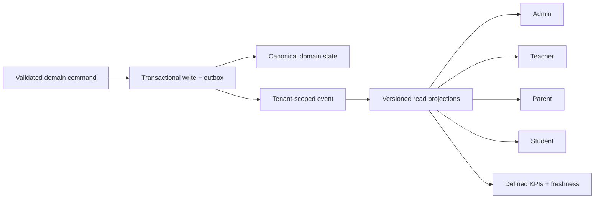
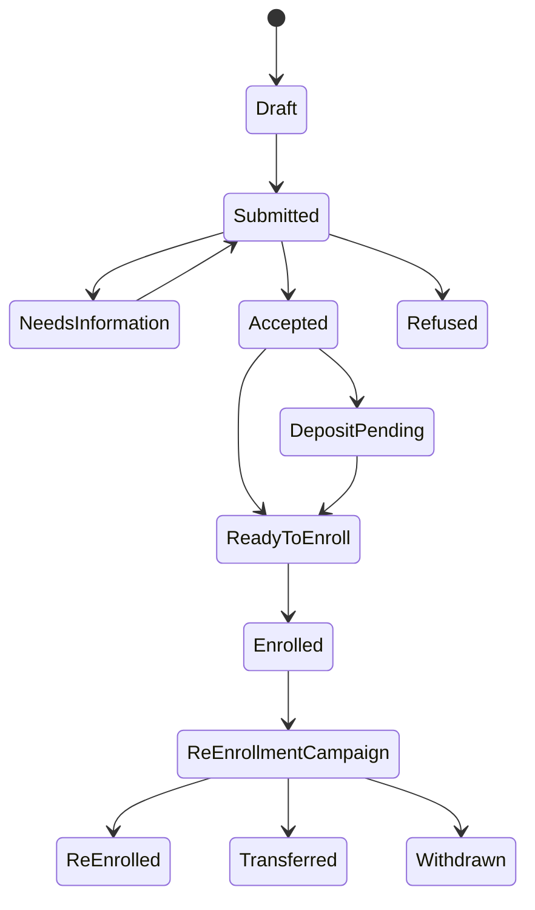
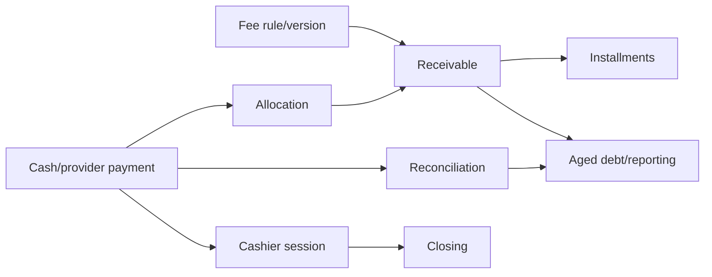
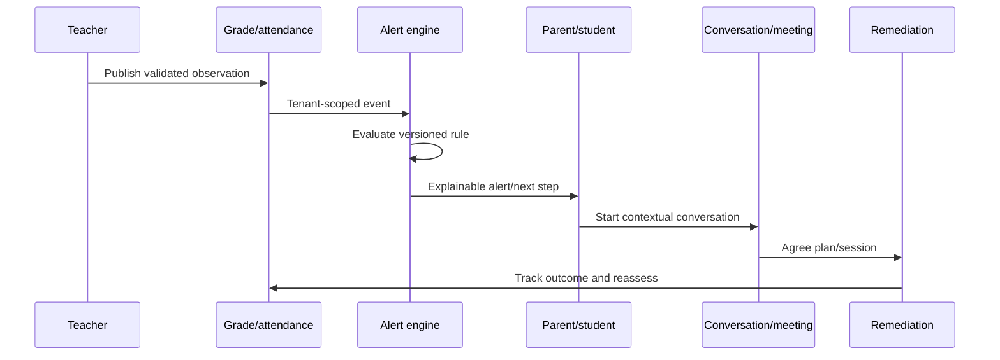
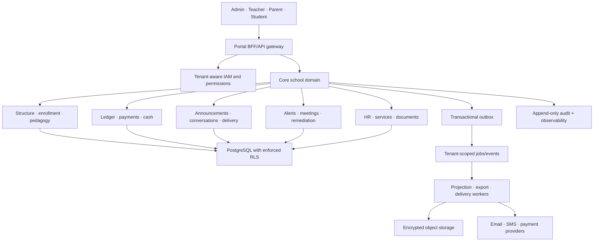

# 03 — Comparative Gap Analysis: Lakoli vs Pilotage scolaire

> **ROUND-5 AUTHORITATIVE COMPARISON (2026-08-02).** This analysis compares reproduced behaviour, not marketing copy or source presence alone. A capability counts as operational only when the relevant runtime path is coherent across its roles and records.

The exhaustive revision uses all five requested methods: adversarial critique of the earlier comparison, decomposition by business capability and technical layer, triangulation of browser/guide/source/live-stack evidence, a systematic boundary-case sweep, and separate stakeholder lenses. The detailed matrix therefore distinguishes **missing**, **source-only**, **implemented-but-gated**, **runtime-broken**, **inconsistent** and **operational** instead of reducing every difference to a binary yes/no.

## 1. Executive conclusion

Lakoli and Pilotage solve different primary jobs:

- **Lakoli** is an administrative/financial school ERP: admissions, receivables, cash, payment communication, official documents, HR and services.
- **Pilotage** is designed as a pedagogical coordination platform: structure, assessment, grades, attendance, analytics, alerts, conversations and remediation.

Lakoli currently wins on operational breadth and staff guidance. Pilotage’s intended alert-to-remediation loop is strategically more differentiated, but the hosted runtime does not yet provide a dependable single source of truth. Pilotage should **not** copy Lakoli feature-for-feature before fixing tenancy, migrations, data/query consistency and broken core routes.

Recommended strategic sequence:

1. **Trust foundation:** tenant isolation, versioned migrations, current academic year, query contracts, legal/support routes, production hygiene.
2. **Repair the signature loop:** assignment → assessment → grade → parent view → alert → conversation → remediation.
3. **Operational core:** admissions/re-enrollment, finance/receivables/cash, documents and communication delivery.
4. **Local expansion:** services, HR, national exports and provider integrations where customer discovery proves demand.

## 2. Comparative scorecard

Legend: **Lead** = materially stronger and usable; **Partial** = present but incomplete/inconsistent; **Absent** = no real surface; **Unsafe** = present but current defects prevent operational trust.

| Capability | Lakoli | Pilotage | Assessment |
|---|---|---|---|
| School/year/class setup | Partial | Unsafe | Lakoli broader guidance; both have year/setup defects. |
| Admissions/new student | Lead | Partial | Lakoli guided and financially linked; Pilotage basic create/enroll works but drops DOB. |
| Pre-enrollment pipeline | Lead but siloed | Partial | Lakoli has public/admin funnels; Pilotage has queue concepts but hosted totals contradict. |
| Re-enrollment campaign | Lead | Absent | Lakoli has mass transfer/campaign semantics. |
| Student/guardian records | Lead | Unsafe | Pilotage’s parent/child state contradicts itself. |
| Fee/receivable management | Lead but unsafe totals | Absent | Largest commercial gap; Lakoli’s debt aggregation still needs repair. |
| Counter cash/payment session | Lead | Absent | Lakoli provides cashier/journal/closing concepts. |
| Online payment links | Partial | Absent | Lakoli provider surface exists; real provider unvalidated. |
| Discounts/reconciliation | Lead | Absent | Pilotage lacks finance domain. |
| Budget/anti-fraud | Lead | Absent | Lakoli operational surfaces, some unvalidated depth. |
| Assessment/grade design | Partial | Intended lead, runtime unsafe | Pilotage source model is stronger; hosted links/counts/visibility fail. |
| Pedagogical analytics | Weak | Intended lead, runtime unsafe | Pilotage has snapshots/drilldowns but inconsistent data. |
| Attendance | Unsafe | Partial/unsafe | Lakoli accepts future dates; Pilotage parent records/trend are inconsistent. |
| Alerts and interventions | Weak | Intended lead, runtime unsafe | Pilotage differentiator; configured/active counts and rule coverage conflict. |
| Remediation/tutoring | Absent | Partial | Pilotage has plans, slots, bookings; authority/workflow gaps remain. |
| Lesson book | Lead | Partial | Lakoli has visa/governance; Pilotage lessons default published. |
| Timetable | Lead | Limited | Lakoli exposes class/teacher and print; Pilotage marketing claims exceed audited proof. |
| Discipline/school life | Lead but unsafe date | Absent/minimal | Lakoli includes discipline and clubs. |
| Parent–teacher conversation | Limited | Lead | Pilotage threaded/moderated conversation works. |
| SMS campaigns/wallet/log | Lead | Absent | Pilotage notification email/in-app is not equivalent. |
| WhatsApp templates | Lead (deep links) | Absent | No real WhatsApp API in either. |
| Announcements | Limited | Partial/unsafe | Pilotage audience fan-out is inconsistent. |
| Notifications | Partial | Partial/unsafe | Both expose false/empty states; Pilotage has preferences/workers. |
| Official document catalogue | Lead | Partial | Lakoli has 12 generators and national exports; Pilotage has reports/exports but broken admin reporting. |
| Imports | Partial | Architectural lead, unproven runtime | Pilotage has async validation/apply/rollback design; no batch tested. |
| Exports | Lead operational breadth | Strong architecture, partially proven | Pilotage async worker/MinIO; Lakoli more school-specific artefacts. |
| HR/timekeeping | Lead | Absent | Lakoli has HR, tax/social settings and pointage. |
| Cafeteria/transport/services | Lead | Absent | Lakoli depth varies; transport is shallower than guide. |
| Audit/governance | Partial | Unsafe | Pilotage audit page crashes; RLS claims unsupported. |
| RBAC | Good role breadth | Good portal + permission design | Both need API/tenant adversarial validation. |
| Multi-tenancy | Unverified | Critical risk | Pilotage defaults unmapped users to demo and lacks effective RLS. |
| Release/data safety | Unverified | Critical risk | Pilotage production uses `db push --accept-data-loss`. |
| Embedded guidance | Lead | Weak | Lakoli tours/checklists are a major differentiator. |
| Open integrations | Weak | Partial | Pilotage OneRoster/import architecture; REST connector incomplete. |
| Test assets | Not observable | Lead in source | Pilotage has 50 spec files, but this audit could not execute them. |

## 3. What Pilotage must fix before feature expansion

### 3.1 Tenant isolation and identity

This is release-blocking. Replace the constant demo-tenant attachment with explicit tenant resolution based on trusted invitation/domain/context. Introduce database-enforced RLS or prove an alternative complete repository-level wall. Add adversarial tests for cross-tenant IDs on every read/write/export/job. Split the student identity client from parent and remove all development identity/email hints from hosted pages.

Acceptance conditions:

- an unmapped login cannot silently join any tenant;
- public registration creates a pending identity scoped to an explicit school workflow;
- cross-tenant IDs return the same safe denial/not-found response;
- worker jobs, object keys and exports preserve tenant context;
- portal clients have separate redirect URIs/audiences;
- audit events include resolved tenant, actor and request correlation.

### 3.2 Versioned database lifecycle

Replace `prisma db push --accept-data-loss` with reviewed Prisma/SQL migrations, deploy-time preflight, backup and rollback/runbook. Remove runtime index bootstraps once their constraints are represented in migrations. Production seed must be opt-in, isolated and impossible under the application production profile.

### 3.3 One source of truth and query contracts

Create canonical service/query contracts for:

- student ↔ enrollment ↔ class membership;
- assessment lifecycle and published grade visibility;
- teacher assignment identity;
- guardian/child resolution;
- attendance history/current class semantics;
- announcement audience and receipts;
- alert rule configuration/evaluation/instances;
- calendar totals and academic-year scope.

Every portal must consume the same canonical read model or a versioned projection with freshness metadata. KPI values must never be computed from incompatible scopes without labelled definitions.

## 4. Functional gaps Pilotage should close

### 4.1 Admissions and re-enrollment

Target workflow:

1. application source (public, staff, import) enters one queue;
2. duplicate/student-family matching;
3. document checklist and consent;
4. review/accept/refuse with reason and audit;
5. class capacity/prerequisite check;
6. optional fee/deposit gate;
7. enrollment activation and account invitations;
8. year-end campaign for re-enrollment/transfer/withdrawal.

Do not reproduce Lakoli’s public/admin queue silo. Treat all sources as channels into one state machine with explicit provenance.

### 4.2 Finance core

Finance is the largest market gap. Implement as an audited ledger, not mutable balances.

Required entities: fee catalogue/version, charge rule, student receivable, installment schedule, discount/waiver, payment, allocation, refund/reversal, cashier session, cash movement, reconciliation item, closing and receipt/document.

Required rules:

- immutable payment/reversal trail;
- allocation sum cannot exceed payment or receivable;
- idempotency key for provider and cashier submissions;
- no silent deletion of financial facts;
- fiscal/academic period locks;
- role separation between collection, adjustment, reconciliation and closing;
- dashboard totals derived from the ledger with an explainable drilldown.

### 4.3 Payment and communication delivery

Add provider abstraction, signed callbacks, replay protection, idempotency, reconciliation and sandbox certification. For SMS/email/WhatsApp, separate transactional and campaign channels; implement consent, opt-out, rate/credit limits, templates, scheduled sends, per-recipient receipts, retry/dead-letter handling and delivery dashboards. Avoid copying Lakoli’s transient contradictory credit states.

### 4.4 Official documents and reporting

Restore admin audit/report pages first. Then provide versioned templates for enrollment certificate, attendance certificate, account statement, payment receipt, report card, class list, teacher workload and regulatory/national exports. Every generated artefact should record template version, data cutoff, issuer, hash, tenant and retention. Add scheduled report delivery only after role/privacy controls are proven.

### 4.5 HR and operational services

These are medium-term extensions, not launch blockers. If validated by customer discovery, model staff identity separately from user account to avoid Lakoli’s HR→teacher deadlock. Cafeteria/transport/services should share charge and enrollment primitives while retaining domain-specific schedule/route/usage data.

## 5. The pedagogical advantage to preserve

Pilotage should not surrender its distinctive loop:

To make it real:

- repair teaching-assignment identifiers and gradebook routes;
- use explicit Draft → Published → Revised assessment states;
- ensure the same published grade appears on all authorised portals;
- attach alert rule/version/evidence to every instance;
- separate acknowledgement from resolution;
- prevent parents from unilaterally closing school-governed plans unless policy says so;
- show projection freshness and calculation definitions;
- add audit/notification receipts and outcome measurement.

## 6. UX/UI comparison

### Lakoli patterns worth adapting

- replayable task guides, not generic documentation;
- onboarding checklist with prerequisites and deep links;
- decision-point explanations for fees, capacity and official rules;
- stepwise flows for enrollment, payment and export;
- purposeful empty states that name the missing configuration;
- operational mobile navigation.

### Lakoli patterns not to copy

- public/admin queue silos;
- guide/behaviour mismatches;
- misleading async zero states;
- closed integrations and opaque technical assurance;
- unstable saved state and weak date validation;
- locked/coming-soon/broken states that look alike;
- hard-coded demo bypass logic.

### Pilotage patterns to retain and repair

- role-specific portals;
- consistent shell/navigation vocabulary;
- contextual conversation and reporting;
- permission builder and notification preferences;
- async import/export architecture;
- explainable alert/remediation ambition.

Immediate UX fixes: remove all 404 links, add global help/legal pages, route IDs correctly, default lessons to draft, label loading states instead of showing zero, define KPI scopes/tooltips, confirm bulk actions, paginate large tables and keep active-year context visible globally.

## 7. Target architecture

Cross-cutting requirements:

- explicit tenant context at identity, request, transaction, job, object and log layers;
- database RLS plus application checks and adversarial tests;
- versioned migrations and backward-compatible deploys;
- transactional outbox/idempotent consumers;
- privacy retention/deletion/legal basis by data class;
- WCAG design tokens and automated/manual accessibility gates;
- telemetry with SLOs, queue lag, projection freshness and reconciliation alerts;
- no demo data/secrets/development links in production images.

## 8. Prioritised roadmap

### Phase 0 — release stop and evidence (0–2 weeks)

| Priority | Deliverable | Exit criterion |
|---|---|---|
| P0 | Freeze risky production schema/seed path. | No `db push --accept-data-loss`; no automatic demo seed. |
| P0 | Tenant-resolution and RLS threat model. | Cross-tenant tests fail before fix, pass after. |
| P0 | Current data reconciliation. | One documented count for students/classes/grades/enrollments. |
| P0 | Establish clean CI environment. | Lockfile install, generate, lint, typecheck and tests reproducible. |
| P0 | Back up and restore hosted demo. | Restore drill completed and timed. |

### Phase 1 — core runtime recovery (2–6 weeks)

- implement explicit tenant selection/invitation and DB policies;
- split student identity client;
- introduce versioned migrations;
- repair active-year management and calendar scoping;
- repair class-create, audit, reports, profile/help/legal routes;
- repair teaching-assignment IDs and gradebook;
- canonicalise student/enrollment/guardian/grade/assessment queries;
- fix announcement audience/receipts and notification counts;
- remove Maildev/seed copy and apply CSP.

Exit criterion: one seeded golden journey passes on all four portals with invariant counts.

### Phase 2 — signature loop and operational quality (6–12 weeks)

- complete assessment lifecycle and revision visibility;
- alert rule configuration/evaluator parity with evidence/version;
- contextual parent conversation and meeting flow;
- remediation authority, booking and outcome rules;
- import-batch end-to-end validation/apply/rollback;
- pagination, loading states, bulk confirmations and accessibility repair;
- active observability dashboards and queue/projection freshness alerts.

Exit criterion: grade/attendance → alert → conversation → remediation is automated, explainable and audited.

### Phase 3 — admissions and finance MVP (3–6 months)

- unified application/enrollment/re-enrollment state machine;
- fee catalogue, receivables, installments, discounts;
- cashier/payment allocation, receipt, reversal and reconciliation;
- provider sandbox and signed callback;
- account statements and debt dashboard;
- role separation and financial audit.

Exit criterion: a school can enroll, charge, collect, reconcile and issue verifiable documents without spreadsheets.

### Phase 4 — commercial breadth (6–12 months)

- SMS campaign/delivery wallet if business case supports it;
- official/local exports and document catalogue;
- HR/timekeeping and operational services;
- mature OneRoster/SIS integration and documented API/webhooks;
- scheduled reports, PWA/offline work only where workflows justify it.

## 9. Decision gates and success measures

Track outcomes rather than page counts:

| Area | Measure |
|---|---|
| Data trust | 100% invariant agreement for canonical counts across portals. |
| Tenancy | Zero cross-tenant access in automated adversarial suite. |
| Release safety | 100% schema changes via reviewed migrations; tested rollback/restore. |
| Teacher workflow | ≥95% assessment/grade journeys complete without support. |
| Parent visibility | Published record parity within defined freshness SLA. |
| Alerts | Every alert exposes rule version, evidence, owner and resolution. |
| Finance | Ledger-to-cash/provider reconciliation difference = 0 at close. |
| Communication | Recipient estimate = fan-out = receipts, with explained exclusions. |
| UX quality | Zero internal navigation 404s; WCAG critical violations = 0. |
| Operations | Queue lag/projection freshness/SLOs continuously visible. |

## 10. Final recommendation

Pilotage should position itself as the **trusted pedagogical operating system with integrated school administration**, not a clone of Lakoli. Lakoli proves the market value of admissions, finance, messaging and documents, and its guided UX is worth adapting. Pilotage’s opportunity is to combine that operational completeness with better tenant security, explainable analytics and a genuinely coherent student-support loop.

The immediate investment is not another visible module. It is the trust substrate that makes every existing module mean the same thing to administrator, teacher, parent and student.

---

## Appendix A — Exhaustive feature comparison matrix

Evidence keys: **L-R** = Lakoli runtime; **L-G** = Lakoli guide/client contract; **P-R** = Pilotage hosted runtime; **P-S** = Pilotage source/schema/deployment. Complexity is relative (`S`, `M`, `L`, `XL`) and assumes the trust-foundation work is complete.

| Domain | Module | Feature | Lakoli | Pilotage | Gap | Evidence | Business impact | Complexity | Priority |
|---|---|---|---|---|---|---|---|---|---|
| Platform | Tenancy | Tenant assignment | Multi-space selector and group view; server isolation unproven | Hard-coded demo fallback; RLS helper unused; no policies | Pilotage critical security deficit | L-G; P-S | Existential confidentiality/integrity risk | L | P0 |
| Platform | Release | Schema migrations | Server unknown | `db push --accept-data-loss`, no migration history, production demo seed | Pilotage production blocker | P-S | Data loss and irreproducible releases | L | P0 |
| Platform | Truth | Cross-portal query contracts | Some KPI/runtime defects | Severe child, roster, grade, assessment, alert, announcement and calendar contradictions | Pilotage larger trust deficit | L-R; P-R/P-S | Users act on incompatible facts | XL | P0 |
| Platform | RBAC | Role permissions | Eight roles, route metadata and sensitive nominative grant | Keycloak + DB roles, but global custom roles, privilege minting and ABAC gaps | Pilotage security gap; Lakoli API assurance unknown | L-G; P-S | Unauthorised data/action risk | L | P0 |
| Platform | Audit | Immutable activity trail | 35 action codes and before/after view; completeness unproven | Page crashes; actor role/filters/KPIs/chain fields wrong or absent | Pilotage material governance gap | L-R/L-G; P-R/P-S | No reliable accountability | M | P0 |
| Platform | Onboarding | Embedded setup | Ten-step checklist, 63 tours, 73 help articles | Public pages and portal navigation, little task-level guidance; help routes 404 | Large Pilotage UX gap | L-R/L-G; P-R | Adoption/support cost | M | P2 |
| Admissions | Enrollment | Rich enrollment wizard | Multi-step identity/family/class/finance/docs; payment gate | Basic student + enrollment; DOB drops; approval deferred | Major functional/integrity gap | L-R/L-G; P-R | Administrative core incomplete | L | P1 |
| Admissions | Capacity | Class capacity enforcement | Modelled; edge suite not fully run | New enrollment correctly rejected, but existing class 29/28 | Both need invariant proof; Pilotage historical gap | P-R | Overcrowding and invalid rosters | M | P1 |
| Admissions | Pre-enrollment | Public + staff funnel | Both exist but are siloed; seven public states | Enrollment-request queue exists but contradicts dashboard; approval/reject missing | Pilotage missing workflow; Lakoli integration defect | L-R/L-G; P-R | Lost/duplicate applicants | L | P1 |
| Admissions | Documents | Required dossier and conformity | Detailed required set and status/reason | No equivalent controlled admission-document workflow | Missing Pilotage capability | L-G; P-S | Manual compliance work | M | P2 |
| Admissions | Import | Bulk students | CSV/TXT/XLS/XLSX, aliases, preview, 2,000 rows, receivable side effect | Five-type generic wizard; stale API/schema; no templates; apply/rollback untested | Pilotage source/runtime and UX gap | L-G; P-R/P-S | Migration/onboarding friction | L | P1 |
| Admissions | Year end | Human decisions and freeze | Seven outcomes, non-computability, publish/freeze/hash/reopen | No equivalent comprehensive lifecycle | Missing Pilotage capability | L-G; P-S | School-year transition impossible at scale | L | P2 |
| Admissions | Re-enrollment | Campaign workflow | Six-step pipeline, contact/response/payment/final axes | No equivalent operational campaign | Missing Pilotage capability | L-G; P-S | Retention and next-year workload | XL | P2 |
| Records | Guardians | Relationship truth | Rich guardian/principal-contact model | Guardians capped at 200; parent-child state contradicts itself | Pilotage data/query defect | L-R/L-G; P-R/P-S | Wrong family access and messaging | L | P0 |
| Records | Documents | Student file control | Upload types and `a_controler/conforme/a_corriger` with reason | Documents/resources empty; no writer/upload | Missing Pilotage capability | L-G; P-R/P-S | Paper/manual file risk | M | P2 |
| Finance | Fee rules | Categories and scope | 18 types, schedule, cycle/class/service scope | No school-fee domain | Missing Pilotage strategic capability | L-G; P-S | Cannot manage school revenue | XL | P2 |
| Finance | Receivables | Student ledger | Deep ledger/status/filter, but KPI ~5k vs ledger ~8k | No receivable ledger | Missing Pilotage; Lakoli reliability warning | L-R/L-G | No collection truth | XL | P2 |
| Finance | Counter payment | Cashier workflow | Eight modes, receipt and cash session | Absent | Missing Pilotage | L-R/L-G | Schools need daily collection | L | P2 |
| Finance | Cash controls | Expense, closing, cancellation/refund | Draft/approval, daily PV, typed mass cancel, refund | Absent | Missing Pilotage | L-G | Fraud and close-control gap | XL | P2 |
| Finance | Reconciliation | Ledger/provider controls | Internal and provider reconciliation | Absent | Missing Pilotage | L-G | Unexplained settlements | L | P2 |
| Finance | Budget | Forecast vs actual | Dedicated budget | Absent | Missing Pilotage | L-R/L-G | Weak executive planning | M | P3 |
| Payments | Aggregators | Online payment configuration | Four provider surfaces; no live provider in tenant | Absent | Missing Pilotage | L-G | Digital collection gap | XL | P3 |
| Payments | Wallet | SMS credit/recharge | Packs, thresholds, Mobile Money verify/idempotence | No comparable metered wallet | Optional gap | L-G | Monetisation and send control | M | P3 |
| Pedagogy | Structure | Years/classes/subjects | Broad, but year/period forms unstable | Broad source/runtime; class create broken; stale year | Both defective; Pilotage repairs first | L-R; P-R/P-S | Blocks every academic path | L | P0 |
| Pedagogy | Assignment | Teacher/class/subject | Rich but HR-account bridge deadlocks | 290 assignments; wrong identifier propagates into gradebook | Both workflow defects | L-R; P-R/P-S | Teacher cannot perform core job | M | P0 |
| Pedagogy | Assessments | Lifecycle and scheduling | Draft/publication/revision, exam grid | Rich source but contradictory runtime counts | Pilotage has strategic depth but broken truth | L-G; P-R/P-S | Signature product loop broken | L | P0 |
| Pedagogy | Grades | Entry and revision | Score grid, publication, bulletin gates | Batch grades/revisions/analytics; wrong link and cross-portal contradictions | Pilotage repair, not replacement | L-G; P-R/P-S | Family/student result trust | XL | P0 |
| Pedagogy | Bulletins | Official/provisional artefact | Four-gate official bulletin, rank/masthead/archive | PDF report exists; context/year contradictions | Pilotage official-document maturity gap | L-G; P-R/P-S | Regulatory/family output | L | P1 |
| Pedagogy | Lessons | Lesson book/visa | `draft/submitted/visa/correct` | Defaults Published; edit always 400 | Pilotage severe workflow defect | L-G; P-R/P-S | Accidental disclosure/no correction | M | P1 |
| Pedagogy | Attendance | Register and correction | Rich statuses/slots/alerts; accepts future date | Rich role views; silent partial save and ABAC gaps | Both critical; Pilotage security worse | L-R/L-G; P-R/P-S | Official register corruption/PII leak | L | P0 |
| Pedagogy | Timetable | Scheduling/conflicts | Rooms, workload, drag/print | Calendar/assignments but no comparable timetable depth shown | Pilotage functional gap | L-G; P-R/P-S | Manual scheduling | L | P2 |
| Pedagogy | Offline | Teacher offline queue | 100 items/30 days/conflict model | No equivalent confirmed | Missing Pilotage resilience | L-G; P-S | Poor low-connectivity usability | L | P3 |
| Analytics | Performance | Drill-down and trends | Weaker risk analytics | Strategically rich model/UI; stale endpoints and mislabelled queries | Pilotage advantage if repaired | P-R/P-S | Differentiation and intervention | XL | P0/P1 |
| Alerts | Rules | Academic/behaviour/attendance alerts | Absence alerts; embedded tab crashes | Eight rules; bounds drift and behaviour rule never fires | Pilotage broader but unreliable | L-R; P-R/P-S | Missed student risk | L | P1 |
| Remediation | Plans/bookings | Coordinated intervention | No comparable coherent loop | Plans, teacher slots/bookings, conversations; parent can close, hosted drift | Pilotage differentiator needing repair | P-R/P-S | Measurable student support | L | P1 |
| Communication | Individual/campaign SMS | Campaign delivery | Mature centre, simulations, 16 rule events, wallet/log | Announcements/conversations; SMS campaign stack absent | Major Pilotage operational gap | L-G; P-R/P-S | Collections and attendance outreach | XL | P2 |
| Communication | Email/push | Multi-channel delivery | Email surface; delivery unproven | Notification email/digest worker concepts; hosted status unclear | Both need delivery assurance | L-G; P-S | Missed/duplicate messages | M | P2 |
| Communication | WhatsApp | Assisted messaging | Deep-link templates/local storage; no API | No equivalent confirmed | Optional Pilotage gap; do not copy hard-coded/local-only weaknesses | L-G | Regional usability | S/M | P3 |
| Communication | Announcements | Audience and receipts | SMS-oriented school communications | Rich composer, receipts, conversations; audience fan-out defective | Pilotage strategic asset, P1 repair | P-R/P-S | Whole-school message misses students | L | P1 |
| Communication | Meetings | Family requests | No equivalent surfaced | Parent requests and resolution | Pilotage advantage, semantics need correction | P-R/P-S | Family coordination | S | P2 |
| HR | Staff/contracts | Employee lifecycle | Nine departments, six contracts, lifecycle | Identity users/teachers only; no full HR | Missing Pilotage | L-G; P-S | Duplicate spreadsheets/admin overhead | XL | P3 |
| HR | Payroll | Statutory payroll | Ivorian rubrics/CNPS/CMU/IRPP and batch validation | Absent | Missing Pilotage, high regulatory scope | L-G | Local ERP breadth | XL | P3 |
| HR | Timekeeping | Staff pointage | Manual events, bulk preview/four-eyes, reports | Teacher attendance only, not staff HR timekeeping | Missing Pilotage | L-G; P-S | Payroll/attendance operations | L | P3 |
| Services | Cafeteria | Subscription and charging | Subscription, charge, expense and state | Absent | Missing Pilotage | L-R/L-G | Ancillary revenue/service | L | P3 |
| Services | Transport | Subscription and operations | Subscription/charge; route model shallow | Absent | Gap but Lakoli not a complete blueprint | L-R/L-G | Family logistics | XL | P3 |
| School life | Discipline | Incident and measure | Human-reviewed incidents/measures; date bug | No equivalent | Missing Pilotage; Lakoli integrity warning | L-R/L-G | Safeguarding and traceability | L | P2 |
| School life | Clubs/activities | Activity lifecycle | Rich taxonomy/publication/print; state unstable | No equivalent | Missing Pilotage; copy only after workflow validation | L-R/L-G | Whole-school operations | M | P3 |
| Safeguarding | Protected follow-up | Sensitive case register | Nominative timed domain/scoped access, encryption wording, k-anonymity | No equivalent specialist case register | Missing Pilotage, but high legal risk | L-G; P-S | Child protection/privacy | XL | P3 gated discovery |
| Compliance | Orientation | DOB campaign | Shipped but tenant-gated; versioned/frozen/internal exports | No equivalent | Potential future gap, not near-term | L-G; P-S | Côte d’Ivoire administrative fit | XL | P3 |
| Compliance | Official canevas | Preparation and reconciliation | Shipped but tenant-gated; immutable snapshot/reconciliation | No equivalent | Potential future gap | L-G; P-S | Reduces official reporting effort | XL | P3 |
| Documents | Official generators | Registry and verification | Ten+ types, QR claim, registry, branding | Bulletins/exports but reports route 404, no general official registry | Pilotage substantial gap | L-G; P-R/P-S | Trust and compliance artefacts | L | P2 |
| Data | Portability | Whole-tenant export | Verified tenant-exit ZIP with SHA-256 contract | MinIO exports, no equivalent whole-tenant exit package confirmed | Pilotage governance gap | L-G; P-S | Vendor exit/data ownership | L | P2 |
| Integrations | OneRoster | Roster interoperability | No comparable open standard found | Users/classes/enrollments, but hosted/incomplete | Pilotage advantage if repaired | P-R/P-S | Ecosystem interoperability | L | P2 |
| UX | Guided workflows | Tours and contextual help | Strong tours, prerequisites and empty-state instruction | Role-specific UI but many 404/dead controls and thin guidance | Large Pilotage experience gap | L-R; P-R | Lower training and error rate | L | P2 |
| UX | Responsive/accessibility | Inclusive task completion | Mobile nav; modal obstruction; audit incomplete | Nested interactive controls and no completed WCAG audit | Both unproven | L-R; P-S | Mobile completion and inclusion | M | P2 |

## Appendix B — Detailed specifications for recommended Pilotage gaps

Each specification describes a product increment, not permission to copy Lakoli’s implementation or branding.

### B.1 Trust foundation and canonical query layer — P0

**User value.** Every role sees the same effective student, enrollment, roster, assessment, grade, alert, announcement and academic-year truth.

**Data and services.** Introduce canonical effective-dated projections for active enrollment, guardian-child link, class roster, teaching assignment, published assessment/grade, alert instance and announcement audience. Remove demo fallback; tenant-key all models/queries; add RLS or equivalent database enforcement; create versioned migrations and release schema ledger.

**Screens.** Add a context indicator (school, academic year, role), a data-quality reconciliation console and explicit historical/current labels rather than silent mixed history.

**Permissions.** Tenant and ABAC checks must be server-side. Custom-role grants must be a subset of the grantor. Parent sees only verified linked children; teacher only assigned classes.

**Notifications.** Data-quality failures alert operators, never silently degrade to empty lists.

**Acceptance criteria.** A fixed fixture produces identical counts and values across all four portals; cross-tenant reads/writes are denied at API and DB; no unmapped identity is provisioned; migration upgrade/downgrade/restore is demonstrated; all release images publish one compatible build/schema manifest.

**Dependencies/complexity.** Identity, Prisma schema, every repository and reporting query; **XL**. This is the prerequisite for all later work.

### B.2 Repair the pedagogical intervention loop — P0/P1

**Workflow.** Assignment → assessment draft → grade batch → publish → parent/student visibility → alert evaluation → conversation/meeting → remediation plan → teacher slot/booking → outcome/closure.

**Data.** One canonical teaching-assignment identifier; assessment revision and publication audit; all-or-none attendance/grade batches; alert provenance; remediation transition owner and outcome measures.

**Screens.** Correct gradebook links, lesson edit, assessment list/counts, parent grades, student/parent announcements, class messaging audience, remediation booking and role-safe closure.

**Permissions.** Teacher edits only assigned classes; parent acknowledges/requests but cannot unilaterally close school plans; admin supervises and audits; student receives permitted announcements.

**Acceptance criteria.** A published grade entered by teacher appears once and identically in admin, teacher, parent and student views; configured alert fires once; parent reply/meeting and remediation booking retain provenance; only authorised owner closes plan; no silent partial batch.

**Dependencies/complexity.** Canonical query layer, queue correctness, notification resolver; **XL**.

### B.3 Admissions and re-enrollment MVP — P1/P2

**Screens.** Configurable application form; staff review queue; student/guardian dedup; class/capacity choice; required-document checklist; decision detail; enrollment conversion; batch import; year-end decision and re-enrollment campaign dashboard.

**States.** `submitted → under_review → accepted/refused → documents_complete → payment_or_waiver → enrolled`; every terminal/reopen transition has actor, time and reason. Keep payment optional behind product configuration so pedagogy-only customers are not forced into finance.

**Data/API.** Application, applicant identity match, document metadata/control, decision, enrollment conversion transaction, import preview/error/apply/rollback and campaign state. All uniqueness/capacity/tenant rules are enforced server-side and inside transactions.

**Notifications.** Submission receipt, missing-document request, decision, enrollment confirmation and re-enrollment contact; consent and delivery status retained.

**Acceptance criteria.** Duplicate applicant and existing student are surfaced before creation; refused applicant cannot appear in official enrolled outputs; full class is rejected across UI/API/import; retry is idempotent; import rollback restores prior state; public/staff queues share one record.

**Complexity/value.** **XL**, high administrative value after P0/P1 foundation.

### B.4 Finance core — P2

**Scope.** Fee category, scoped charge rules, receivable ledger, discounts/waivers, counter payment, receipt, cash session, expense approval, daily closing, refund/cancellation, debt aging and reconciliation. Defer full payroll and multi-provider marketplace until core accounting closes reliably.

**Data.** Immutable ledger entries with type, effective date, actor, payment/provider reference, reversal link and idempotency key; never update a balance without balanced entry history. Separate student settlement, cash movement and provider settlement.

**Screens.** Accountant dashboard, student ledger, cashier collection, closing PV, exceptions/reconciliation, aging campaign preview and audit drill-down.

**Permissions.** Registrar may view status; cashier collects; accountant adjusts/reconciles; Direction approves refund/close exceptions; auditor read-only. No role can create and approve the same sensitive adjustment.

**Notifications.** Receipt, payment link, arrears simulation/campaign and failed-payment status with opt-out/consent and guardian dedup.

**Acceptance criteria.** Ledger total equals all dashboard/report totals under partial, over-, duplicate, failed, reversed and refunded payment cases; concurrent callback/cash collection settles once; closing cannot be mutated without a compensating audited event; provider settlement matches internal ledger.

**Complexity/value.** **XL**, high commercial value and high risk.

### B.5 Official documents and records — P2

**Scope.** Configurable school branding; enrollment certificate, student record, attendance statement, bulletin and payment receipt; document registry; stable snapshot; verification token/QR if legally appropriate; portable export.

**Data/API.** Document type/version, source snapshot hash, generation actor/time, student/enrollment scope, status, storage object, verification/revocation and retention. Files use private object access and malware scanning.

**Permissions.** School office generates student documents; finance generates receipts; Direction publishes official bulletins; family downloads only linked-child documents; auditor sees registry metadata.

**Acceptance criteria.** Output is generated from one frozen snapshot; refused/non-enrolled persons cannot enter enrolled lists; revoked document verifies as revoked; cross-tenant object access fails; portable archive manifest hashes every item and can be restored/read independently.

**Complexity/value.** **L**, strong trust/compliance value.

### B.6 Communication delivery service — P1/P2

**Scope.** One audience resolver shared by announcements, email/SMS/push, meetings and alerts; templates and variables; preview/simulation; scheduled jobs; delivery receipts/retries; consent and quiet hours.

**Data/API.** Audience query snapshot, deduplicated contact, channel preference, message/template version, job/attempt/delivery status and error. Idempotency includes tenant, event, recipient and channel.

**Permissions.** Teacher targets only assigned classes; administrators target authorised scopes; parent/student deep links resolve to their own portal; moderation actions are reachable and audited.

**Acceptance criteria.** Whole-school preview role totals equal actual unique recipients; parent and student receive permitted item exactly once; siblings may deduplicate at guardian channel while preserving child context; no cross-tenant dedup; >500 recipient metrics remain exact or explicitly sampled.

**Complexity/value.** **L**, prerequisite for trustworthy alerts and collections.

### B.7 Guided operations and help — P2

**Scope.** Contextual tours for first year, class, subject, assignment, student/enrollment, assessment/grade publication, attendance, announcement and remediation. Help content is versioned to feature/build and every menu link is crawl-tested.

**Acceptance criteria.** Guide steps refer only to visible/enabled controls; prerequisites distinguish loading, empty, locked and broken; tours resume/replay; no profile/help/legal/contact link returns 404; mobile primary actions remain reachable; keyboard/reader tests pass.

**Complexity/value.** **M**, reduces support and operational errors.

## Appendix C — What not to copy from Lakoli

| Lakoli observation | Risk if copied | Pilotage design response |
|---|---|---|
| KPI/ledger inconsistency | Finance loses trust | Build ledger invariants and reconciliation first |
| Future attendance accepted | Official records become impossible | Server-side date/year/session validation |
| Discipline date drift | Safeguarding chronology fails | UTC/local contract and round-trip tests |
| Public/staff pre-enrollment silos | Duplicate applicants/manual matching | One canonical application record and queue |
| HR-to-teacher email deadlock | Cross-module onboarding blocks | Atomic staff/user/teacher identity orchestration |
| Guide promises deeper transport than runtime | Expectation debt | Feature/build-bound documentation and acceptance |
| WhatsApp state/templates in localStorage | No central audit/delivery truth | Server-side template/audit; deep link only as explicit fallback |
| Hard-coded client template/support number | Tenant data leakage/white-label failure | Tenant-configured, validated communication metadata |
| AI audit missing manual defects | False assurance | Treat automation as a signal, never a release gate |
| Gated shipped modules labelled “coming soon” | Bundle/support/security ambiguity | Server feature flags, entitlement matrix and dead-code discipline |

## Appendix D — Prioritised acceptance gates

| Gate | Exit criteria | Owner lens | Blocks |
|---|---|---|---|
| G0 Security containment | Remove demo fallback; tenant-key roles/dedup; teacher ABAC; JWT audience; no known cross-tenant path | Security/DPO | Any production scale |
| G1 Release integrity | Versioned migrations, clean seed policy, immutable build/schema manifest, backup/restore drill | Platform operator | All feature releases |
| G2 Canonical truth | Fixed fixture reconciles student/child/roster/assessment/grade/alert/audience/calendar across portals | Product/data | Signature loop and reporting |
| G3 Core teacher journey | Correct assignment ID; assessment/grade/lesson/attendance batch atomicity; publication visible to family/student | Teacher/family | Pilot launch |
| G4 Communication | Exact preview/fan-out/deep links/delivery metrics; moderation and consent | Admin/family | Alerts and collections |
| G5 Governance | Working audit with accurate actor/role/time/IP/UA/diff; role/school changes included; legal/help routes valid | Direction/auditor | Paid production |
| G6 Operations | Admissions, documents and finance each pass edge suites and reconciliation where in scope | Registrar/accountant | ERP expansion |
| G7 Non-functional | CI green, WCAG evidence, load/queue tests, SLOs, monitoring and incident runbook | Engineering/operations | General availability |
