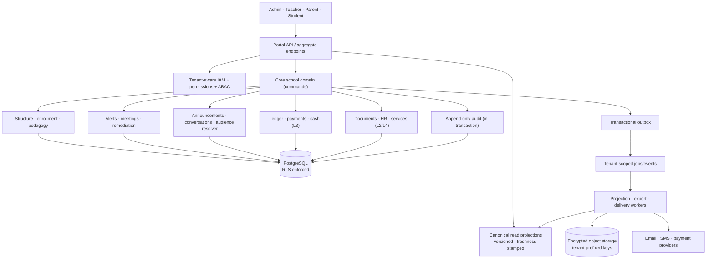

# Architecture Impact

What V3 changes structurally, and which decisions need an ADR before code.

## 1. Target architecture

## 2. The five structural changes

### 2.1 Tenant context becomes a first-class, enforced concern
Today tenancy is an application-level `where` clause with a constant fallback. Target: tenant resolved from a trusted
claim at the edge, carried into the transaction via a **parameterised** `SET LOCAL app.current_tenant_id`, enforced by
**PostgreSQL RLS**, and propagated into every job payload, object key and log line. Application predicates remain as
defence in depth. *(V3-E01; ADR required.)*

### 2.2 Reads split from writes — canonical projections
The audit's central failure is that each portal computes its own version of a shared fact. Target: commands write
canonical state transactionally with an outbox event; **versioned, freshness-stamped projections** serve every portal.
A KPI returns `{value, scope, asOf}` — never a bare number. *(V3-E03; ADR required.)*

This is **not** a move to full CQRS/event-sourcing. It is the minimum separation needed to make one fact mean one thing:
projections may be materialised views or tables, rebuilt from canonical state, and the system remains a modular
monolith.

### 2.3 The audit row joins the transaction
Audit is currently written (when written at all) beside the mutation, with a hard-coded actor role and null chain
fields. Target: an interceptor/uow that writes the audit row **inside the same transaction** as every privileged
mutation — so a rollback loses both, and a committed change is always accounted for. *(V3-E04.)*

### 2.4 A typed identifier layer
`ClassSectionId`, `TeachingAssignmentId`, `AssessmentId`, `StudentId` and `EnrollmentId` become distinct branded types.
This is the structural fix for PF-13 (a class id passed where an assignment id was expected) and prevents the whole
class of defect at compile time rather than per-route. *(V3-E07; small ADR.)*

### 2.5 Release becomes reproducible
Baseline migration → ordered `migrate deploy` → immutable build+schema manifest → deploy preflight comparing running SHA
and schema version. This closes the audit's most alarming systemic finding: **the hosted system is not the audited
codebase** (a hosted stack trace references a file absent from the repository). *(V3-E02; ADR required.)*

## 3. What deliberately does **not** change

| Kept | Why |
|---|---|
| Modular monolith (NestJS modules), not microservices | ADR-001 stands; nothing in the audit invalidates it, and service boundaries would multiply the tenancy surface |
| Keycloak as IdP | Sound; the defect is client topology (student aliasing parent) and `aud`/`azp` validation, not the choice |
| BullMQ + worker separation | Correct; the defect is a **missing consumer**, not the architecture |
| Prisma + PostgreSQL | ADR-014 stands; RLS is a PostgreSQL strength we are currently not using |
| Async export jobs + presigned object URLs | Already better than the comparator; extend rather than replace |
| Four separate portals | Product differentiator; keep |
| `@pilotage/ui` + design tokens + `packages/contracts` | Existing guardrail; V3 adds no new UI framework |

## 4. New ADRs required (Winston gate)

| ADR | Decision | Epic | Blocking |
|---|---|---|---|
| **ADR-025** | Tenant enforcement: RLS + application predicate, fail-closed, parameterised GUC | V3-E01 | yes |
| **ADR-026** | Migration policy: baseline, expand/contract, preflight, no `db push`, seed prohibition | V3-E02 | yes |
| **ADR-027** | Canonical read projections: versioning, freshness contract, KPI envelope | V3-E03 | yes |
| **ADR-028** | Audit in-transaction, chain genesis, and the accepted pre-V3 gap | V3-E04 | yes |
| **ADR-029** | Branded identifier types across route and service boundaries | V3-E07 | no |
| **ADR-030** | Audience resolution as a single shared service | V3-E11 | no |
| **ADR-031** | Finance as an immutable ledger (supersedes the deferral in ADR-018) | V3-E15 | yes, when L3 opens |

**ADR-002 must be corrected, not deleted.** It currently records multi-tenancy RLS as *Accepted* while zero policies
exist. Superseding it with ADR-025 and annotating the gap is part of `V3-E01`'s definition of done — otherwise the
repository keeps lying to its next reader, which is precisely how this situation arose.

## 5. Cross-cutting requirements (apply to every epic)

- Explicit tenant context at identity, request, transaction, job, object and log layers.
- Versioned migrations; backward-compatible deploys; no destructive step in the same release that stops writing a column.
- Transactional outbox with idempotent consumers.
- Privacy: retention, deletion and legal basis declared **per data class**, with children's data treated as the
  strictest.
- Accessibility: WCAG gates in CI (the assets exist; they are simply not run).
- Telemetry: SLOs, queue lag, projection freshness, reconciliation alerts.
- No demo data, secrets or development links in production images.

## 6. Performance sequencing — correctness before optimisation

The known hotspots are the 290-row unpaginated assignments page, the unpaginated announcement API, unread-count message
fan-out, per-child parent fan-out, search-per-keystroke renders, N+1 batch grade writes and repeated analytics queries.

**They are deliberately scheduled after `V3-E03`.** Optimising contradictory projections would only make wrong answers
faster. After correctness: request/query budgets, cursor pagination, indexed effective-date predicates, batch loaders,
queue backpressure, cache-invalidation tests, and production traces tied to SLOs.

## 7. Impact on the existing BMAD spec-kit

V3 reuses the established per-epic layout under `docs/spec/features/<epic>/` — `spec.md`, `plan.md`, `data-model.md`,
`contracts/openapi.yaml`, `tasks.md`, `quickstart.md`, `PROGRESS.md`. V3 epics adopt the same shape when the routine
runs an `epic-spec` mode, so nothing about the existing tooling or the sprint workflow needs to change. `bmad/roadmap.md`
remains the long-horizon ambition compass; `docs/daily-improvement-v3/roadmap.md` is the **execution order** the routine
follows first.
