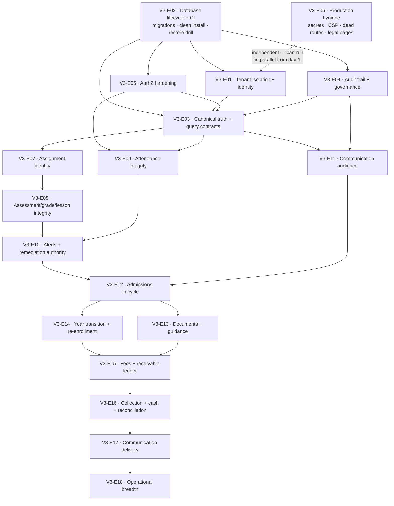

# Dependency Map

The V3 routine consults this file at Step 1 to decide what is **unblocked right now**. An epic is eligible only when
every arrow pointing into it originates from a `closed` epic (or an explicitly accepted partial in
`traceability-matrix.md`).

## 1. Epic dependency graph

## 2. Why each critical edge exists

| Edge | Reason it is a hard dependency |
|---|---|
| **E02 → E01** | Tenant work changes `Role`, `UserProfile` and adds RLS policies. Without reviewed, reversible migrations, a tenancy mistake is unrecoverable on hosted data (PF-03). |
| **E02 → E04** | The audit chain needs `ip_address`, `user_agent`, `hash`, `prev_hash` columns actually populated; that is a schema + backfill change (PF-31). |
| **E01 → E03** | A canonical read model is meaningless while identities can land in the wrong tenant (PF-01). Canonicalising queries first would freeze the wrong scope. |
| **E05 → E03** | Projections must be built *behind* correct ABAC, or the canonical layer will happily serve a teacher another class's roster (PF-07). |
| **E04 → E03** | Truth work changes read semantics; without a working audit surface there is no way to evidence what changed (PF-14). |
| **E03 → E07** | The identifier repair only helps if the resulting reads are canonical; otherwise the gradebook loads the right id against an inconsistent projection (PF-13 + PF-04). |
| **E07 → E08** | Every assessment/grade write is scoped by teaching assignment. |
| **E08 + E09 → E10** | Alerts consume grades and attendance. Firing rules over corrupt completeness (PF-06) manufactures false alerts. |
| **E03 + E04 → E11** | The audience resolver is a read projection with an audit obligation; both must exist first (PF-16). |
| **E10 + E11 → E12** | Admissions triggers notifications and downstream alerts; the delivery/audience layer must be correct before applicants receive anything. |
| **E12 → E14** | You cannot run a re-enrollment campaign without a canonical enrollment state machine. |
| **E14 → E15** | Fee rules are scoped to a year/period; period closure semantics must exist before receivables are generated against them (LG-28). |
| **E15 → E16** | Collection allocates against receivables; the ledger must exist first. |
| **E16 → E17** | Dunning campaigns need real balances, or they message the wrong families. |

## 3. Parallelisation

Because the routine ships **one slice per run**, parallelism matters less than eligibility. But when a run must choose:

| Can run concurrently | Why it is safe |
|---|---|
| **E06** with anything | Touches hygiene, static routes, CSP and copy — disjoint from domain seams |
| **E05** with **E03** | Disjoint seams: guards/DTOs/controllers vs read projections (the V2 "disjoint seams" rule) |
| **E04** with **E01** | Audit columns/writer vs identity resolution |
| **E09** with **E08** | Attendance service vs assessment/grade service |

**Never concurrent:** any two stories that both touch `schema.prisma`, or both touch the same canonical projection.

## 4. External blockers (not solvable by the routine)

| Blocker | Blocks | Resolution owner | Tracked as |
|---|---|---|---|
| Production Keycloak client/redirect changes | E01 S-E01-4 | Operator + security | VAL-04, D-02 |
| Payment provider sandbox credentials | E16 | Finance + operator | VAL-05, D-03 |
| SMS/WhatsApp gateway account | E17 | Operator | VAL-05 |
| Market decision: Côte d'Ivoire or EU-first | E18 scope, LG-14/LG-20/LG-26 | Product/leadership | D-04 |
| Legal review: payroll statutory rules | E18 (LG-20) | Legal | D-06 |
| Legal review: sensitive/health case register | E18 (LG-26) | Legal + DPO | D-07 |
| Commercial packaging decision (module entitlements) | out of scope until decided | Leadership | D-05 |
| Backup/restore window on hosted data | E02 S-E02-3 | Operator | VAL-03, D-01 |

## 5. The one edge that is deliberately *not* drawn

There is **no** arrow from any L2/L3/L4 epic back into L0. That is intentional: if a capability epic discovers a
foundation defect, the routine does **not** fix it inline. It records a new finding id, and the fix is scheduled at its
own layer. This is what stops V3 from re-becoming V2, where foundation work was absorbed invisibly into feature slices.
