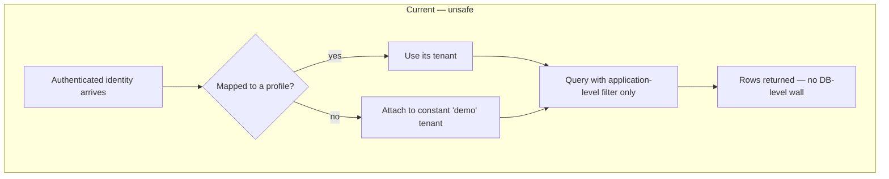
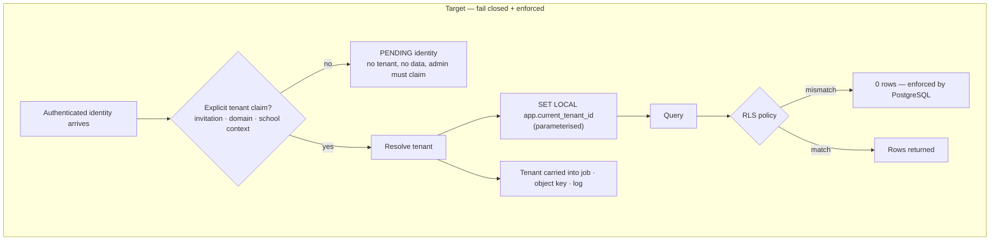

# V3-E01 — Tenant isolation and identity resolution

| | |
|---|---|
| **Layer** | L0 · Trust and production foundation |
| **Size** | L |
| **Depends on** | V3-E02 (reviewed migrations + restore rehearsal must exist first) |
| **Blocks** | V3-E03, and transitively every layer above |
| **Closes** | PF-01, PF-02, PF-18, VAL-02, VAL-04 |
| **Gates** | G-TENANT, G-AUTHZ, G-MIGRATION |
| **DNC** | DNC-10 (no hard-coded bypass) |
| **Open decisions** | D-01 (restore window), D-02 (student Keycloak client) |

## 1. Objective and business outcome

Make "which school does this data belong to?" a question the system answers **the same way at every layer** — identity,
request, transaction, background job, object key and log line — and make a wrong answer impossible rather than unlikely.

**Business outcome.** Pilotage can be sold to a second school without the first school's data being reachable. Today it
cannot: any unmapped authenticated identity is attached to a constant `demo` tenant, and the row-level security the
codebase claims to rely on does not exist.

## 2. Audit evidence

| Finding | Evidence |
|---|---|
| **PF-01** | `UserSyncService` and public registration resolve profiles against `DEMO_TENANT_SLUG = 'demo'`. Any unmapped login or open parent registration is created there (A2 §11.1, §14; E2 "Static architecture evidence"). |
| **PF-02** | `PrismaService.withTenant` sets `app.current_tenant_id`, but repository search finds **no call sites**, and no `CREATE POLICY` / `ENABLE ROW LEVEL SECURITY` statement exists anywhere. The code comment asserting repositories are RLS-isolated is unsupported (A2 §11.2, §14). |
| **PF-02 (b)** | The helper interpolates the tenant value into raw SQL rather than parameterising it (A2 §11.3). |
| **PF-18** | The student portal reuses the parent Keycloak client; the student password-reset flow targets that client (A2 §8, §11.4). |
| **Amplifier** | `bmad/roadmap.md` already mandates "Tenant + RLS + RBAC/ABAC + append-only audit on every backend change" — so this epic closes a gap between a stated guardrail and reality, not a gap in intent. |

## 3. Scope

**In scope**
1. Replace the `demo` fallback with explicit tenant resolution (invitation, domain, or school context).
2. Make unmapped identities **fail closed** — a pending, unprovisioned state, never silent membership.
3. Enable PostgreSQL RLS on every tenant-scoped table, with `withTenant` actually used on the request/job path.
4. Parameterise the tenant session setting.
5. Split the student identity client from the parent client (config + code path already exists via env override).
6. A two-tenant adversarial test suite that runs in CI on every PR (VAL-02).
7. Tenant context propagated into worker jobs, object keys and log correlation.

**Explicitly out of scope**
- Fixing cross-tenant *custom roles* (PF-08) and *coefficient writes* (PF-10) — those are `V3-E05`, deliberately kept in
  a separate seam so this epic stays reviewable.
- Multi-school "group" consolidation (a Lakoli capability, `LG`-none) — not a trust prerequisite.
- Any change to what a correctly-scoped user may see (that is ABAC, `V3-E05`).

## 4. Affected roles

| Role | Effect |
|---|---|
| Prospective/new user | Registration no longer silently joins `demo`; enters an explicit pending state |
| School admin | Gains a real tenant boundary; may see a new "pending identities" surface |
| Teacher / parent / student | No visible change when correctly provisioned — **this is the success condition** |
| Operator | Must provision the student Keycloak client (D-02) and run the restore rehearsal (D-01) |
| Auditor/DPO | Gains the evidence that tenant isolation is enforced, not asserted |

## 5. Current vs target workflow

## 6. Data and migration impact

| Change | Type | Notes |
|---|---|---|
| Add `tenantId` where missing on tenant-scoped models | expand | `Role` is handled in V3-E05; audit this epic's set explicitly |
| `ENABLE ROW LEVEL SECURITY` + `CREATE POLICY` per tenant-scoped table | expand | policy predicate `tenant_id = current_setting('app.current_tenant_id')::uuid` |
| Index on every tenant predicate | expand | required before enabling RLS (risk R-11) |
| New `UserProfile.status = 'pending'` state (or equivalent) | expand | fail-closed target for unmapped identities |
| Backfill: reassign existing `demo`-attached real users | **data migration** | requires D-01; must be reviewed row-by-row, not scripted blindly |

**Migration discipline (G-MIGRATION).** Expand → migrate → contract, across at least three releases. No column drop in
the same release that stops writing it. Every step reversible. **No `db push`.**

## 7. API, worker and UI impact

- **API:** a tenant-resolution middleware/interceptor that runs before any repository call; `withTenant` wraps the
  request transaction; rejects requests with no resolved tenant (403/404, never a fallback).
- **Worker:** every BullMQ job payload carries `tenantId`; the consumer opens its transaction with the same GUC.
- **Storage:** object keys are prefixed by tenant; a cross-tenant key read fails.
- **Web:** a "pending — awaiting school assignment" state on registration; no other visible change.

## 8. Permissions

No new permissions. This epic changes *scope resolution*, not *authorisation*. The one rule it adds: **no code path may
resolve a tenant from anything other than a trusted claim** — not from a request body, query parameter or header.

## 9. Notification behaviour

- A pending identity notifies school admins ("N identities awaiting assignment"), never the requester's future
  colleagues.
- Tenant-resolution failures alert operators (they are a defect signal), and must **not** degrade silently to an empty
  list (this is the A2 §14 "silent-error-as-empty-state" pattern, PF-31 family).

## 10. Edge cases

| Case | Required behaviour |
|---|---|
| Authenticated identity with no mapping | `pending`, zero data, explicit admin action to claim |
| User legitimately belonging to two schools | Explicit membership per school; switching is an explicit act with audit — never implicit |
| Foreign-tenant id supplied on any read/write/export | Identical safe response to "not found"; never a distinguishable error (no enumeration oracle) |
| Worker job enqueued before the fix, consumed after | Job without `tenantId` is dead-lettered, not guessed |
| RLS enabled but GUC unset | Query returns zero rows — fail closed, and log loudly |
| Existing `demo`-attached real users | Never auto-migrate; produce a review list (D-01) |
| Student login after client split | Reset/redirect targets the student client; old links degrade gracefully |

## 11. Security and privacy

This is the epic where the product stops leaking across schools. Threats addressed, from A2 Appendix E: demo-tenant
auto-assignment, unscoped queries, cross-tenant object access, and weak portal audience separation. **Children's data**
raises every severity one level.

Explicit prohibition (`DNC-10`): **no hard-coded identity, email or slug may bypass a tenant or billing check.** Lakoli
implements its billing bypass as `email !== "demo@lakoli.com"` — a backdoor by string comparison that cannot be revoked
without a redeploy. We must not copy that shape.

## 12. Observability

- Metric: count of `pending` identities, and of tenant-resolution failures (should be ~0).
- Every log line and audit row carries resolved `tenantId` + request correlation id.
- Alert when a job is dead-lettered for missing tenant context.
- Benchmark: p95 on the largest seeded tenant before/after RLS (risk R-11).

## 13. Acceptance criteria

1. An authenticated identity with no explicit tenant claim **cannot read or write any tenant data** and is visible as
   `pending`.
2. `grep` for the demo-tenant constant returns **no** production code path.
3. `pg_policies` is non-empty; every tenant-scoped table has RLS enabled; a query with the GUC unset returns 0 rows.
4. `withTenant` has real call sites on the request and job paths, and sets the GUC **parameterised**.
5. A two-tenant adversarial suite covers every read, write, export and job, and **fails before the fix, passes after**.
6. Cross-tenant identifiers produce an identical safe response to non-existent identifiers.
7. Worker jobs, object keys and log lines all carry tenant context.
8. The student portal authenticates against its own Keycloak client; reset targets that client.
9. A timed backup→restore rehearsal was completed before the data migration (VAL-03).
10. p95 latency on the largest tenant has not regressed beyond the agreed budget.

## 14. Test strategy

| Level | Tests |
|---|---|
| Unit | tenant resolver: claim present / absent / malformed / conflicting |
| Integration | per module, foreign-tenant id on GET/POST/PATCH/DELETE → safe denial |
| DB | RLS policy present per table; GUC-unset returns 0 rows; parameterisation (injection attempt) |
| Worker | job without tenant → DLQ; job with foreign tenant → denied |
| Storage | cross-tenant object key → denied |
| E2E | two seeded tenants; every portal; no bleed in list, detail, export or search |
| Perf | before/after RLS on largest tenant |
| Negative | enumeration: foreign id and non-existent id are indistinguishable |

## 15. Rollout and rollback

1. **Expand** — add columns, indexes, `pending` state. No behaviour change. Reversible.
2. **Shadow** — resolve tenant and log mismatches without enforcing. Measure. Reversible.
3. **Enforce (API)** — reject unresolved tenants. Feature-flagged. Reversible by flag.
4. **Enforce (DB)** — enable RLS table-group by table-group, smallest first. Reversible per group.
5. **Contract** — remove the demo fallback code. Only after ≥1 clean week.

**Rollback triggers:** any cross-tenant denial affecting a legitimate user; p95 regression beyond budget; any job
dead-lettering above baseline. Rollback is by feature flag or policy disable — never by restoring a backup, unless
step 5 has already run.

## 16. Definition of done

- All 10 acceptance criteria evidenced (test id or artefact) in `traceability-matrix.md`.
- PF-01, PF-02, PF-18 marked `closed`; VAL-02, VAL-04 marked `closed`.
- Gates G-TENANT, G-AUTHZ, G-MIGRATION recorded with evidence, not assertion.
- ADR written for the tenancy enforcement decision (RLS + application predicate) — Winston gate.
- `bmad/project-context.md` updated so the guardrail now describes reality.
- Risk R-02 moves to `mitigated`; R-01 and R-11 re-scored.
- No `DNC-10` shape introduced.
