# Layer 0 epics — V3-E02 … V3-E06

`V3-E01` has its own file (the template exemplar). These five follow the same structure.

---

# V3-E02 — Versioned database lifecycle and release integrity

| | |
|---|---|
| **Layer / Size** | L0 · L | **Depends on** — (entry point of the whole roadmap) |
| **Blocks** | E01, E03, E04, E05 | **Closes** PF-03, PF-55, PF-56, VAL-01, VAL-03, VAL-10 |
| **Gates** | G-MIGRATION | **Decisions** D-01 |

**Objective.** Make every schema change reviewed, ordered and reversible, and make CI actually run. Today production
starts with `prisma db push --accept-data-loss` against a database with **no migration history**, the prod compose runs
demo seed logic outside `NODE_ENV=production`, and the hosted API/schema are **provably not the audited source** — a
failed row's stack trace references `snapshot-drain-cron.service.ts`, a file that exists nowhere in the repository.

**Evidence.** A2 §12, §13, §14; A2 App. C.4; E2 static evidence.

**Scope.** Baseline migration from the current hosted schema; convert runtime index bootstraps into migrations; remove
seed from the production profile; immutable build+schema manifest per release; deploy preflight comparing running SHA
and schema version; clean dependency install + CI running lint, typecheck, unit, integration, Playwright and axe;
timed backup→restore rehearsal.
**Out of scope.** Any tenancy schema change (that is E01, and it depends on this).

**Roles.** Operator (owns), engineering (CI), Direction (accepts the downtime window).

**Current → target.** `source → image → hosted` and `schema.prisma → db push --accept-data-loss → prod DB` become
`source → immutable manifest (SHA + schema version) → preflight → ordered migrations → verified deploy`.

**Data/migration impact.** One baseline migration capturing today's hosted schema exactly; thereafter expand/contract
only. Seed becomes an explicit, separately-invoked, clearly-labelled command that refuses to run against production.

**API/UI impact.** None user-visible. A build/schema manifest endpoint (or health field) exposing running SHA + schema
version for VAL-10.

**Permissions.** None new. Deploy rights become the control point.

**Notifications.** Deploy preflight failure alerts the operator and **blocks** the deploy.

**Edge cases.** Hosted schema differs from any migration lineage → baseline must be taken *from the hosted database*,
not from `schema.prisma`. Runtime index bootstrap already created an index the migration also creates → make migrations
idempotent-safe. Restore rehearsal reveals unrecoverable data → stop, escalate (D-01).

**Security/privacy.** Removing demo seed from production removes seeded personal-shaped records and author labels
(PF-17 overlaps E06). Backups must be encrypted and access-controlled.

**Observability.** Deploy emits: image SHA, schema version, migrations applied, duration, rollback availability.
Restore drill duration recorded as a baseline SLO.

**Acceptance criteria.**
1. No code path runs `db push` in any non-development profile.
2. `prisma migrate status` is clean against the hosted database.
3. Seed cannot execute under the production profile (proven by an attempted run that refuses).
4. A merge to `main` produces a running image whose reported SHA matches, within one deploy cycle.
5. CI runs lint + typecheck + unit + integration + Playwright + axe from a clean lockfile install and gates merges.
6. A timed backup→restore rehearsal is documented with its duration and acceptance sign-off.
7. Every runtime index bootstrap has an equivalent migration and has been removed.

**Test strategy.** Migration up/down on a restored snapshot; CI self-test on a clean container; deploy preflight
negative test (mismatched schema version must block); seed refusal test.

**Rollout/rollback.** Baseline first (no behaviour change), then CI gate, then preflight, then seed removal. Each step
independently revertible.

**Done when.** All 7 criteria evidenced; PF-03/PF-55/PF-56 and VAL-01/VAL-03/VAL-10 `closed`; R-01 and R-05 re-scored;
ADR for the migration policy.

---

# V3-E03 — Canonical truth and query contracts

| | |
|---|---|
| **Layer / Size** | L0 · XL | **Depends on** E02, E01, E05, E04 |
| **Blocks** | E07, E09, E11 → all of L1+ | **Closes** PF-04, PF-05, PF-12, PF-15, PF-20, PF-24, PF-36, PF-40, PF-50 |
| **Gates** | G-TRUTH, G-PORTAL | **Decisions** D-09 (KPI definitions) |

**Objective.** Make one fact mean one thing on all four portals. This is the largest epic in L0 and the one that
converts Pilotage from "rich but unreliable" to "trustworthy".

**Evidence.** The same dataset yields: 2 466 students on the dashboard vs a zero enrollment queue vs 28 pending; 0
published assessments vs 2 in teacher reports vs 3 drafts on the teacher dashboard vs 46 grades elsewhere; a published
grade visible on four surfaces but **zero on the parent grades page**; parent child linkage simultaneously active and
absent; active academic year 2023–24 in 2026 (A2 §5.1, §5.3, §7, App. D).

**Scope.** Canonical, effective-dated read projections for: active enrollment · guardian↔child link · class roster ·
teaching assignment · published assessment/grade · alert instance · announcement audience · academic-year context.
Every portal consumes the same projection or a versioned view of it. Each KPI publishes its scope and freshness.
Includes the **snapshot drain** (PF-24: enqueued with no consumer) and the pagination/fan-out hotspots (PF-50).
**Out of scope.** Changing what the numbers *mean* — that is D-09, a human decision this epic implements.

**Roles.** All four portals; product owns definitions; data/engineering owns projections.

**Current → target.**

```mermaid
flowchart LR
  subgraph NOW["Now"]
    Q1["Admin query"] --> N1["number A"]
    Q2["Teacher query"] --> N2["number B"]
    Q3["Parent query"] --> N3["number C or zero"]
    Q4["Student query"] --> N4["number D"]
  end
  subgraph TARGET["Target"]
    CMD["Validated command"] --> TX["Transactional write + outbox"]
    TX --> CORE["Canonical state"]
    TX --> EV["Tenant-scoped event"]
    EV --> PROJ["Versioned projection + freshness"]
    PROJ --> P1["Admin"] & P2["Teacher"] & P3["Parent"] & P4["Student"]
  end
```

**Data impact.** Projection tables/views with `version` and `computedAt`; a working drain for
`snapshot_recompute_trigger` (or the honest removal of the comments claiming a worker exists); indexes for effective-date
predicates.

**API/UI impact.** Aggregate endpoints replace per-portal ad-hoc queries; KPI responses carry `{value, scope, asOf}`;
UI shows loading states rather than zero (PF-40); large lists paginate server-side (PF-50).

**Permissions.** Projections are ABAC-filtered at read time; a projection must never widen what a role may see.

**Notifications.** Projection staleness beyond SLA alerts operators; it must never render as "no data".

**Edge cases.** Historical vs current enrollment must be **labelled**, never silently mixed (PF-35 family). A child in
one class with attendance rows from another must show provenance. Async loads must never emit a contradictory interim
value. A stale year must be visibly flagged, not silently used.

**Security/privacy.** A canonical projection is a new read path — it inherits G-TENANT and every ABAC rule; it is the
single most likely place to accidentally widen access.

**Observability.** Projection lag, freshness per projection, drain queue depth, and a reconciliation console showing
canonical vs legacy values during migration.

**Acceptance criteria.**
1. A fixed fixture yields **identical** values for every shared metric on admin, teacher, parent and student.
2. A published grade appears once, identically, on all authorised portals — including the parent grades page.
3. Parent child/enrollment state is self-consistent across dashboard, detail, children list, family settings and claim.
4. Every KPI exposes scope + freshness; none is computed from an incompatible scope.
5. Enqueued snapshot work is drained, or the claim is removed and analytics documented as live-computed.
6. Active-year context is correct, visible globally, and stale years are flagged.
7. No list renders more than one page of rows client-side; no per-child or per-message HTTP fan-out remains.

**Test strategy.** Golden-fixture cross-portal reconciliation test (the flagship); per-projection contract tests;
freshness/staleness tests; pagination and N+1 assertions; a regression test per contradiction listed in A2 Appendix D.

**Rollout/rollback.** Projection built in shadow → reconciliation console → portal-by-portal cutover behind a flag →
legacy query removal. Rollback by flag.

**Done when.** All 7 criteria evidenced; nine findings `closed`; G-TRUTH and G-PORTAL recorded; D-09 resolved and each
definition published in-product; R-03 mitigated.

---

# V3-E04 — Audit trail and governance surfaces

| | |
|---|---|
| **Layer / Size** | L0 · M | **Depends on** E02 |
| **Blocks** | E03, E11 | **Closes** PF-14, PF-31, PF-32 |
| **Gates** | G-AUDIT | |

**Objective.** Make privileged action accountable. Today `/admin/audit` **crashes** (server/client boundary),
`/admin/reports` is 404, role and school mutations write **no audit row at all**, actor role is hard-coded
`school_admin`, and `ip_address` / `user_agent` / `hash` / `prev_hash` are **never populated** — so the chain columns
exist but are always null.

**Evidence.** A2 §5.6, App. B.5, App. C.2.

**Scope.** Fix the boundary crash; implement `/admin/reports` or remove the link; write audit rows **inside the same
transaction** as every privileged mutation; record real actor role, tenant, IP and user-agent (honouring
`X-Forwarded-For` behind the proxy); populate the hash chain from a declared genesis; fix the end-date filter and the
three structurally wrong KPIs.
**Out of scope.** Retention/legal-hold policy (needs D-08-adjacent legal input).

**Roles.** Auditor/DPO (primary), Direction, operator.

**Data impact.** Backfill is **impossible** for pre-V3 rows — accepted as risk A-01. Chain starts at a genesis row and
the gap is documented, never fabricated.

**Acceptance criteria.**
1. `/admin/audit` renders; filters, KPIs and the diff drawer work.
2. Role grant/revoke, school mutation, enrollment decision, grade publish and every finance action write an audit row in
   the same transaction as the change — proven by a rollback test that leaves neither.
3. Actor role is the caller's real role; tenant, IP and UA are populated; chain verifies from genesis.
4. The `to` filter includes the selected day; all four KPIs are correct by definition.
5. `/admin/reports` either works or the navigation entry is gone — no dead link.

**Test strategy.** Transactional rollback test (mutation fails → no audit row, and vice versa); chain verification;
proxy header test; KPI unit tests; a link-crawl assertion for the reports route.

**Done when.** PF-14/PF-31/PF-32 `closed`; G-AUDIT evidenced; R-10 accepted and documented.

---

# V3-E05 — AuthN/AuthZ hardening and permission integrity

| | |
|---|---|
| **Layer / Size** | L0 · L | **Depends on** E02 |
| **Blocks** | E03, E09 | **Closes** PF-07, PF-08, PF-09, PF-10, PF-11, PF-25, PF-26, PF-46, PF-51, PF-52, PF-53, VAL-07 |
| **Gates** | G-AUTHZ, G-TENANT | **Decisions** D-02 |

**Objective.** Close every reachable path that lets a caller read or change what their role and tenant do not entitle
them to.

**Evidence (each is a distinct reachable defect).** Custom roles are **global across tenants** — cross-tenant read,
write and delete (PF-08). An admin can mint a role carrying permissions they do not hold (PF-09). The coefficient matrix
accepts **foreign-tenant identifiers**, re-weighting another tenant's averages (PF-10). Notification fan-out dedup is
**not tenant-scoped** (PF-11). Two attendance read endpoints have **no ABAC** — any teacher reads any class's roster and
student PII (PF-07). `PATCH /cycles/grade-levels/:levelId` runs **zero validation** and mass-assigns into Prisma;
notification `kind` accepts arbitrary strings; several query params bypass validation (PF-51). Parent registration is
public, unthrottled and self-verifies email (PF-46). Wrong password reports "MFA required" and `mfaEnabled` is
hard-coded false (PF-25). Logout does not end the Keycloak session; middleware ignores `session.error` and declares nine
non-existent routes (PF-26). `hasPermission()` is never used, so there is **no client-side permission gating**;
`users.suspend` is granted with no implementation; revocation is backend-only (PF-52). Invite and permission rewrites
are non-atomic; 18 granted codes are missing from the role builder and 5 are unseeded (PF-53).
Source: A2 App. C.2, C.3, App. E, App. G.

**Scope.** Tenant-key `Role` and every role/permission query; grant-subset enforcement; DTO validation on the
unvalidated paths; ABAC on the two attendance reads; tenant-scope the dedup query; rate-limit + verify registration;
correct auth error semantics; RP-initiated logout + `session.error` handling; remove phantom routes; seed the missing
permission codes and reconcile the builder; make invite/permission rewrite atomic; wire client-side gating or delete the
dead helper; implement or remove `users.suspend`; validate `aud`/`azp`.
**Out of scope.** The tenancy *mechanism* itself (E01) — this epic consumes it.

**Acceptance criteria.**
1. A tenant-A admin receives an identical safe denial for every tenant-B role id on read, update and delete.
2. An admin cannot grant a permission they do not hold (negative test per sensitive scope).
3. Foreign-tenant ids are rejected on the coefficient matrix and every other bulk write; batches are size-bounded.
4. Notification dedup is tenant-scoped (negative test across two tenants).
5. Both attendance read endpoints enforce teaching-assignment scope.
6. Every route has explicit validation; no mass-assign path; enum fields reject arbitrary strings; guards never fail open.
7. Registration is rate-limited and email-verified; wrong password reports a credential failure.
8. Logout ends the Keycloak session; a dead session cannot continue browsing; middleware lists only real routes.
9. Permission catalogue and role builder agree; all granted codes are grantable and seeded.
10. Invite and permission rewrite are atomic (failure leaves no orphan).
11. `aud`/`azp` are validated; a token minted for another client is rejected.

**Test strategy.** Two-tenant adversarial matrix per verb; grant-subset property test; ABAC matrix per role per
endpoint; validation fuzz on the unvalidated paths; session lifecycle tests; atomicity tests via injected failure;
catalogue-vs-builder consistency test.

**Rollout/rollback.** Ship as several disjoint slices (roles/tenancy · validation · session · catalogue) so each is
independently revertible. Client-side gating last, since it is defence-in-depth, not the wall.

**Done when.** Eleven findings `closed`; VAL-07 `closed`; G-AUTHZ and G-TENANT evidenced; R-02 mitigated.

---

# V3-E06 — Production hygiene and navigation completeness

| | |
|---|---|
| **Layer / Size** | L0 · M | **Depends on** — (independent; can run from day 1) |
| **Blocks** | nothing | **Closes** PF-17, PF-19, PF-29, PF-38, PF-39, PF-45, PF-54, PF-57 |
| **Gates** | G-AUTHZ (CSP/branding) | **Decisions** D-08 (legal text) |

**Objective.** Stop the product from advertising that it is a demo. This epic is small, independent and
disproportionately valuable to credibility — which is why it is scheduled in parallel from day one.

**Evidence.** Hosted admin/teacher registration ships **Maildev `localhost` instructions**; hosted data shows seed
author labels (PF-17). Hard-coded credential fallbacks and dev URLs ship in production-facing code (PF-54). Helmet's
**CSP is explicitly disabled** and branding values are injected unvalidated into a server-rendered `<style>` (PF-45).
`/admin/classes/new` is linked prominently and **crashes** (PF-19). `/legal/privacy`, `/legal/terms`, `/legal/cookies`,
`/pricing`, `/contact`, `/help` are **404 while parent registration requires accepting them** (PF-38). Teacher/parent
profile and help 404; teacher notification settings contain parent copy ("your child"); teacher "Import grades" links
into the admin portal (PF-39). Calendar holiday import fires **immediately with no confirmation** into the stale year
(PF-29). Student portal has no profile/settings (PF-57).

**Scope.** Remove dev artefacts and hard-coded fallbacks from production builds; enable a nonce/hash CSP and sanitise
branding; implement `/admin/classes/new`; add a route/link crawl as a CI gate; legal/help/contact holding pages (D-08);
fix cross-role copy leakage; add confirmation + explicit year selection + idempotency messaging to bulk writes; give
the student portal a minimal profile/settings surface.

**Acceptance criteria.**
1. No Maildev, localhost, seed-author or dev-URL string appears in a production build.
2. CSP is enabled with a nonce/hash policy; branding values are validated/sanitised before render.
3. An authenticated link crawl per role returns **zero internal 404s** — enforced in CI.
4. Every bulk/irreversible control has a confirmation naming the target scope, and states its idempotency.
5. Legal, help and contact routes resolve (holding pages acceptable per D-08) before consent is requested.
6. No portal renders copy addressed to a different role.
7. The student portal has profile/settings and a working help route.

**Test strategy.** Production-bundle string scan in CI; CSP header assertion; per-role authenticated link crawl;
confirmation-required test on each bulk control; copy-ownership lint.

**Done when.** Eight findings `closed`; the link crawl is a permanent CI gate; R-13 addressed via holding pages.
