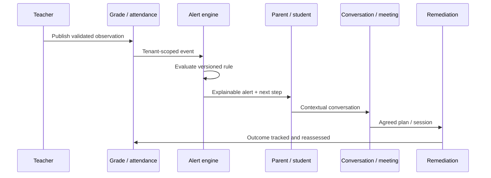

# Layer 1 epics — repair the signature pedagogical loop (V3-E07 … V3-E11)

**Layer objective (gate G3).** A grade entered by a teacher appears once, identically, in admin, teacher, parent and
student views; a configured alert fires exactly once with rule, version and evidence; conversation and remediation
transitions carry provenance and role-correct authority.

**Why this layer matters commercially.** This loop is the one place Pilotage is **ahead of Lakoli** — A3 §2 records
Lakoli as "weak" on alerts and interventions and having "no comparable coherent loop" for remediation. L1 is therefore
not catch-up work; it is protecting the differentiator while it is still ahead.

---

# V3-E07 — Teaching-assignment identity and gradebook repair

| | |
|---|---|
| **Layer / Size** | L1 · M | **Depends on** E03 | **Blocks** E08 |
| **Closes** | PF-13 | **Gates** G-PORTAL |

**Objective.** Make the teacher's core job possible. The class hub and the dashboard "create assessment" action both
pass a **class-section id** where the gradebook expects a **teaching-assignment id**; the page reports the mismatch and
the workflow dead-ends (A2 §6.1, App. B.6).

**Scope.** One canonical identifier per route segment; a typed identifier layer so `ClassSectionId`,
`TeachingAssignmentId`, `AssessmentId` and `StudentId` cannot be interchanged; repair every link that constructs a
gradebook URL.
**Out of scope.** Assessment lifecycle itself (E08).

**Target workflow.** `Teacher → class hub → (teachingAssignmentId) → gradebook → create assessment → batch grades`,
with the id resolved server-side from the class + subject + teacher triple rather than passed hopefully from the UI.

**Acceptance criteria.**
1. Every gradebook entry point resolves to a valid teaching assignment for the authenticated teacher.
2. A class-section id supplied where an assignment id is expected is **rejected**, not coerced.
3. The dashboard "create assessment" path completes end to end.
4. Compile-time: the two id types are not assignable to each other.
5. A teacher cannot open a gradebook for an assignment that is not theirs (ABAC negative test).

**Test strategy.** Type-level test; route resolution unit tests; teacher E2E from dashboard to saved grade; negative
ABAC test.

**Done when.** PF-13 `closed`; the typed-id layer is documented in an ADR; teacher golden journey passes.

---

# V3-E08 — Assessment, grade and lesson lifecycle integrity

| | |
|---|---|
| **Layer / Size** | L1 · L | **Depends on** E07 | **Blocks** E10 |
| **Closes** | PF-21, PF-22, PF-23, PF-30, PF-37, PF-42, LG-29 | **Gates** G-AUDIT, G-TRUTH, G-PORTAL |
| **DNC** | DNC-03 (no date drift) |

**Objective.** Make what a teacher records survive a round trip, and make publication a deliberate act.

**Evidence.** Student **date of birth is silently dropped** on create/read-back (PF-21). Editing a cahier-de-texte entry
returns **400 every time** (PF-22). Calendar edit **destroys `cycle_scope`** and drops `academicYearId`; multi-month
events are invisible outside their start month (PF-23). `POST /grades/batch` is an **N+1 inside a transaction** and
**fabricates phantom revisions** (PF-30). New lessons default to **Published** — parent-visible before review (PF-37).
`/admin/students` has a filter wired to nothing and **fabricates some metrics as facts** (PF-42).

**Scope.** Round-trip integrity for every write in this domain; `Draft → Published → Revised` as explicit states with
audit; lesson `draft → submitted → visa → correct` (LG-29, adopting Lakoli's governance model); batch grade write made
set-based and revision-accurate; remove fabricated UI metrics; fix or remove the dead filter.

**Data impact.** Lesson visa fields (`submittedAt`, `visaBy`, `visaAt`); revision provenance on grades; no schema change
for DOB — that is a mapping defect.

**Acceptance criteria.**
1. Every field submitted on student create is present on read-back, or rejected with a field error — never silently
   dropped.
2. Lesson edit succeeds; lesson defaults to **Draft**; publication is explicit and audited.
3. Lesson supports submit → visa → correct with actor and timestamp.
4. Calendar edit preserves `cycle_scope` and `academicYearId`; a multi-month event appears in every intersecting month.
5. Batch grade write is set-based, all-or-none, and creates exactly one revision per actual change — zero phantom rows.
6. No UI renders a fabricated metric; every displayed number has a real source or is absent.
7. Every filter either filters or is removed.

**Test strategy.** Property-based round-trip tests (write → read → compare) for student, lesson and calendar; a date
round-trip test across timezone boundaries (`DNC-03`); transaction atomicity test with injected mid-batch failure;
revision-count assertion; a "no fabricated data" test that asserts every table column maps to a real field.

**Done when.** Seven findings `closed`; `DNC-03` not reproduced; G-AUDIT evidenced for publication and visa.

---

# V3-E09 — Attendance integrity and scope correctness

| | |
|---|---|
| **Layer / Size** | L1 · M | **Depends on** E05, E03 | **Blocks** E10 |
| **Closes** | PF-06, PF-35 | **Gates** G-AUDIT, G-TRUTH |
| **DNC** | DNC-02 (no future dates) |

**Objective.** Make the attendance register trustworthy enough to drive alerts and to be shown to a family.

**Evidence.** Attendance can **silently partially save**, and every downstream rate then consumes corrupt completeness
(PF-06 — rated P0 in A2 Appendix G). The parent view shows seven records and 71.4 % but **includes a different class**
without labelling it, and displays a nonsensical **−71.4-point trend** (PF-35). Teacher attendance defaults to a 2026
date while the active year is 2023–24.

**Scope.** All-or-none batch persistence with explicit per-row failures; server-side date/year/session validation
(reject future dates — `DNC-02`, learned from Lakoli's L5-01); effective-dated roster so history is labelled, not mixed;
correct trend arithmetic or its removal; revalidate after save.
**Out of scope.** The two missing ABAC guards — those are E05 (this epic depends on them).

**Acceptance criteria.**
1. A batch either persists entirely or not at all; partial failures are reported per row and nothing is written.
2. A future-dated attendance entry is rejected server-side.
3. An entry outside the active academic year is rejected or explicitly flagged, never silently accepted.
4. Parent attendance shows only the child's records for the selected scope, with historical classes **labelled**.
5. Attendance rate and trend are mathematically valid for every input, including single-record and empty sets.
6. Saving revalidates and the UI reflects persisted state, not optimistic state.

**Test strategy.** Injected mid-batch failure (atomicity); boundary dates (yesterday/today/tomorrow, year edges,
DST); mixed-class fixture asserting provenance labels; property test asserting trend ∈ valid range; a specific
regression test for the −71.4 case.

**Done when.** PF-06 and PF-35 `closed`; `DNC-02` proven not reproduced; R-09 mitigated by a versioned recompute.

---

# V3-E10 — Alerts, remediation authority and analytics freshness

| | |
|---|---|
| **Layer / Size** | L1 · L | **Depends on** E08, E09 | **Blocks** E12 |
| **Closes** | PF-27, PF-28, PF-44, PF-49 | **Gates** G-AUTHZ, G-TRUTH |
| **Decisions** | D-10 (remediation authority) |

**Objective.** Make the intervention loop explainable, correctly scoped and correctly owned — the capability A3 names as
Pilotage's differentiator.

**Evidence.** `BEHAVIOR_ALERT` can be enabled but **can never fire**; rule bounds are not server-enforced and the UI
minimum disagrees with the evaluator (PF-49). Alert filters, exports and totals operate on a truncated **≤100-row
per-status window**; announcement engagement truncates at 500 and the list is unpaginated (PF-28). A **parent can
terminally close a school-created remediation plan** while having no direct booking action (PF-27). Meeting request
"Clôturer" actually **resolves** with different semantics — the UI reports a lie (PF-44).

**Scope.** Every alert instance carries rule id, rule **version**, evidence and threshold; separate *acknowledge* from
*resolve*; server-enforce rule bounds and reconcile them with the evaluator; make behaviour rules fire or remove the
rule type; exact (or explicitly sampled and labelled) totals; authority matrix for remediation transitions (D-10);
honest action labels.

**Acceptance criteria.**
1. A configured rule fires **exactly once** per qualifying event, with rule id, version, evidence and threshold attached.
2. `BEHAVIOR_ALERT` either fires or is removed from the configurator — no enableable dead rule.
3. Rule bounds are enforced server-side and the UI minimum equals the evaluator minimum.
4. Alert and announcement totals/filters/exports are exact, or labelled as a sample with its size.
5. Only the plan owner may close a school-created remediation plan; a parent may acknowledge, request and comment.
6. Every action label matches the transition it performs.

**Test strategy.** Rule-firing idempotency test; bounds parity test (UI constant vs evaluator constant); >100 and >500
row fixtures asserting exact totals; authority matrix negative tests per role; label-vs-transition assertion test.

**Done when.** Four findings `closed`; D-10 resolved and implemented; G-AUTHZ evidenced for the authority matrix.

---

# V3-E11 — Communication audience and delivery correctness

| | |
|---|---|
| **Layer / Size** | L1 · L | **Depends on** E03, E04 | **Blocks** E12 |
| **Closes** | PF-16, PF-34, PF-43 | **Gates** G-PORTAL, G-TENANT, G-AUTHZ |
| **DNC** | DNC-07 (no client-side comms state) |

**Objective.** Make "who receives this?" a single, correct, auditable answer — the prerequisite for trustworthy alerts
and, later, for collections.

**Evidence.** A whole-school announcement estimated 191 accounts but broke them down as **1 parent, 0 teachers,
0 administrators and 190 "other"**; the **student never received it**; recipient roles rendered blank (PF-16). Teacher
class messaging links to a **404**, and the alternate composer computes **zero recipients** for a class with known
families (PF-34). Conversation moderation is **write-only** — `reviewed`/`dismissed`/`blocked` are unreachable, so
`/admin/conversations` is a "Modération" page with no moderation controls (PF-43).

**Scope.** One audience resolver shared by announcements, conversations, alerts and meetings; correct role
classification; delivery receipts per recipient; reachable moderation transitions; deep links that resolve to the
recipient's **own** portal (today announcement notifications send every role to the parent portal).
**Out of scope.** SMS/WhatsApp channels — that is `V3-E17`, gated on L3.

**Acceptance criteria.**
1. The preview count equals the actual fan-out equals the number of receipts, with any exclusions explained.
2. Role breakdown is accurate; "other" is not a bucket for 99 % of users.
3. A whole-school announcement reaches parent **and** student exactly once each.
4. Teacher class messaging resolves and computes a non-zero, correct audience for a class with linked families.
5. `reviewed`, `dismissed` and `blocked` are reachable, permissioned and audited.
6. Every recipient's deep link opens their own portal.
7. Dedup across siblings preserves child context and never crosses tenants.

**Test strategy.** Audience-resolver contract tests per scope; a fixture with parents, siblings, teachers, admins and
students asserting exact fan-out; cross-tenant dedup negative test; moderation transition permission matrix; deep-link
per-role test.

**Done when.** Three findings `closed`; the resolver is the single audience source (no second implementation);
G-PORTAL evidenced on all four portals.
