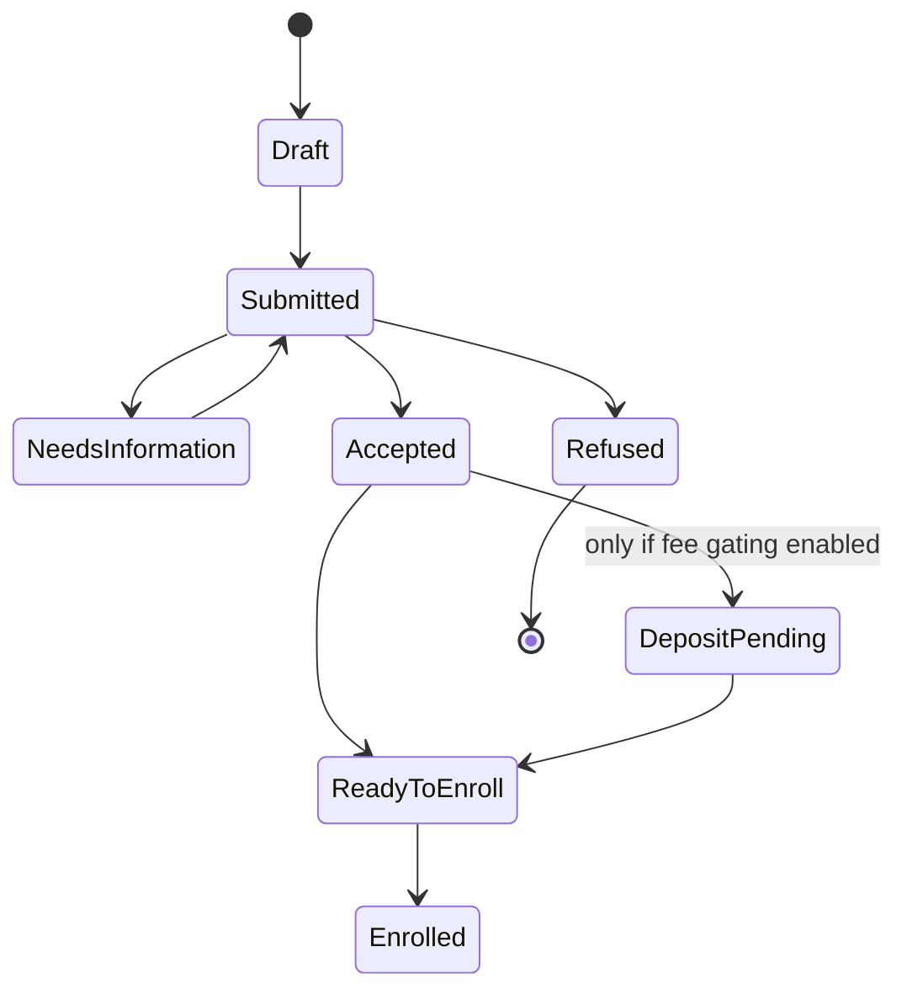

# Layers 2–4 epics — operational, financial and strategic build-out (V3-E12 … V3-E18)

These epics close the **capability** gap Lakoli proves exists. They are deliberately specified one level less granularly
than L0/L1: their stories cannot be written responsibly until the L0 canonical layer exists and the open decisions
(D-03, D-04) are resolved. Each carries its **promotion criteria** — what must be true before the routine may write its
stories.

---

# V3-E12 — Unified admissions and enrollment lifecycle

| | |
|---|---|
| **Layer / Size** | L2 · XL | **Depends on** E10, E11 | **Blocks** E13, E14 |
| **Closes** | PF-33, PF-41, PF-47, LG-12, LG-27 | **Gates** G-TENANT, G-AUDIT, G-TRUTH |
| **DNC** | DNC-04 (no queue silos), DNC-11 (no refused applicant in official output) |

**Objective.** One application record, whatever channel it arrives through, carried to an enrolled student with capacity
and identity invariants enforced server-side.

**Evidence.** Enrollment approval/rejection is **explicitly not implemented** (PF-47). Dashboard says 28 pending while
the queue is empty (PF-20, closed in E03). One class is **29/28 over capacity** although manual enrollment correctly
rejects overflow — so import or history bypasses the invariant (PF-33). Guardians are capped at **200 rows**, and
filters/export operate on the truncated set (PF-41). Import apply/rollback has **never been executed** (LG-27,
`BLOCKED_BY_DEPENDENCY`). Lakoli's own funnel is siloed between public and staff queues (`DNC-04`) and leaked a refused
applicant into a document population (`DNC-11`) — both to be avoided, not copied.

**Target state machine** (one record, explicit provenance):

**Design constraints.** Payment gating is **configuration, not architecture** — a pedagogy-only customer must never be
forced into finance (A3 App. B.3). Channel is provenance metadata on one record, never a second queue. Capacity,
uniqueness and tenancy are enforced **inside the transaction**, on the import path as well as the UI path.

**Acceptance criteria.** Duplicate applicant and existing student are surfaced before creation · a refused applicant can
never appear in an enrolled population or official output · a full class is rejected identically via UI, API and import
· import preview → apply → **rollback** restores prior state exactly · retry is idempotent · public and staff
applications are the same record · guardian list is server-paginated with exact totals.

**Promotion criteria.** E10 and E11 closed; D-04 resolved if fee gating is to ship enabled.

---

# V3-E13 — Official documents, student records and guidance

| | |
|---|---|
| **Layer / Size** | L2 · L | **Depends on** E12 | **Closes** PF-48, PF-57, LG-15, LG-23, LG-24, LG-25 |
| **Gates** | G-AUDIT, G-TENANT | **DNC** DNC-06 (no guide/runtime mismatch), DNC-11 |

**Objective.** Produce verifiable official artefacts from a frozen snapshot, and teach the product in-product.

**Evidence.** "Documents" and "Ressources" are two full sidebar features built over a field **nothing writes**; direct
upload is deferred (PF-48). Student portal has no profile/settings (PF-57). Lakoli ships **10+ generators with a
registry, branding, unique number and QR authenticity claim** (LG-15), student document control with
`a_controler / conforme / a_corriger` and a reason (LG-23), **63 guided tours + a 10-step onboarding checklist +
73 help articles** (LG-24), and a portable tenant-exit export with a SHA-256 manifest (LG-25).

**Scope.** Versioned document templates; generation from a frozen snapshot with hash; registry with issuance metadata
and revocation; verification token/QR **only if legally appropriate**; student document upload with control states and
malware scanning; private object access; guided tours **version-bound to the build** (this is how we avoid `DNC-06`);
tenant-exit archive with manifest.

**Acceptance criteria.** Every artefact is generated from one frozen snapshot and records template version, data cutoff,
issuer, hash, tenant and retention · a revoked document verifies as revoked · a non-enrolled or refused person can never
enter an enrolled list · cross-tenant object access fails · guide steps reference only controls that exist and are
enabled in that build · the portable archive hashes every item and is independently readable.

**Promotion criteria.** E12 closed; D-08 resolved for any legally-worded artefact.

---

# V3-E14 — Year transition, period closure and re-enrollment

| | |
|---|---|
| **Layer / Size** | L2 · XL | **Depends on** E12 | **Blocks** E15 |
| **Closes** | LG-13, LG-14, LG-28 | **Gates** G-AUDIT, G-TRUTH |

**Objective.** Let a school end a year and start the next one — today impossible, and the reason the hosted active year
is still 2023–24 in 2026.

**Evidence.** Lakoli has period closure with prechecks where reopening **depublishes official results** (LG-28); seven
end-of-year outcomes with six non-computability codes, publish/freeze/hash and a reopen requiring a reason (LG-14); and
a six-step re-enrollment campaign with four independent state axes (LG-13). Pilotage has **none** of these; A2 confirms
zero implementation hits for closure and end-of-year decisions.

**Scope.** Period lifecycle `open → prechecked → closed → published`, with reopen depublishing; end-of-year decision
register with explicit human decision and non-computability reasons; freeze with hash and audited reopen; re-enrollment
campaign with contact/response/payment/final axes; mass promotion with capacity enforcement.

**Acceptance criteria.** A period cannot close while prechecks fail · reopening depublishes dependent official artefacts
and is audited with a reason · a frozen decision register is hash-verifiable · a re-enrollment campaign is idempotent
(re-running creates nothing new) · promotion respects capacity via the same invariant as E12 · no official artefact
survives a reopen unmarked.

**Promotion criteria.** E12 closed; D-04 resolved (decision vocabulary is jurisdiction-shaped).

---

# V3-E15 — Fee rules, receivable ledger and discounts

| | |
|---|---|
| **Layer / Size** | L3 · XL | **Depends on** E14, E13 | **Blocks** E16 |
| **Closes** | LG-01, LG-02, LG-06 | **Gates** G-TENANT, G-AUDIT |
| **DNC** | DNC-01 (never mutable balances) | **Decisions** D-04 (currency/locale) |

**Objective.** Introduce money into the product as an **immutable ledger**, not as mutable balances.

**Evidence and the lesson.** Lakoli's finance is its deepest chain — 18 fee types with scope and periodicity, a
receivable ledger, 8 discount criteria — **and its headline debt KPI (~5k) disagrees with its own detailed ledger
(~8k)** (`DNC-01`, A1 §5.3). That divergence is the direct consequence of treating balances as mutable state. We adopt
the capability and reject the implementation shape.

**Scope.** Fee catalogue with versioned rules and scope (cycle/class/service); charge rule resolution most-specific-first;
receivable as a derived projection over immutable ledger entries; discounts/waivers applied at receivable creation with
justification; installment schedules; **no silent deletion of a financial fact**.

**Non-negotiables.** Every ledger entry is append-only with type, effective date, actor, reference, reversal link and
idempotency key. Scope changes never retroactively rewrite existing receivables. Every dashboard total is derived from
the ledger with a drill-down that reconciles exactly, or it is not shipped.

**Acceptance criteria.** Ledger total equals every dashboard and report total under partial, over-, duplicate, failed,
reversed and refunded cases · applying a fee twice creates one receivable · a discount is traceable to its criterion and
grantor · a scope change leaves historical receivables untouched · currency and statutory fields are configuration, not
constants (D-04).

**Promotion criteria.** E14 closed; **D-04 resolved** — this epic hard-codes a currency and fee model otherwise.

---

# V3-E16 — Collection, cash control, reconciliation and reporting

| | |
|---|---|
| **Layer / Size** | L3 · XL | **Depends on** E15 | **Blocks** E17 |
| **Closes** | LG-03, LG-04, LG-05, LG-07, LG-09 | **Gates** G-AUDIT, G-TENANT |
| **DNC** | DNC-12 (no irreversible-close contradiction) | **Decisions** D-03, credentials (VAL-05) |

**Objective.** Take money through every channel a school uses and prove at day-end what was taken.

**Evidence.** Lakoli provides counter payment with 8 modes and receipts, cashier session and journal, a daily closing PV
with theoretical-vs-counted variance, two-layer reconciliation, refunds and typed mass-cancellation, and provider
callbacks. It also demonstrates the trap: closing is presented as irreversible **while mass-cancellation tooling can
undo its inputs** (`DNC-12`).

**Scope.** Counter collection with receipt; cashier session; expense draft→approval; daily closing with variance and
formal PV; refund and reversal as first-class operations; provider adapter with signed, replay-protected, idempotent
callbacks; internal-ledger and provider-settlement reconciliation kept as **two distinct layers**.

**Role separation (from Lakoli's model, worth adopting).** Registrar views status · cashier collects · accountant
adjusts and reconciles · Direction approves refunds and close exceptions · auditor read-only. **No role may create and
approve the same sensitive adjustment.**

**Acceptance criteria.** A duplicated provider callback settles exactly once · concurrent cashier collection and
callback settle once · a close cannot be mutated without a compensating audited event, and the policy is coherent with
cancellation tooling (`DNC-12`) · provider settlement matches the internal ledger with an explained exception list · an
unmatched payment lands in an explicit state and never disappears.

**Promotion criteria.** E15 closed; **D-03 resolved and sandbox credentials issued** (both are STOP conditions).

---

# V3-E17 — Communication delivery service (SMS / WhatsApp / campaigns)

| | |
|---|---|
| **Layer / Size** | L4 · XL | **Depends on** E16 | **Closes** LG-10, LG-11 |
| **Gates** | G-TENANT, G-AUDIT | **DNC** DNC-07 | **Decisions** credentials (VAL-05) |

**Objective.** Reach families on the channel they actually use, and make dunning a controlled campaign rather than a
manual chase.

**Evidence.** Lakoli's centre has campaigns with **mandatory simulation before send**, 16 automation triggers, a prepaid
wallet with hard balance guard, a delivery log, sibling deduplication, exclusion of payments within 24 h from debt
campaigns, and a documented J+7 / J+30 / J+60 / J+90 collection ladder (LG-10). WhatsApp is **deep links only**, with
templates in `localStorage` and one hard-coded client template — capability worth adopting, storage model explicitly not
(`DNC-07`).

**Scope.** Transactional and campaign channels separated; consent and opt-out; quiet hours; templates and variables
**server-side and audited**; mandatory simulation before any spend; per-recipient receipts, retry and dead-letter;
credit/wallet accounting debited on enqueue and refunded on hard failure; delivery dashboards.

**Acceptance criteria.** Simulation output equals actual fan-out · wallet never goes negative and every movement is
ledgered · an automation fires at most once per (student, trigger, period) · opt-out is honoured across every channel ·
no template or delivery state lives only in the browser · no cross-tenant dedup.

**Promotion criteria.** E16 closed; gateway credentials issued; consent model reviewed.

---

# V3-E18 — Operational breadth: HR, services, school life, timetable, compliance

| | |
|---|---|
| **Layer / Size** | L4 · XL+ | **Depends on** E17 | **Closes** LG-08, LG-16 … LG-22, LG-26 |
| **Decisions** | **D-04 (blocking)**, D-06 (payroll legal), D-07 (sensitive data legal) |

> **This epic is a container, not a commitment.** Each capability inside it requires its own discovery note and its own
> promotion to a real epic before any story is written. Listing it here records the known gap without pretending it is
> planned work.

| Capability | Source | Promotion requires |
|---|---|---|
| Timetable: rooms, slots, conflicts, workload, print (LG-16) | A1 App. A.3 | Customer discovery; likely the first to promote — it is a genuine daily gap and has no legal exposure |
| Discipline: incident → measure → convocation with Direction validation (LG-17) | A1 App. A.6 | Safeguarding policy review; must not reproduce `DNC-03` |
| Clubs and activities (LG-18) | A1 App. A.6 | Discovery only |
| Cafeteria / transport / other services (LG-22) | A1 App. A.2 | Shares charge + subscription primitives with E15 — must not fork them |
| HR: staff registry, contracts (LG-19) | A1 App. A.5 | Model staff identity **separately** from user account, to avoid Lakoli's `DNC-05` deadlock |
| Payroll: statutory rubrics (LG-20) | A1 App. A.5 | **D-06 legal review**; strongly consider integrating rather than building |
| Staff timekeeping (LG-21) | A1 App. A.5 | After HR |
| Budget: forecast vs actual (LG-08) | A1 App. A.2 | After E16 |
| Sensitive/health case register with nominative habilitation (LG-26) | A1 App. A.6 | **D-07 legal + DPO review**. Highest-risk data class in the product. Lakoli's model — nominative, time- and domain-limited grants that even a super-admin lacks — is the right shape to adopt |

**Blocking condition.** While **D-04** is unresolved, no story in this epic may be selected by the routine
(risk **R-17**). Building Ivorian statutory payroll for an EU-shaped product, or vice versa, is the single most
expensive mistake available on this roadmap.
