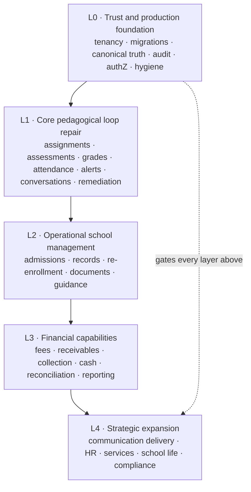
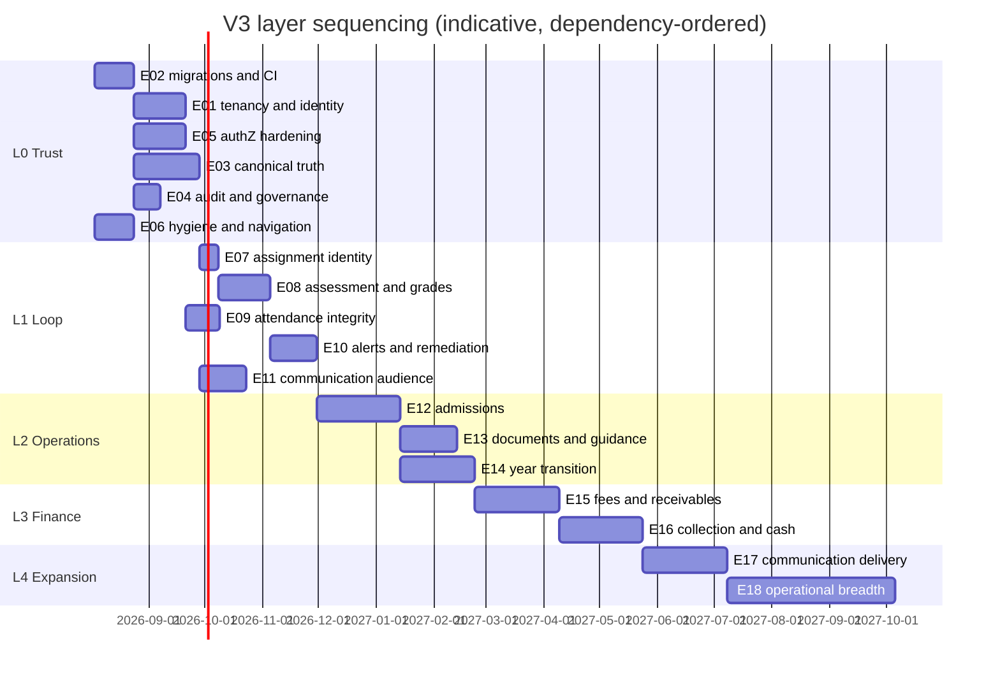

# Daily Improvement V3 — Implementation Roadmap

> **Governing rule.** No visible feature expansion is scheduled ahead of a security, tenancy, migration or
> data-consistency prerequisite that materially affects it. Layer order is a **hard dependency order**, not a preference.

## 1. Why the order is what it is

The audits establish two facts that jointly determine the sequence:

1. **Pilotage's product idea is ahead of Lakoli** — the grade → alert → conversation → remediation loop is a real
   differentiator Lakoli does not have (A3 §2, §5).
2. **Pilotage's runtime cannot currently be trusted to mean one thing** — one dataset produces incompatible counts,
   a published grade is invisible on the parent grades page, tenancy defaults to `demo`, and production schema changes
   run with `--accept-data-loss` (A2 §2, §14).

Building more features on that substrate multiplies the contradictions instead of resolving them. Equally, *pausing all
product work* would surrender the differentiator while it is still ahead. V3 therefore sequences **trust first, then the
signature loop, then the operational core, then finance, then breadth** — and treats the guardrails as executable gates
rather than roadmap prose.

### 1.1 The V2 lesson this encodes

`bmad/roadmap.md` already states the guardrail *"Tenant + RLS + RBAC/ABAC + append-only audit on every backend change
(children's data)"*. The audits prove none of the four is actually enforced: RLS has zero policies and zero call sites,
tenancy falls back to a constant, role mutations write no audit row, and two attendance endpoints have no ABAC at all.

**V2 shipped epics against a guardrail that was text.** V3's central change is not a new roadmap — it is that these
guardrails become **release gates the routine cannot pass without evidence** (see `routine/daily-improvement-v3.md` §5).

## 2. Layer map

Layers are **sequential for scheduling** but **not monolithic**: within a layer, epics run in dependency order and each
epic ships as vertical slices, one per routine run (the V2 discipline that works — see `product-strategy.md` §4).

## 3. Layer 0 — Trust and production foundation

**Exit condition (gate G0+G1+G2):** a fixed fixture produces identical counts and values across all four portals;
cross-tenant reads/writes are denied at API *and* database; every schema change is a reviewed migration; the audit trail
records actor, role, IP, UA and diff for every privileged mutation.

| Epic | Title | Closes | Size |
|---|---|---|---|
| **V3-E01** | Tenant isolation and identity resolution | PF-01, PF-02, PF-18, VAL-02, VAL-04 | L |
| **V3-E02** | Versioned database lifecycle and release integrity | PF-03, PF-55, PF-56, VAL-01, VAL-03, VAL-10 | L |
| **V3-E03** | Canonical truth and query contracts | PF-04, PF-05, PF-12, PF-15, PF-20, PF-24, PF-36, PF-40, PF-50 | XL |
| **V3-E04** | Audit trail and governance surfaces | PF-14, PF-31, PF-32 | M |
| **V3-E05** | AuthN/AuthZ hardening and permission integrity | PF-07, PF-08, PF-09, PF-10, PF-11, PF-25, PF-26, PF-46, PF-51, PF-52, PF-53, VAL-07 | L |
| **V3-E06** | Production hygiene and navigation completeness | PF-17, PF-19, PF-29, PF-38, PF-39, PF-45, PF-54, PF-57 | M |

**Sequencing inside L0.** `V3-E02` before `V3-E01`, because tenancy work requires reversible migrations to be safe.
`V3-E05` may start in parallel with `V3-E03` (disjoint seams: guards/DTOs vs read projections). `V3-E04` depends on
`V3-E02` (audit chain columns need a migration) and unblocks evidence for everything after it.

## 4. Layer 1 — Repair the signature pedagogical loop

**Exit condition (gate G3):** a grade entered by a teacher appears once, identically, in admin, teacher, parent and
student views; a configured alert fires exactly once with rule, version and evidence; conversation and remediation
transitions carry provenance and role-correct authority.

| Epic | Title | Closes | Size |
|---|---|---|---|
| **V3-E07** | Teaching-assignment identity and gradebook repair | PF-13 | M |
| **V3-E08** | Assessment, grade and lesson lifecycle integrity | PF-21, PF-22, PF-23, PF-30, PF-37, PF-42, LG-29 | L |
| **V3-E09** | Attendance integrity and scope correctness | PF-06, PF-35 | M |
| **V3-E10** | Alerts, remediation authority and analytics freshness | PF-27, PF-28, PF-44, PF-49 | L |
| **V3-E11** | Communication audience and delivery correctness | PF-16, PF-34, PF-43 | L |

**Why E07 first.** It is a small, well-understood identifier repair that unblocks the entire teacher journey; every
other L1 epic reads from the same graph.

## 5. Layer 2 — Operational school management

**Exit condition (gate G6, partial):** a school can take an application from any channel through review, documents,
capacity and enrollment; can close a year and run a re-enrollment campaign; and can issue verifiable official documents.

| Epic | Title | Closes | Size |
|---|---|---|---|
| **V3-E12** | Unified admissions and enrollment lifecycle | PF-33, PF-41, PF-47, LG-12, LG-27 | XL |
| **V3-E13** | Official documents, student records and guidance | PF-48, PF-57, LG-15, LG-23, LG-24, LG-25 | L |
| **V3-E14** | Year transition, period closure and re-enrollment | LG-13, LG-14, LG-28 | XL |

**Deliberate divergence from Lakoli.** `V3-E12` implements **one** application state machine with explicit channel
provenance — it must not reproduce `DNC-04` (public/staff silos) or `DNC-11` (refused applicant leaking into official
output). Payment gating is **configurable**, so pedagogy-only customers are never forced into finance (A3 App. B.3).

## 6. Layer 3 — Financial capabilities

**Exit condition (gate G6, full):** ledger total equals every dashboard and report total under partial, over-, duplicate,
failed, reversed and refunded payment cases; provider settlement matches the internal ledger; a close cannot be mutated
without a compensating audited event.

| Epic | Title | Closes | Size |
|---|---|---|---|
| **V3-E15** | Fee rules, receivable ledger and discounts | LG-01, LG-02, LG-06 | XL |
| **V3-E16** | Collection, cash control, reconciliation and reporting | LG-03, LG-04, LG-05, LG-07, LG-09 | XL |

**Non-negotiable design constraint.** Finance is implemented as an **immutable ledger**, never as mutable balances —
directly because Lakoli's mutable-aggregate approach produced `DNC-01` (KPI ≈5k vs ledger ≈8k). Dashboard totals are
derived from the ledger with an explainable drill-down, or they are not shipped.

## 7. Layer 4 — Strategic expansion

Scheduled only after L0–L3 gates hold, and only where customer discovery justifies it (A3 §4.5).

| Epic | Title | Closes | Size |
|---|---|---|---|
| **V3-E17** | Communication delivery service (SMS / WhatsApp / campaigns) | LG-10, LG-11 | XL |
| **V3-E18** | Operational breadth: HR, services, school life, timetable, compliance | LG-08, LG-16…LG-22, LG-26 | XL+ |

`V3-E18` is deliberately a **container**, not a commitment. Each capability inside it requires its own discovery note
before promotion to an implementable epic. Payroll (`LG-20`) and sensitive follow-up (`LG-26`) additionally require
legal review before any story is written.

## 8. Sequencing view

Durations are **indicative capacity envelopes for planning**, not commitments. The routine ships one slice per run; the
number of runs an epic needs is recorded in its `PROGRESS.md`.

## 9. What is explicitly *not* on this roadmap

| Item | Why excluded |
|---|---|
| Copying Lakoli's guided-tour engine wholesale | Adopt the *pattern* (`LG-24`) inside `V3-E13`; the implementation must be version-bound to features (`DNC-06`) |
| A general report builder / scheduled subscriptions | A3 §4.4 — only after role and privacy controls are proven; no audit evidence of demand |
| Orientation DOB and Conformity centre | Côte d'Ivoire-specific, `IMPLEMENTED_BUT_GATED` even at Lakoli; requires market decision first (`open-decisions` D-04) |
| PWA / offline teacher mode | A3 §8 Phase 4 — only where workflows justify it |
| Module entitlement/paywall system | Requires a commercial packaging decision before an architecture decision (`open-decisions` D-05) |
| Any Lakoli behaviour in the `DNC` register | Actively prohibited; the routine fails a story that reproduces one |

## 10. Definition of "layer complete"

A layer is complete only when **all** hold:

1. Every finding mapped to that layer in `audit-findings-index.md` is `closed` or explicitly `deferred-with-reason` in
   `traceability-matrix.md`.
2. The layer's gate (G0–G7, `03_Comparative_Gap_Analysis.md` Appendix D) has recorded evidence, not an assertion.
3. No story in the layer regressed a `DNC` rule.
4. The four-portal golden journey still passes with invariant counts.
5. `risk-register.md` has no open `HIGH` risk owned by that layer without an accepted mitigation.
