# V3-E04 — Plan (architecture, sequencing, decisions)

> Companion to `spec.md`. Read `spec.md` §0 first — six of the epic contract's statements were re-measured on
> 2026-08-08 and one is still an **open measurement**.

---

## 1. Architecture overview

```mermaid
flowchart TB
  subgraph NOW["Now (measured 2026-08-08)"]
    B1["browser"] -->|"no XFF, no UA"| W1["apps/web server action / fetch<br/>forwards Accept, Content-Type, Authorization only"]
    W1 --> N1["nginx"] --> A1["apps/api — bare NestFactory.create<br/>no 'trust proxy'"]
    A1 --> C1["22 of 28 call sites:<br/>prisma.auditLog.create OUTSIDE any transaction"]
    A1 --> C2["6 of 28 call sites:<br/>tx.auditLog.create inside $transaction"]
    C1 --> D1[("audit_log — 54 rows<br/>hash 0 · prev_hash 0 · ip 0 · ua 0")]
    C2 --> D1
  end
  subgraph TARGET["Target"]
    B2["browser"] -->|"client IP + UA forwarded explicitly"| W2["apps/web api-client<br/>one forwarding seam"]
    W2 --> N2["nginx (pinned hop count)"] --> A2["apps/api<br/>trust proxy = N, declared in ADR"]
    A2 --> S["shared/audit/<br/>deriveAuditProvenance + sanitisers"]
    S --> TX["writeAudit(tx, …) — ALWAYS inside the mutation's $transaction"]
    TX --> D2[("audit_log<br/>actor · role · tenant · ip|null · ua|null · hash · prev_hash")]
    D2 --> V["chain verification (fails closed, DNC-08)"]
    D2 --> K["KPIs over the TABLE's own where, scope labelled"]
  end
```



**Three structural moves, in this order:**

1. **One home** — provenance derivation and sanitisation move out of `modules/calendar/` and `modules/alerts/` into
   `apps/api/src/shared/audit/`. Nothing else can be built correctly until there is exactly one place to build it.
2. **One truth about the caller** — an ADR pins the hop count, and `apps/web` forwards the real client IP and UA, or
   the field stays **null**. There is no third option: a proxy IP is a *valid* inet, so no sanitiser can catch it.
3. **One writer** — `writeAudit(tx, …)` takes a transaction client, never a bare `PrismaService`. The signature makes
   the non-transactional write **unrepresentable** rather than merely discouraged (the shape `S-E02-18` used for
   `observeJobStalled`'s arity-1 signature, and the same reason).

---

## 2. Sequencing rationale — why the chain is LAST

The hash chain is the visible, demoable half of this epic. Building it early would be the wrong call, and this section
exists so a later reader does not "optimise" the order.

A chain computed over an `actorRole` that is a string literal at eight sites, an `ipAddress` that is the web
container's address, and a `userAgent` that is null on every UI-driven write would produce a **cryptographically
verifiable record of falsehoods**. That is strictly worse than the honest blank the epic's own principle demands —
*« une provenance absente, jamais une provenance fausse »* — because a verified chain is *believed*.

So the order is: **decide → correct the writer → correct the reader → chain**.

| Phase | Slices | Why here |
|---|---|---|
| **Decide** | `S-E04-1` | the ADR is the precedent ~20 call sites inherit; deciding it after they are written means rewriting them |
| **See** | `S-E04-2` | settle the `PF-14` open measurement before two later slices edit that page |
| **Correct the writer** | `S-E04-3`, `S-E04-6`, `S-E04-7` | provenance, then transactionality, then the sweep + the gate that holds it |
| **Correct the reader** | `S-E04-4`, `S-E04-5` | vocabulary before KPIs — a KPI stated over an undeclared vocabulary is the `criticalChanges` defect again |
| **Chain** | `S-E04-8` | only once every field it hashes is true |

`S-E04-4` (vocabulary) is placed **before** `S-E04-5` (KPIs) deliberately: `criticalChanges` measured 9 by matching a
French display string and no machine code at all. Fixing the KPI first would mean writing the destructive-action set
twice.

---

## 3. The provenance decision (`S-E04-1`) — the load-bearing one

**Inherited verbatim from `docs/spec/features/v3-e06/PROGRESS.md:370`, unresolved.**

**Measured facts.** `grep 'trust proxy\|trustProxy'` over `apps/api/src` + `infra/` → **0 hits**. `apps/api/src/main.ts:37`
is a bare `NestFactory.create`, so Express `req.ip` is the **socket peer**. The real chain is
browser → Next server action → the `apps/web` server-side `fetch` (which forwards only `Accept`, `Content-Type`,
`Authorization`) → nginx → API. The stored value is therefore the **web container's address, identical for every actor
forever**, and `userAgent` is `null` on every UI-driven write because undici sends none.
`sanitiseInetOrNull` **cannot** catch this: a proxy IP *is* a valid inet.

**The three options, and the ruling.**

| Option | Verdict |
|---|---|
| (a) Leave it — `req.ip` as today | **Refused.** It inverts the stated principle: the field is not absent, it is *wrong*, and `/admin/audit` renders it in monospace as "where the admin acted from" |
| (b) Blanket `app.set('trust proxy', true)` | **Refused, in writing, with the reason.** It makes the audit IP **client-forgeable** — any caller can send `X-Forwarded-For: 1.2.3.4`. A forgeable provenance in a governance trail is **strictly worse than blank** |
| (c) **A pinned hop count**, plus explicit forwarding from `apps/web` | **Adopted.** `app.set('trust proxy', <N>)` where `N` is derived from the *real* Traefik → nginx → api topology and **written down**, and `apps/web`'s single fetch seam forwards the real client IP and UA explicitly. Where the hop count cannot resolve a trustworthy address, the field is **null** and the UI says « provenance non disponible » |

**Non-negotiable consequence, and it must be stated in the ADR:** the API can never see the operator's IP or UA unless
`apps/web` forwards them. Fixing `trust proxy` alone changes nothing, because the *only* peer nginx ever sees is the web
container. `S-E04-1` writes the decision; `S-E04-3` builds the forwarding. They are separate PRs on purpose — the ADR
must land before ~20 call sites inherit it, and the forwarding chain touches `apps/web`, `infra/nginx` and `apps/api`
in one diff, which is a different review.

**What the ADR must contain** (`tasks.md` T-1.3): the pinned `N` and the topology it was derived from; the refusal of
(b) with its reason; the null-rather-than-wrong rule; the statement that a forged `X-Forwarded-For` from a client is
discarded because it sits **beyond** hop `N`; and a named way to re-derive `N` if the topology changes (otherwise `N`
becomes a magic number, which is `R-26`'s shape).

---

## 4. The vocabulary decision (`S-E04-4`)

**Where it lands.** `packages/contracts/src/enums/` — not `apps/api`, not `apps/web`. Two reasons, one immediate and
one deferred:

- *Immediate:* the KPI definitions (`apps/api`) and the label map (`apps/web`) must be stated over the **same** set,
  or they drift — which is exactly the `criticalChanges` defect (`['delete','Suppression','Révision','revise']`, a set
  straddling two vocabularies, matching no machine code at all).
- *Deferred:* the parent transparency panel (`spec.md` §1.2). A vocabulary declared in `packages/contracts` is
  inherited by all four portals; one declared in an admin client component is a second label map waiting to happen.

**Shape.** The French label is attached to the **code**, in one place — a new `packages/contracts/src/audit/` module
(`ADR-037`), not appended to `src/enums/index.ts`:

```ts
// packages/contracts/src/audit/ — SHAPE, not final content
export const AUDIT_RESOURCE_TYPES = { role: 'Rôles', grade: 'Notes', calendar_event: 'Événement du calendrier', … } as const;
export const AUDIT_ACTIONS       = { 'role.create': 'Création de rôle', 'assessment.publish': 'Publication d’évaluation', … } as const;
export const AUDIT_CRITICAL_ACTIONS  = [ … ] as const;   // the criticalChanges KPI reads THIS
export const AUDIT_EXPORT_ACTIONS    = [ … ] as const;   // the sensitiveExports KPI reads THIS
```

**Two rules the slice must honour.**

1. **Derived, not duplicated.** `AuditPageFilters.tsx`'s local `RESOURCE_TYPE_LABELS` is **deleted**, not extended. A
   guard asserts no file outside `packages/contracts` declares two or more audit labels — the `S-E02-16` rule 2 shape
   (*a value is written exactly once*), applied here because `S-E06-5` measured what happens when it is not: a guard
   that measures the *name* and not the invariant stays green over a fifth copy.
2. **Completeness is checked in both directions.** Measured, the map is wrong in *both*: of its 13 keys, **7 are
   written by no call site at all** (`announcement`, `class_section`, `enrollment`, `enrollment_request`,
   `import_batch`, `student`, `teacher_profile`) and only **6** intersect the **20** codes actually written — leaving
   **14 written codes with no label**. A one-directional check is how `calendar_event` went missing
   (`v3-e06/PROGRESS.md:378`) *and* how seven dead keys survived. `portal` is the same problem at a smaller size:
   `PORTALS` and `PORTAL_LABELS` are **both 3-valued** while `apps/web/src/app/student/` exists — `student` is added
   in the same slice (`G-PORTAL`).
3. **Three consumers, not two.** The web label map and the API KPI predicates are the obvious pair; the third is
   `apps/worker/.../exports/generators/audit-csv.generator.ts:16`, which exports the `action` column **raw**. A
   two-consumer fix leaves the CSV export drifting, and an export is precisely what a DPO hands to a regulator.

**The 54 legacy rows are not migrated.** See `spec.md` §6 — the append-only ruling. This is a product decision, not a
deferral.

---

## 5. The transactional writer (`S-E04-6`, `S-E04-7`)

**Signature first.** `writeAudit(tx: Prisma.TransactionClient, input: AuditWriteInput): Promise<void>`. Because the
first parameter is a transaction client, `writeAudit(this.prisma, …)` is a type error. The G-AUDIT invariant becomes a
compile-time property rather than a review convention.

**Order of adoption.**

- `S-E04-6` — the five families `AC-2` names, and only those: role grant/revoke, school mutation, enrollment decision,
  grade publish, finance. **Measured today:** role grant/revoke writes **no row** (`identity/users.service.ts:57`,
  `:74`; `users.controller.ts` has no `auditLog.create`); `apps/api/src/modules/schools/` has **zero** `auditLog`
  references; `apps/api/src/modules/enrollments/` has **zero**; grade publish **is** already transactional
  (`assessments.controller.ts:290`, `tx.auditLog.create`) and needs only the shared seam; **there is no finance module
  in `apps/api/src/modules`** — 26 modules, none of them finance (`ADR-018` defers it). So `AC-2`'s finance clause is
  **vacuous today**, and the honest way to satisfy it is `S-E04-7`'s gate, which arms it for the module that does not
  yet exist. Say this plainly rather than ticking the criterion.
- `S-E04-7` — the sweep of the remaining sites onto the seam, plus `scripts/audit-write-check.js`: a blocking ratchet
  that fails on any `auditLog.create` reached outside `shared/audit`, with a reviewed baseline carrying an owning
  finding id per row (the `link-integrity-baseline.json` shape — and note `S-E06-5` found that baseline validating an
  id's **shape**, not its **existence**; this one resolves against `audit-findings-index.md`).

**Rollback test shape (the `G-AUDIT` evidence, both directions).** Inside one `$transaction`: (i) perform the
mutation, (ii) `writeAudit`, (iii) throw. Assert **neither** row exists. Inverted: make `writeAudit` throw and assert
the mutation did not persist. Run per family. A test that only proves direction (i) proves nothing about a writer
placed after a `commit`.

---

## 6. The hash chain (`S-E04-8`) — and the genesis gap

**Chain shape.** `hash = H(prevHash ‖ canonical(row))` over a **declared, versioned** field list. The field list and
the hash function go in the ADR, because changing either later invalidates every prior verification, and a chain whose
definition is implicit is not a chain.

**Genesis.** One declared genesis row with `prevHash = null` (or a declared constant) and a stated `createdAt`.
**Every row before it is permanently unchained** — the 54 measured rows, and any written before the slice lands.
`A-01`: backfill is impossible; fabricating it would be worse than the gap. The gap must be visible **in-product** on
`/admin/audit`, not only in this file.

**Serialisation.** Two concurrent audit writes must not read the same `prevHash`. The mechanism (a per-tenant advisory
lock, a serialisable transaction, or a monotonic sequence column) is an **open design item** for the slice — it was
**not measured this run**, and the slice's first task is to choose and justify it. Note `S-E06-6`'s residual as
precedent: `isolationLevel: 'Serializable'` has **zero occurrences** in `apps/api`, so adopting it is a new idiom
needing a retry policy that does not exist.

**`G-MIGRATION` triggers here and nowhere else in this epic.** The columns already exist and are nullable
(`schema.prisma:1238-1239`), so the migration is about *constraints and indexes*, not columns — likely a chain-order
index and, if the serialisation choice needs it, a sequence. Expand/contract, reviewed file under
`apps/api/prisma/migrations`, **never `db push`**, stated rollback, and `scripts/schema-drift-check.js` green
(`ADR-027`).

**`DNC-08` is the sharpest constraint in the epic.** A chain verifier that cannot read the rows — no database, a
truncated table, an unreadable artefact — must **exit non-zero and say which**, never report "nothing to verify" as a
pass. `ADR-025` and `ADR-027` both litigated this shape already; follow them.

**`DNC-10`:** no `AUDIT_DISABLED`, no `SKIP_AUDIT`, no `NODE_ENV` branch, no demo-tenant string comparison. The writer
has no off switch, and a test asserts the absence in the negative.

---

## 7. ADR numbering (check before writing — the register of record is `docs/adr/`)

`docs/adr/` currently holds **`ADR-001` … `ADR-028`**. `docs/daily-improvement-v3/architecture-impact.md` §4 reserves
`ADR-029` … `ADR-035`, and **`ADR-035` is already reserved for this epic**: *"Audit in-transaction, chain genesis, and
the accepted pre-V3 gap"* (renumbered from `ADR-028` by `PF-110`, because `docs/adr/` wins over a reservation).

**The plan, and it must be re-checked against `docs/adr/` immediately before each file is created:**

| ADR | Slice | Subject |
|---|---|---|
| **`ADR-036`** *(next genuinely free number — above every live reservation)* | `S-E04-1` | Client provenance behind the reverse proxy: pinned hop count, blanket XFF refused, null-rather-than-wrong |
| **`ADR-037`** *(new)* | `S-E04-4` | The audit vocabulary is declared in `packages/contracts`, **not** a Postgres enum, and the French label is attached to the code. Covers the treatment of the 54 legacy rows |
| **`ADR-035`** *(the existing `V3-E04` reservation)* | `S-E04-6` writes it, `S-E04-8` **amends** it | Audit in-transaction, chain genesis, and the accepted pre-V3 gap. The amendment pattern is `ADR-024`'s, already used four times in this repo |

`ADR-036` and `ADR-037` **supersede nothing**. `ADR-035` *narrows* `ADR-002`: the audit's tenant scoping is
**application-level only** until `ADR-032` / `V3-E01` delivers RLS — measured, **0 occurrences** of
`ENABLE ROW LEVEL SECURITY` or `CREATE POLICY` anywhere in the repository, `0_baseline/migration.sql` included.
Note also that the KPI envelope this epic introduces is **minimal and local**: `architecture-impact.md` §4 reserves
**`ADR-034`** (*canonical read projections … KPI envelope*) for **`V3-E03`**. This epic offers an input to that
decision; it does not claim it.

If a number is taken by the time the slice runs, take the next free one **and record the renumber in
`architecture-impact.md`** — the precedence rule `S-E02-18` installed (`PF-110`) says `docs/adr/` is the register of
record, and a silent collision is exactly what that rule exists to prevent.

---

## 8. Risk and pre-mortem seeds (for the Critic agent)

| # | "Assume this shipped and production is now worse — why?" | Mitigation, and which AC carries it |
|---|---|---|
| 1 | `trust proxy` was set to a number that is one hop off, so every audit IP is the nginx address — and it now *looks* trustworthy | `AC-7` pins `N` against the real topology **and** names how to re-derive it; `AC-8` requires null rather than wrong. A test drives a forged `X-Forwarded-For` and asserts it is discarded |
| 2 | The chain landed over a `userAgent` that is null on every UI-driven write, so verification is green over an empty provenance | Sequencing (§2): `S-E04-3` before `S-E04-8`, non-negotiable |
| 3 | The vocabulary landed, the seed was corrected, and the KPIs now silently under-count the 54 legacy rows | `spec.md` §6 + `AC-9`: the legacy marker is rendered, and the under-count is **labelled on the card**, not hidden |
| 4 | The rollback test proved one direction only, so a writer placed after the commit still passes | §5: both directions, per family |
| 5 | The writer gate baselined the 22 non-transactional sites and nobody ever came back | `S-E04-7`'s baseline rows carry an owning finding id resolved against `audit-findings-index.md`, and the ratchet is **one-way** |
| 6 | `/admin/audit` still crashes authenticated, and three slices were built on top of it | `S-E04-2` runs **before** the page is edited, and its verdict is recorded either way |
| 7 | Chain verification found nothing to verify and reported PASS | `AC-12` / `DNC-08`: cannot-run ⇒ FAIL, with the reason named |
| 8 | An operator turned the audit writer off during an incident | `AC-12` / `DNC-10`: no off switch, asserted in the negative |
| 9 | `AuditLog` still has no FK to `Tenant`, and someone "fixed" it with a cascade, erasing a deleted tenant's own history | `spec.md` §5.4: `PF-96` referenced, posture stated in `ADR-035`, relation **not** changed here |
| 10 | The epic was called `shipped` while `/admin/audit`'s render was never observed under authentication | `PROGRESS.md` carries a **"Not claimed"** table; the epic goes `code-complete`, never `shipped`, until a real render is recorded |

---

## 9. What this epic hands to the epics that depend on it

- **`V3-E03`** (canonical truth) inherits a KPI that states its scope and a vocabulary declared once — the pattern its
  `{value, scope, asOf}` envelope generalises.
- **`V3-E11`** inherits `writeAudit(tx, …)` and the blocking writer gate, so an audience-resolution mutation cannot
  ship unaudited.
- **The parent transparency panel** (`spec.md` §1.2) inherits the contracts-level vocabulary, and nothing else. It is
  a later epic's work, and this plan deliberately does not pre-build for it beyond that one declaration.
